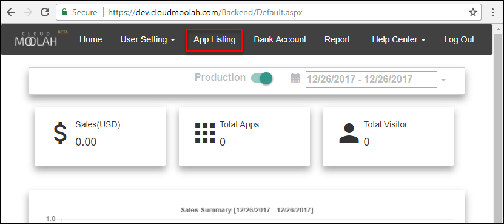
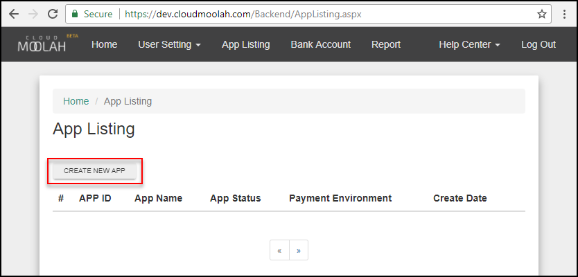
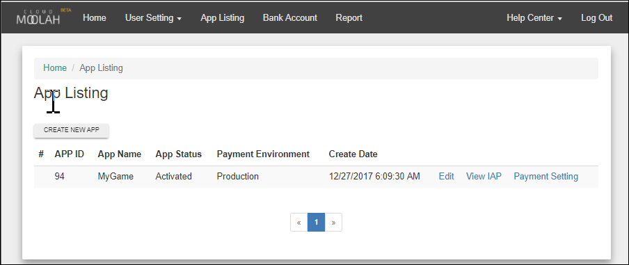
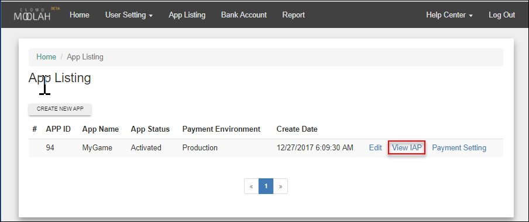
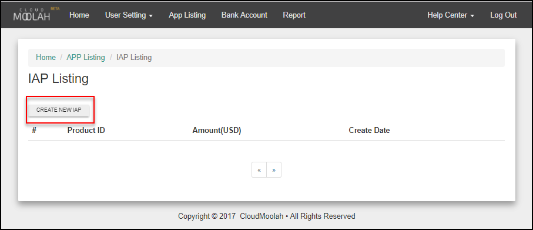
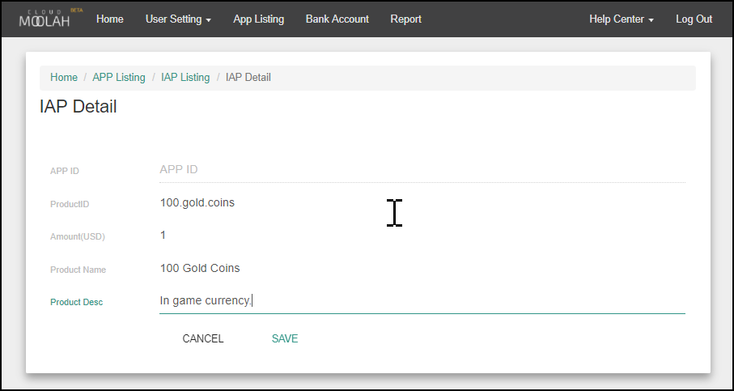

# CloudMoolah MOO store

The CloudMoolah MOO Store is a commercial service that enables people to buy and sell mobile apps. It also provides In-App Purchasing (IAP) services for apps distributed through the store. This guide describes the end-to-end process for a developer adding IAP services to a game that they publish to the CloudMoolah MOO Store.

The MOO Store serves Asian markets including the Philippines, Malaysia, Vietnam, Singapore, and Thailand. Users maintain a digital wallet, which they can fund using a variety of payment providers, such as mobile-pay, banks, and convenience store prepaid cards.

Although compatible with Unity, the CloudMoolah MOO Store is not a Unity product. For more information, see the CloudMoolah Developer Portal website at [dev.cloudmoolah.com](https://dev.cloudmoolah.com/).

The general workflow for publishing your game to the store and adding IAP to your game is as follows:

* Register your game as an app in the CloudMoolah store
* Add items in the store that you can add to your game for purchase
* Add the CloudMoolah store initialization code to your game
* Test the integration
* Publish the game to the CloudMoolah store

## Getting started

Your game must be built as an Android app. For information on building as an Android app, see [Getting started with Android development](android-GettingStarted).

To register your game as an available app in the CloudMoolah store:

1. Sign in to the [CloudMoolah Developer Portal](https://dev.cloudmoolah.com/).

2. Click __App Listing__.



3. On the App Listing page, click the __CREATE NEW APP__ button.



4. On the __App Detail__ page, enter the following information:

    1. In __App Name__, enter a name that will identify your game in the CloudMoolah store.

    2. In __BundelID__, enter the Package name you used for your game in the Unity Editor.

    3. In __Currency Name__, enter a name for the currency that players will use to complete the in-app purchase.

    4. To create a HashKey that you will use in the initialization code for your app, click __GENERATE__ next to the __HMAC/HashKey__ field.

    5. In the __Notification HMAC__ field, enter the App ID. This value is used during initialization. 

    6. Click __Save__.



### Add items that your users can purchase

An in-app purchase is the transaction of exchanging money for digital goods inside an application. A platform's store allows users to purchase products, which are digital goods. These products have an identifier, which is typically a string data type.

To add a purchasable item in the CloudMoolah Developer portal:

1. On the __App Listing__ page, click __View IAP__.



2. On the__ IAP Listing__ page, click the __CREATE NEW IAP__ button.



3. On the __IAP Detail__ page, enter the following information:

    1. In the __ProductID__ field, enter a string identifier that you will use in your code to enable purchase of the item in your game.

    2. In the __Amount__ field, enter the number cost of the item in the default currency you specified when you registered your game.

    3. In the __Product Name__ field, enter a name for the product.

    4. In the __Product Description__, enter a description for the product.



4. Click __SAVE__.

The  item now appears on the __IAP Listing__ page and you can reference it from your game to offer it to your users.

### Add IAP to your game

To configure IAP in your game:

1. Retrieve the appKey and hashKey for your app's product from the MOO Store Developer Portal and store them for later use.

An app targeting the CloudMoolah MOO Store must configure the CloudMoolah appKey and hashKey using the IMoolahConfiguration via the scripting API before initializing Unity IAP. Collect these variables' values from the app's CloudMoolah developer dashboard.

The following example configures and starts initialization of Unity IAP:

```
using UnityEngine.Purchasing;
public class MyStore : IStoreListener
{
    public void InitializeStore()
    {
        var module = StandardPurchasingModule.Instance();
        var builder = ConfigurationBuilder.Instance(module);

        // Configure CloudMoolah
        builder.Configure<IMoolahConfiguration>().appKey = "d93f4564c41d463ed3d3cd207594ee1b";
        builder.Configure<IMoolahConfiguration>().hashKey = "cc";
        // For server-to-server (also called "online" games) transaction
        // logging, set IMoolahConfiguration.notificationURL.
        builder.Configure<IMoolahConfiguration>().notificationURL = "https://gameserver.example.com/callback";
        builder.Configure<IMoolahConfiguration>().SetMode(CloudMoolahMode.Production);
        // Add purchasable products. The product must be defined in the store.
        // Unity IAP provides the *ProductType* enumeration to specify the durability 
        // of a purchasable product. CloudMoolah limits the product type to Consumable. 
        builder.AddProduct("100.gold.coins", ProductType.Consumable);

        // Start asynchronous IAP initialization.
        UnityPurchasing.Initialize(this, builder);
    }
}
```

1. In the Unity Editor, set the Unity IAP Android target to CloudMoolah by selecting __Window &gt; Unity IAP &gt; Android &gt; Target CloudMoolah__. This sets CloudMoolah as the Android store that the game uses to fulfill IAP requests.


To set the target store in your initialization code, call the UnityPurchasingEditor.TargetAndroidStore function:

UnityPurchasingEditor.TargetAndroidStore(AndroidStore.CloudMoolah);

1. Build a signed non-Development Build Android APK from your game. For more information, see [Getting started with Android development](android-GettingStarted).

**Note**: Take special precautions to safely store your keystore file. The original keystore is always required to update a published app.

For more information on setting up and configuring IAP, see [Setting Up Unity IAP](UnityIAPSettingUp), [Unity In-App Purchasing Initialization](UnityIAPInitialization), and [Integrating Unity In-App Purchasing with your game](https://unity3d.com/learn/tutorials/topics/analytics/integrating-unity-iap-your-game-beta).

### Test IAP

The CloudMoolah MOO Store supports testing. To test your game in the CloudMoolah MOO Store, you must enable developer mode in the app before making purchases by calling the `IMoolahConfiguration.SetMode` function.

When you set the test mode in a build of your game, transactions are processed against a dummy offline store. This allows you to test the app's purchasing logic without incurring real-world monetary costs related to the product.

To modify the game's MOO Store test mode, create the ConfigurationBuilder instance and add the following line, then build and run the app to test its IAP logic:

```
// TESTING: auto-approves all transactions
builder.Configure<IMoolahConfiguration>().SetMode(CloudMoolahMode.AlwaysSucceed);
```

To test error handling, configure the test mode to fail all transactions. To do this, use the CloudMoolahMode.AlwaysFailed enumeration:

```
builder.Configure<IMoolahConfiguration>().SetMode(CloudMoolahMode.AlwaysFailed); // TESTING: always fails all transactions
```

Note: When you finish testing, remove the SetMode statement that configures developer mode, or change the parameter to use the CloudMoolahMode.Production enumeration value. This ensures users pay real-world money when the app is in use.

### Example implementation

Unity IAP's default integration includes an implementation script example that demonstrates how to use the required, and some of the optional, CloudMoolah scripting APIs.

To view the CloudMoolah-specific example:

1. On your development machine, open the folder for the app in which you have enabled IAP.

2. Open the *Assets/Plugins/UnityPurchasing/script* folder.

3. In the script folder, open *IAPDemo.cs*.

The example implements the `Awake` function, which calls the `IMoolahConfiguration` API to set `appKey` and `hashKey`. This connects your app to the CloudMoolah store server.

The *IAPDemo.cs* file also shows how to use optional API calls to configure test mode, and for extending functionality to include transaction restoration. For more information on the optional APIs, sign in to the CloudMoolah Developer Portal website at [dev.cloudmoolah.com](https://dev.cloudmoolah.com/).

---

<span class="page-edit"> 2018-03-07  <!-- include IncludeTextAmendPageSomeEdit --></span>
