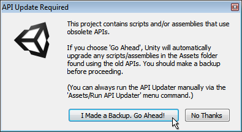
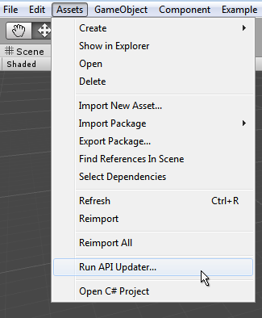

# Using the Automatic API Updater

Sometimes, during development of the Unity software, we make the decision to change and improve the way the classes, functions and properties (the API) work. We do this with a focus on causing the least impact on user's existing game code, but sometimes in order to make things better, we have to break things.

We tend to only introduce these significant "breaking changes" when moving from one significant version of Unity to another, and only in cases that it makes Unity easier to use (meaning users will incur fewer errors) or brings measurable performance gains, and only after careful alternative consideration. However, the upshot of this is that if you were to - for example - open a Unity 4 project in Unity 5, you might find some of the scripting commands that you used have now been changed, removed, or work a little differently.

One obvious example of this is that in Unity 5, we removed the "quick accessors" which allowed you to reference common component types on a GameObject directly, such as `gameObject.light`, `gameObject.camera`, `gameObject.audioSource`, etc.

In Unity 5, you now have to use the GetComponent command for all types, except transform. Therefore if you open a Unity 4 project that uses `gameObject.light` in Unity 5, you will find that particular line of code is *obsolete* and needs to be updated.

## The automatic updater

Unity has an **Automatic Obsolete API Updater** which will detect uses of obsolete code in your scripts, and can offer to automatically update them. If you accept, it will rewrite your code using the updated version of the API. 



Obviously, as always, it's important to have a backup of your work in case anything goes wrong, but particularly when you're allowing software to rewrite your code! Once you've ensured you have a backup, and clicked the "Go Ahead" button, Unity will rewrite any instances of obsolete code with the recommended updated version.

For example you had a script which did this:

````

light.color = Color.red;

````

Unity's API updater would convert that for you to:

````

GetComponent<Light>().color = Color.red;

````

The overall workflow of the updater is as follows:

1. Open a project / import a package that contains scripts / assemblies with obsoleted API usage

2. Unity triggers a script compilation

3. API updater checks for particular compiler errors that it knows are "updatable"

4. If any occurrence is found in the previous step, show a dialog to user offering automatic update, otherwise, we've finished.

5. If user accepts the update, then run API updater (which will update all scripts written in the same language being compiled in step 2)

6. Go to step 2 (to take any updated code into account) until no scripts get updated in step 5

So, from the list above you can see the updater may run multiple times if there are scripts which fall into different compilation passes (Eg, scripts in different languages, editor scripts, etc) that use obsolete code.

When the API Updater successfully finishes, the console displays the following notification:


If you choose *not* to allow the API updater to update your scripts, you will see the script errors in your console as normal. You will also notice that the errors which the API Updater could update automatically are marked as **(UnityUpgradable)** in the error message.


If your script has other errors, in addition to obsolete API uses, the API updater may not be able to fully finish its work until you have fixed the other errors. In this case, you'll be notified in the console window with a message like this:


"Some scripts have compilation errors which may prevent obsolete API usages to get updated. Obsolete API updating will continue automatically after these errors get fixed."

Once you have fixed the other errors in your script, you can run the API updater again. The API updater runs automatically when a script compilation is triggered, but you can also run it manually from the Assets menu, here:



## Command line mode

When running Unity in batch mode from the command line, use the `-accept-apiupdate` option to allow the API Updater to run. For more information, see [Command Line Arguments](CommandLineArguments).

## Logging

A [Version control](https://en.wikipedia.org/wiki/Version_control) system helps you see which changes the APIUpdater applies to a Project’s scripts. However, this can be difficult when dealing with pre-compiled assemblies. To see the list of changes made by the AssemblyUpdater (the APIUpdater component responsible for updating assemblies), set the `UNITY_ASSEMBLYUPDATE_LOGTHRESHOLD` environment variable to the desirable log threshold and start Unity. For example, on Windows you can enter:

```
c:> set UNITY_ASSEMBLYUPDATE_LOGTHRESHOLD=Debug

c:> \path\to\unity\Unity.exe
```

After AssemblyUpdater has finished, you can see the updates that have been applied in the Editor.log:

```
[AssemblyUpdater] Property access to 'UnityEngine.Rigidbody
UnityEngine.GameObject::get_rigidbody()' in 'System.Void
Test.ClassReferencingObsoleteUnityAPIThroughEditorAssembly::Run()' replaced with 'T
UnityEngine.GameObject::GetComponent<UnityEngine.Rigidbody>()'.
```

The valid values for the `UNITY_ASSEMBLYUPDATE_LOGTHRESHOLD` environment variable are, in increasing order of detail:

* __Error:__ The AssemblyUpdater only logs __Error__ messages. Error messages are logged when the AssemblyUpdater fails to apply a specific update, which requires you to take corrective action (usually requesting the original assembly author to provide an updated version of the assembly).

* __Warning:__ The AssemblyUpdater only logs __Warning__, and __Error__ messages. Warning messages usually indicate that the AssemblyUpdater has reached a state that could be a potential problem. These problems can depend on conditions not known to the AssemblyUpdater at the point the message was logged.

* __Info:__ The AssemblyUpdater only logs __Informational__, __Warning__, and __Error__ messages. Info messages include updates applied by the AssemblyUpdater.

* __Debug:__ The AssemblyUpdater logs all messages. Debug help with troubleshooting. You may want to set the threshold to this level if you are having issues with the AssemblyUpdater and you want to report them to Unity.

__Error__ is the default value when `UNITY_ASSEMBLYUPDATE_LOGTHRESHOLD` is not set.

## Troubleshooting

If you get a message saying "API Updating failed. Check previous console messages." this means the API updater encountered a problem that prevented it from finishing its work.

A common cause of this is if the updater was unable to save its changes - For example - the user may not have rights to modify the updated script because it is write protected.

By checking the previous lines in the console as instructed, you should be able to see the problems that occurred during the update process.


## Limitations

The API updater cannot automatically fix every API change. Generally, API that is upgradable is marked with `(UnityUpgradable)` in the obsolete message. For example:

```

[Obsolete("Foo property has been deprecated. Please use Bar (UnityUpgradable)")]

```

The API updater only handles APIs marked as `(UnityUpgradable)`. 

The API updater might not run if the only updatable API in your scripts include component or GameObject common properties, and those scripts only access members of those properties. Examples of common properties are `renderer` and `rigidbody`, and example members of those properties are `rigidbody.mass` and `renderer.bounds`. To workaround this, add a dummy method to any of your scripts to trigger the API updater. For example:

```

private object Dummy(GameObject o) { return o.rigidbody;}.

```

* <span class="page-edit">2018-07-31  <!-- include IncludeTextAmendPageSomeEdit --></span>

* <span class="page-history">"accept-apiupdate" command line option added in Unity 2017.2</span>

* <span class="page-history">AssemblyUpdater logging improved in Unity [2018.3] (https://docs.unity3d.com/2018.3/Documentation/Manual/30_search.html?q=newin20183) <span class="search-words">NewIn20183</span></span>


