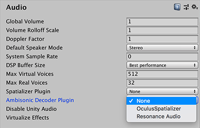

#Ambisonic Audio

##Introduction

This page explains how to play back ambisonics and the changes to our audio plugin interface to support ambisonic audio decoders.

Ambisonics are stored in a multi-channel format. Instead of each channel being mapped to a specific speaker, ambisonics instead represent the soundfield in a more general way. The soundfield can then be rotated based on the listener’s orientation (i.e. the user’s head rotation in XR). The soundfield can also be decoded into a format that matches the speaker setup. Ambisonics are commonly paired with 360-degree videos and can also be used as an audio skybox, for distant ambient sounds.

 

##Selecting an ambisonic audio decoder

Navigate to the project's [Audio](class-AudioManager) settings (main menu: **Edit** > **Project Settings**, then select the **Audio** category). Select an ambisonic decoder from the list of available decoders in the project. There are no built-in decoders that ship with Unity 2017.1, but Google and Oculus each provide one in their audio SDKs for Unity.

##Import an ambisonic audio clip

Import a multi-channel WAV file just like normal. In the audio clip’s inspector window, select the new ambisonic check-box. The WAV file should be B-format, with ACN component ordering, and SN3D normalization.

##Play the ambisonic audio clip through an audio source

Play the ambisonic audio clip through an audio source just like you would any other audio clip. When an ambisonic clip is played, it will first be de-compressed if necessary, then sent through an ambisonic decoder to convert it to the project’s selected speaker mode, then sent through the audio source’s effects.

 There are a couple of things to note related to audio source properties:

* Set spatialize to false. When an ambisonic audio clip is played, it is automatically sent through the project’s selected ambisonic audio decoder. The decoder converts the clip from ambisonic format to the project’s selected speaker format. It also already handles spatialization as a part of this decoding operation, based on the orientation of the audio source and audio listener.

* Reverb zones are disabled for ambisonic audio clips, just like they are for spatialized audio sources.

##Audio plugin interface changes

For plugin authors, please start by reading about the native audio plugin SDK and audio spatializer SDKs in the Unity manual and downloading the audio plugin SDK:

[https://docs.unity3d.com/Manual/AudioMixerNativeAudioPlugin.html](https://docs.unity3d.com/Manual/AudioMixerNativeAudioPlugin.html)

[https://docs.unity3d.com/Manual/AudioSpatializerSDK.html](https://docs.unity3d.com/Manual/AudioSpatializerSDK.html)

[https://bitbucket.org/Unity-Technologies/nativeaudioplugins](https://bitbucket.org/Unity-Technologies/nativeaudioplugins)

There are two changes to AudioPluginInterface.h for ambisonic audio decoders. First, there is a new effect definition flag: UnityAudioEffectDefinitionFlags_IsAmbisonicDecoder. Ambisonic decoders should set this flag in the definition bit-field of the effect. During the plugin scanning phase, this flag notifies Unity that this effect is an ambisonic decoder and it will then show up as an option in the **Audio** settings's list of ambisonic decoders.

Second, there is a new UnityAudioAmbisonicData struct that is passed into ambisonic decoders, which is very similar to the UnityAudioSpatializerData struct that is passed into spatializers, but there is a new ambisonicOutChannels integer that has been added. This field will be set to the DefaultSpeakerMode’s channel count. Ambisonic decoders are placed very early in the audio pipeline, where we are running at the clip’s channel count, so ambisonicOutChannels tells the plugin how many of the output channels will actually be used.

If we are playing back a first order ambisonic audio clip (4 channels) and our speaker mode is stereo (2 channels), an ambisonic decoder’s process callback will be passed in 4 for the in and out channel count. The ambisonicOutChannels field will be set to 2. In this common scenario, the plugin should output its spatialized data to the first 2 channels and zero out the other 2 channels.

The Unity ambisonic sources framework in 2017.1 can support first and second order ambisonics. The plugin interface includes the information to support binaural stereo, quad, 5.1, and 7.1 output, but the level of support is really determined by the plugin. Initially, it is only expected that ambisonic decoder plugins will support 1st order ambisonic sources and binaural stereo output.

There is nothing in the current framework that is specific to any of the different ambisonic formats available. If the clip’s format matches the ambisonic decoder plugin’s expected format, then everything should just work. Our current plan, though, is that Unity’s preferred ambisonic format will be B-format, with ACN component ordering, and SN3D normalization.

----
* 2017-08-10  <!-- include IncludeTextNewPageNoEdit -->
 * New feature in Unity [2017.1](https://docs.unity3d.com/2017.1/Documentation/Manual/30_search.html?q=newin20171) NewIn20171

