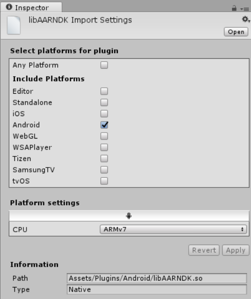

#Native (C++) plug-ins for Android

Unity supports native plug-ins for Android written in C/C++ and packaged in a shared library (.so) or a static library (.a). When using the IL2CPP scripting backend, you can use C/C++ source files as plug-ins and Unity compiles them along with IL2CPP generated files. This includes all C/C++ source files with extensions .c, .cc, .cpp and .h.

To build a C++ plug-in for Android, use the [Android NDK](https://developer.android.com/ndk/index.html) and get yourself familiar with the steps required to build a shared library. The same applies to static libraries.

If you are using C++ to implement the plug-in, you must ensure the methods are declared with C linkage to avoid [name mangling issues](http://en.wikipedia.org/wiki/Name_mangling). By default, only the C source files that have a .c file extension in the plug-ins have C linkage (not C++).

```
extern "C" {
  float Foopluginmethod ();
}
```

After building the library, copy the output .so file(s) into the __Assets/Plugins/Android__ directory in your Unity project. In the Inspector, mark your .so files as compatible with Android, and set the required CPU architecture in the dropdown box:




                                                                                                                   
To call the methods in your native plug-in from within your C# scripts, use the following code:

```
[DllImport ("pluginName")]
private static extern float Foopluginmethod();
```

Note that pluginName should not include the prefix (‘lib’) or the extension (‘.so’) of the filename. It is recommended to wrap all the native plug-in method calls with an additional C# code layer. This code checks [Application.platform](ScriptRef:Application-platform) and calls native methods only when the app is running on the actual device; dummy values are returned from the C# code when running in the Editor. Use [platform defines](https://docs.unity3d.com/Manual/PlatformDependentCompilation.html) to control platform dependent code compilation.

When you use C/C++ source files as plug-ins, you call them from C# in the same way except that you use  `__Internal` for plug-in name, for example:

```
[DllImport ("__Internal")]
private static extern float Foopluginmethod();
```

##Native (C++) plug-in Sample
This [zip archive](../uploads/Examples/AndroidNativePlugin.zip) contains a simple example of a native code plug-in.
This sample demonstrates how C++ code is invoked from a Unity application. The package includes a scene which displays the sum of two values as calculated by the native plug-in. You will need the [Android NDK](https://developer.android.com/ndk/index.html) to compile the plug-in.

<br/>

----
* <span class="page-edit">2018-03-10  <!-- include IncludeTextNewPageSomeEdit --></span>

* <span class="page-history">Updated features in 5.5</span>

* <span class="page-history">Support for using C++ source files and static libraries as plug-ins on Android added in [2018.2](https://docs.unity3d.com/2018.2/Documentation/Manual/30_search.html?q=newin20182) <span class="search-words">NewIn20182</span></span>
