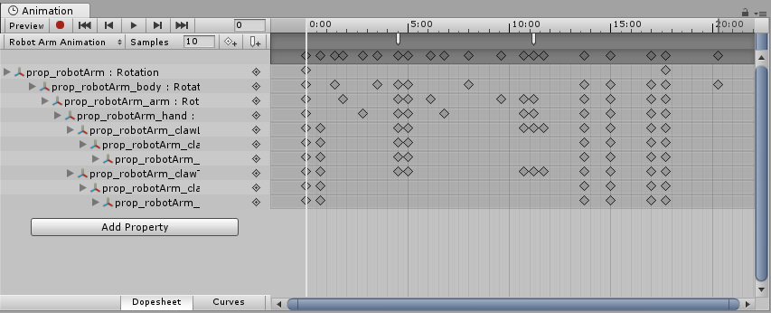

##What's the difference between the Animation window and the Timeline window?

###The Timeline window

The [Timeline window](TimelineEditorWindow) allows you to create cinematic content, game-play sequences, audio sequences and complex particle effects. You can animate many different GameObjects within the same sequence, such as a cut scene or scripted sequence where a character interacts with scenery. In the timeline window you can have multiple types of [track](TimelineTrackList), and each track can contain multiple [clips](TimelineClipsView) that can be moved, trimmed, and blended between. It is useful for creating more complex animated sequences that require many different GameObjects to be choreographed together.

The Timeline window is newer than the Animation window. It was added to Unity in version 2017.1, and supercedes some of the functionality of the Animation window. To start learning about Timeline in Unity, visit the [Timeline section](TimelineSection) of the user manual.

###The Animation window

The [Animation window](AnimationEditorGuide) allows you to create individual [animation clips](animeditor-CreatingANewAnimationClip) as well as viewing [imported animation clips](AnimationsImport). Animation clips store animation for a single GameObject or a single hierarchy of GameObjects. The Animation window is useful for animating discrete items in your game such as a swinging pendulum, a sliding door, or a spinning coin. The animation window can only show one animation clip at a time.

The Animation window was added to Unity in version 4.0. The Animation window is an older feature than the Timeline window. It provides a simple way to create animation clips and animate individual GameObjects, and the clips you create in the Animation window can be combined and blended between using anim [Animator controller](Animator). However, to create more complex sequences involving many disparate GameObjects you should use the Timeline window (see above).

The animation window has a "timeline" as part of its user interface (the horiontal bar with time delineations marked out), however this is separate to the Timeline window.

To start learning about animation in Unity, visit the [Animation section](AnimationSection) of the user manual.

