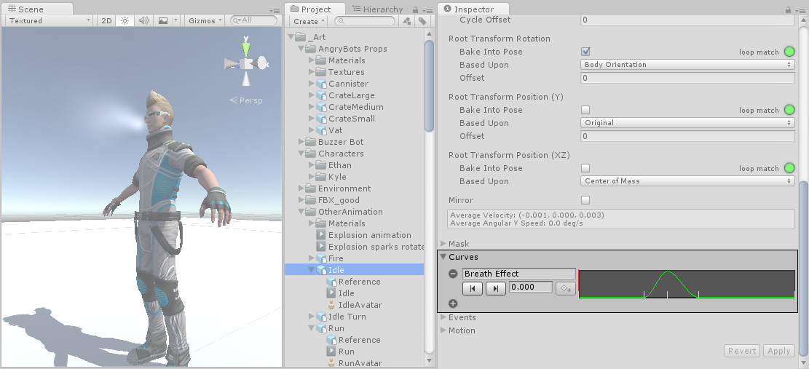
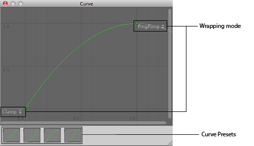

# Curves

You can attach animation curves to imported animation clips in the [Animation tab](class-AnimationClip).

You can use these curves to add additional animated data to an imported clip. You can use that data to animate the timings of other items based on the state of an animator. For example, in a game set in icy conditions, an extra animation curve could be used to control the emission rate of a particle system to show the player's condensing breath in the cold air.

To add a curve to an imported animation, expand the __Curves__ section at the bottom of the [Animation tab](class-AnimationClip), and click the plus icon to add a new curve to the current animation clip:

 

If your imported animation file is split into multiple animation clips, each clip can have its own custom curves. 

 

The curve's X-axis represents _normalized time_ and always ranges between 0.0 and 1.0 (corresponding to the beginning and the end of the animation clip respectively, regardless of its duration). 

 

Double-clicking an animation curve brings up the [standard Unity curve editor](EditingValueProperties) which you can use to add __keys__ to the curve. Keys are points along the curve's timeline where it has a value explicitly set by the animator rather than just using an interpolated value. Keys are very useful for marking important points along the timeline of the animation. For example, with a walking animation, you might use keys to mark the points where the left foot is on the ground, then both feet on the ground, right foot on the ground, and so on. Once the keys are set up, you can move conveniently between key frames by pressing the __Previous Key Frame__ and __Next Key Frame__ buttons. This moves the vertical red line and showa the _normalized time_ at the keyframe. The value you enter in the text box drives the value of the curve at that time. 

## Animation curves and animator controller parameters

If you have a curve with the same name as one of the [parameters](AnimationParameters) in the [Animator Controller](Animator), then that parameter takes its value from the value of the curve at each point in the timeline. For example, if you make a call to [GetFloat](ScriptRef:Animator.GetFloat.html) from a script, the returned value is equal to the value of the curve at the time the call is made. Note that at any given point in time, there might be multiple animation clips attempting to set the same parameter from the same controller. In that case, Unity blends the curve values from the multiple animation clips. If an animation has no curve for a particular parameter, then Unity blends with the default value for that parameter.

---

*  2018-04-25  <!-- include IncludeTextAmendPageSomeEdit -->
