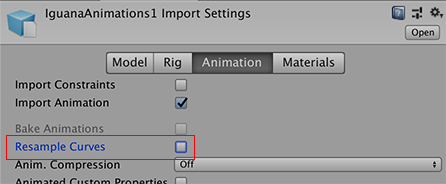
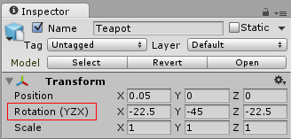
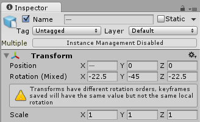

# Euler curve resampling

Rotations in 3D applications are usually represented as Quaternions or Euler angles. For the most part, Unity represents rotations as Quaternions internally; however, it's important to have a basic understanding of [rotation and orientation in Unity](QuaternionAndEulerRotationsInUnity).

When you import files containing animation that come from external sources, the imported files usually contain keyframe animation in Euler format. Unity's default behavior is to resample these animations as Quaternion values and generate a new Quaternion keyframe for every frame in the animation. This minimizes the differences between the source animation and how it appears in Unity. 

There are still some situations where the quaternion representation of the imported animation may not match the original closely enough, even with resampling. For this reason, Unity provides the option to turn off animation resampling. This means that you can use the original Euler animation keyframes at run-time instead.

**Note:** You should only keep the Euler curves as a last resort, if the default Quaternion interpolation between frames gives bad results and causes issues.

## Keeping the original Euler curves on imported animations

To use the original Euler curve values in an animation file, uncheck the __Resample Curves__ option in the [Animation tab](class-AnimationClip):

When you disable this option, Unity keeps the rotation curve with its original keyframes, in Euler or Quaternion mode as appropriate for the curve type. 

**Note:** The FBX SDK automatically resamples any rotation curve on a joint that has pre- or post-rotations. This means that Unity automatically imports them as Quaternion curves.

Unity supports such a wide variety of imported files and attempts to keep the imported curves as close to the original as possible. In order to achieve this, Unity supports all normal (non-repeating) Euler rotation orders, and imports curves in their original rotation orders. 

### Euler values and the Unity engine

When using original Euler (non-resampled) rotations, you can see very little visual difference in the playback of animations. Under the hood, Unity stores these curves in Euler representation even at run-time. However, Unity has to convert rotation values to Quaternions eventually, since the engine only works with Quaternions. 

When you disable the __Resample Curves__ option, Unity keeps the rotation values as Euler values up until they are applied to a GameObject. This means that the end result should look as good as the original, but with an improvement in memory, since rotation curves that have not been baked in the authoring software take up less memory.

### Non-default Euler orders in the Transform Inspector

By default, Unity applies the Euler angles that appear in the Transform Inspector in the Z,X,Y order. 

When playing back or editing imported animations that feature Euler curves with a rotation order different from Unity’s default, Unity displays an indicator of the difference next to the rotation fields:

When editing multiple transforms with differing rotation orders, Unity displays a warning message that the same Euler rotation applied will give different results on curves with different rotation orders:

---

*  2018-04-25  <!-- include IncludeTextAmendPageSomeEdit -->
