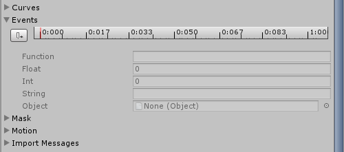
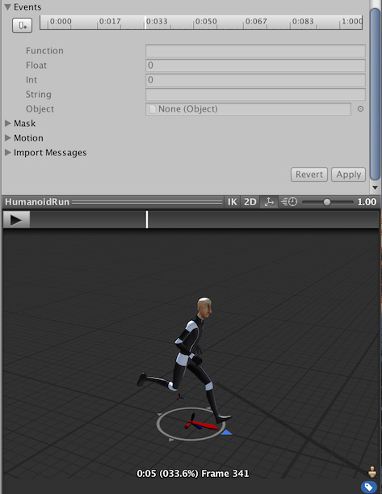
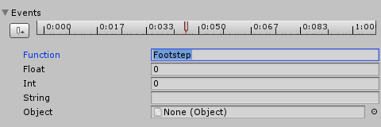

# Events

You can attach animation events to imported animation clips in the [Animation tab](class-AnimationClip).

Events allow you to add additional data to an imported clip which determines when certain actions should occur in time with the animation. For example, for an animated character you might want to add events to walk and run cycles indicating when the footstep sounds should play.

To add an event to an imported animation, expand the Events section to reveal the events timeline for the imported animation clip:

 

To move the playback head to a different point in the timeline, use the timeline in the preview pane of the window:

Position the playback head at the point where you want to add an event, then click __Add Event__. A new event appears, indicated by a small white marker on the timeline. in the __Function__ property, fill in the name of the function to call when the event is reached.

Make sure that any GameObject which uses this animation in its animator has a corresponding script attached that contains a function with a matching event name. 

The example below demonstrates an event set up to call the `Footstep` function in a script attached to the Player GameObject. This could be used in combination with an AudioSource to play a footstep sound synchronised with the animation.

You can also choose to specify a parameter to be sent to the function called by the event. There are four different parameter types: __Float__, __Int__, __String__ or __Object__.

By filling out a value in one of these fields, and implementing your function to accept a parameter of that type, you can have the value specified in the event passed through to your function in the script. 

For example, you might want to pass a float value to specify how loud the footstep should be during different actions, such as quiet footstep events on a walking loop and loud footstep events on a running loop. You could also pass a reference to an effect Prefab, allowing your script to instantiate different effects at certain points during your animation.

---

*  2018-04-25  <!-- include IncludeTextAmendPageSomeEdit -->
