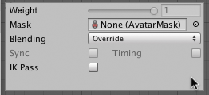
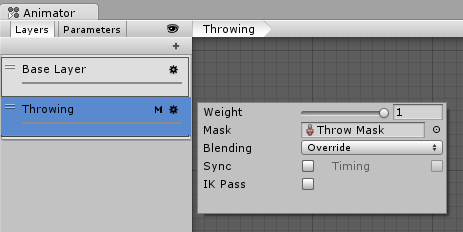
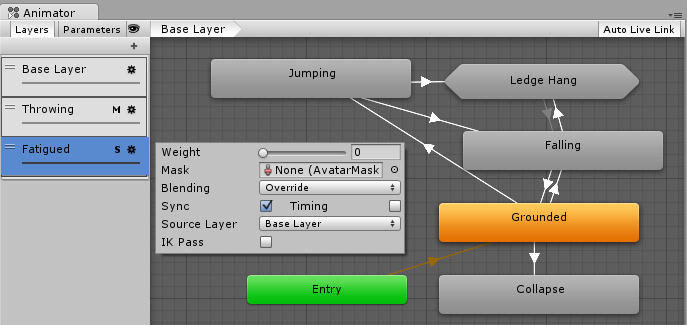

Animation Layers
================

Unity uses __Animation Layers__ for managing complex state machines for different body parts. An example of this is if you have a lower-body layer for walking-jumping, and an upper-body layer for throwing objects / shooting.

You can manage animation layers from the __Layers Widget__ in the top-left corner of the __Animator Controller__. 

 

Clicking the gear wheel on the right of the window shows you the settings for this layer.

 

On each layer, you can specify the mask (the part of the animated model on which the animation would be applied), and the Blending type. __Override__ means information from other layers will be ignored, while __Additive__ means that the animation will be added on top of previous layers.

You can add a new layer by pressing the __+__ above the widget. 

The __Mask__ property is there to [specify the mask used on this layer](class-AvatarMask). For example if you wanted to play a throwing animation on just the upper body of your model, while having your character also able to walk, run or stand still at the same time, you would use a mask on the layer which plays the throwing animation where the upper body sections are defined, like this:

 

An 'M' symbol is visible in the Layers sidebar to indicate the layer has a mask applied.

Animation Layer syncing
-----------------------

Sometimes it is useful to be able to re-use the same state machine in different layers. For example if you want to simulate "wounded" behavior, and have "wounded" animations for walk / run / jump instead of the "healthy" ones. You can click the __Sync__ checkbox on one of your layers, and then select the layer you want to sync with. The state machine structure will then be the same, but the actual animation clips used by the states will be distinct.

This means the Synced layer does not have its own state machine definition at all - instead, it is an instance of the source of the synced layer. Any changes you make to the layout or structure of the state machine in the synced layer view (eg, adding/deleting states or transitions) is done to the source of the synced layer. The only changes that are unique to the synced layer are the selected animations used within each state.

The Timing checkbox allows the animator to adjust how long each animation in synced layers takes, determined by the weight. If Timing is unselected then animations on the synced layer will be adjusted.  The adjustment will be stretched to the length of the animation on the original layer.  If the option is selected the animation length will be a balance for both animations, based on weight.  In both cases (chosen and not chosen) the animator adjusts the length of the animations.  If not chosen then the original layer is the sole master. If chosen, it is then a compromise.

 

An 'S' is symbol is visible in the Layers sidebar to indicate the layer is a synced layer.

---

*  2018-04-25  <!-- include IncludeTextAmendPageSomeEdit -->
