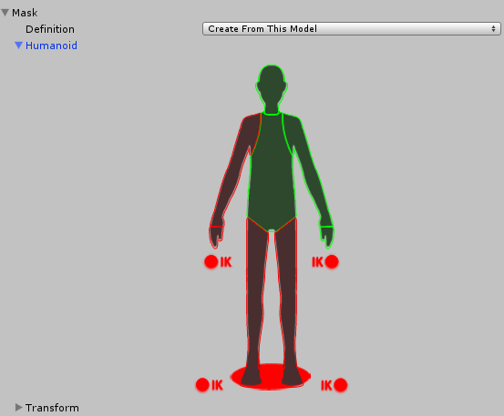
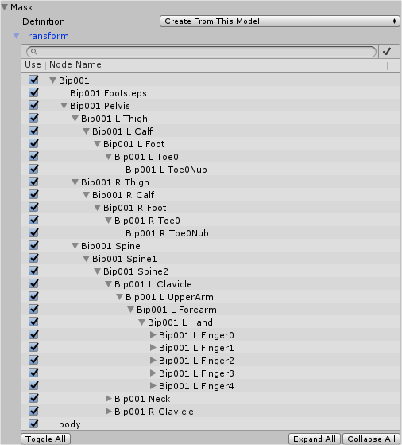

# Mask

Masking allows you to discard some of the animation data within a clip, allowing the clip to animate only parts of the object or character rather than the entire thing.  For example, if you had a character with a throwing animation. If you wanted to be able to use the throwing animation in conjunction with various other body movements such as running, crouching and jumping, you could create a mask for the throwing animation limiting it to just the right arm, upper body and head. This portion of the animation can then be played in a layer over the top of the base running or jumping animations.

Masking can be applied to your build, making filesize and memory smaller. It also makes for faster processing speed because there is less animation data to blend at run-time. In some cases, import masking may not be suitable for your purposes. In that case you can use the layer settings of the Animator Controller to apply a mask at run-time. This page relates to masking in the import settings.

To apply a mask to an imported animation clip, expand the Mask heading to reveal the Mask options. When you open the menu, you'll see three options: Definition, Humanoid and Transform.

 

## Definition

Allows you to specify whether you want to create a one-off mask in the inspector specially for this clip, or whether you want to use an existing mask asset from your project. 

If you want to create a one-off mask just for this clip, choose / Create From This Model /.

If you are going to set up multiple clips with the same mask, you should select / Copy From Other Mask / and use a mask asset. This allows you to re-use a single mask definition for many clips.

When Copy From Other Mask is selected, the Humanoid and Transform options are unavailable, since these relate to creating a one-off mask within the inspector for this clip.

 

## Humanoid

The Humanoid option gives you a quick way of defining a mask by selecting or deselecting the body parts of a human diagram. These can be used if the animation has been marked as humanoid and has a valid avatar.

 

## Transform

This option allows you to specify a mask based on the individual bones or moving parts of the animation. This gives you finer control over the exact mask definition, and also allows you to apply masks to non-humanoid animation clips.

 

---

*  2018-04-25  <!-- include IncludeTextAmendPageSomeEdit -->
