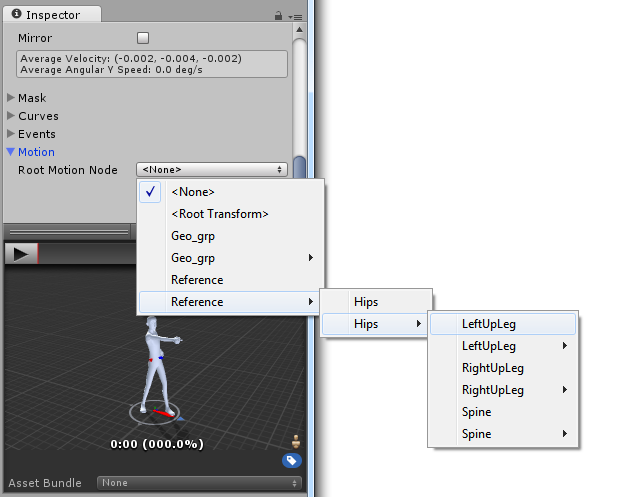

# Motion

When an imported animation clip contains root motion, Unity uses that motion to drive the movement and rotation of the GameObject that is playing the animation. Sometimes however it may be necessary to manually select a different specific node within the hierarchy of your animation file to act as the root motion node.

The Motion field within the Animation import settings allows you to use a hierarchical popup menu to select any node (Transform) within the hierarchy of the imported animation and use it as the root motion source. That object's animated position and rotation drive the animated position and rotation of the GameObject playing back the animation.

To select a root motion node for an animation, expand the Motion section to reveal the Root Motion Node menu. When you open the menu, any objects that are in the root of the imported file's hierarchy appear, including *None* and *Root Transform*. This may be your character's mesh objects, as well as its root bone name, and a submenu for each item that has child objects. Each submenu also contains the child object(s) itself, and further sub-menus if / those / objects have child objects.

 

Once you select the Root motion node, the object's animation drives its motion.

---

*  2018-04-25  <!-- include IncludeTextAmendPageSomeEdit -->
