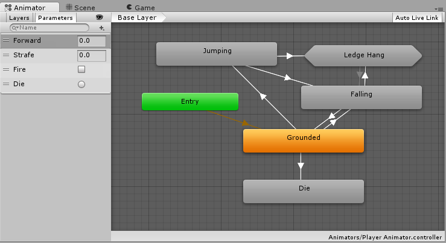

Creating an AnimatorController
==============================

###Animator Controller

You can view and set up character behavior from the __Animator Controller__ view (Menu: __Window__ &gt; __Animation__ &gt; __Animator__).

The various ways an Animator Controller can be created:

* From the __Project View__ by selecting '__Create &gt; Animator Controller__'.

* By right-clicking in the Project View and selecting '__Create &gt; Animator Controller__'.

* From the Assets menu by selecting '__Assets &gt; Create &gt; Animator Controller__'.

This creates a `.controller` asset on disk. In the __Project Browser__ window the icon will look like:

 

###Animator Window
After the state machine setup has been made, you can drop the controller onto the Animator component of any character with an Avatar in the __Hierarchy View__. 

The Animator Controller window contains: 

* The __Animation Layer Widget__ (top-left corner, see [Animation Layers](AnimationLayers))
* The __Event Parameters Widget__ (top-left, see [Animation Parameters](AnimationParameters))
* The visualization of the [State Machine itself](AnimationStateMachines).

 

Note that the Animator Controller Window will always display the state machine from the most recently selected `.controller` asset, regardless of what scene is currently loaded.

