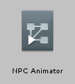
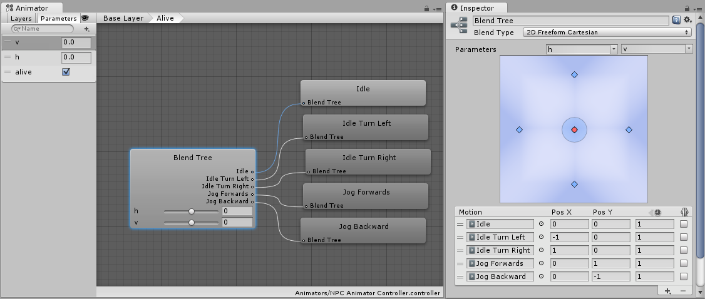
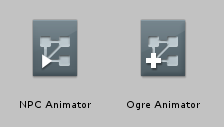
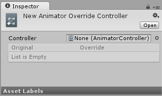
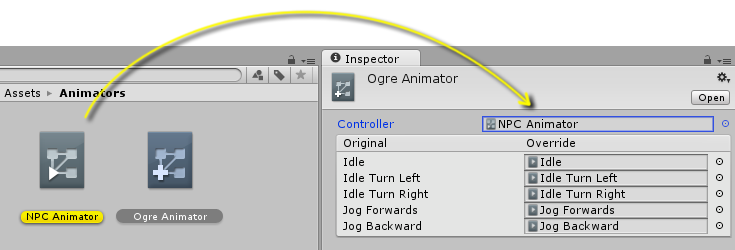
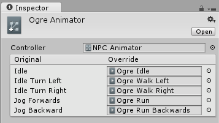
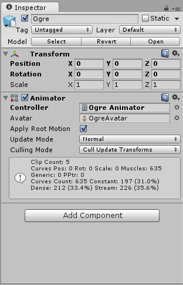

#Animator Override Controllers

The Animator Override Controller is a type of asset which allows you to extend an existing Animator Controller, replacing the specific animations used but otherwise retaining the original's structure, parameters and logic.

This allows you to create multiple variants of the same basic state machine, but with each using different sets of animations. For example, your game may have a variety of NPC types living in the world, but each type (goblin, ogre, elf, etc) has their own unique animations for walking, idling, sitting, etc.

By creating one "base" Animator Controller containing the logic for all NPC types, you could then create an override for each type and drop in their respective animation files.

To demonstrate, here's a typical Animator Controller asset:

This represents an Animator Controller containing a simple state machine with a blend tree controlling animations in four directions, plus an idle animation, looking like this:

To extend this general NPC state machine to use unique animations which just apply to - say - an ogre-type character, you can create an Animator Override Controller and drop in the Ogre's animation clips as replacements to the original animation clips. The Ogre may have a different way of idling and moving around, perhaps with slower, heavier and more muscular motion. However, using an Animator Override Controller, the basic logic for how to transistion and blend between movement states can be shared between different characters with different sets of animation, reducing the work required building and modifying state machines themselves.

To create a new Animator Override Controller, use the **Assets -> Create** menu, or the **Create button** in the Project view, and select Animator Override Controller.

The Animator Override Controller has a very similar icon to the Animator Controller, except that it has a "plus" sign rather than a "play" sign in the corner of the icon:

When you select the new Animator Override Controller in the inspector, it will initially be unassigned, and will look like this:

To begin using the Override Controller, you need to assign the original controller asset to the new Override Controller in the inspector. Once this is done, all the animations used in the original controller will show up as a list in the inspector of the override controller:

You can then assign new animation clips to override the original's clips. In this example, all the clips have been overridden with the "Ogre" versions of the animation.

This Override Controller can now be used in an animator component on the Ogre character's Game Object just as if it was an Animator Controller. It will use the same logic as the original Animator Controller, but play the new animations assigned instead of the originals.

