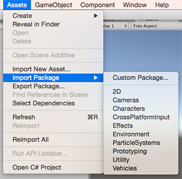
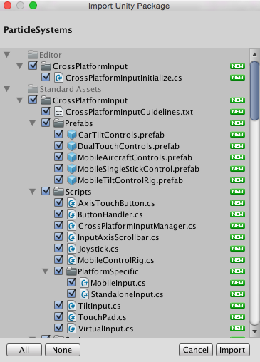
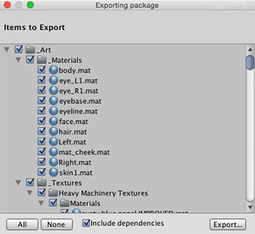

# Asset packages

Unity uses two types of packages:

* **Asset packages**, available on the Unity __Asset Store__, which allow you to share and re-use Unity Projects and collections of Assets.
* **Unity packages**, available through the [Package Manager window](https://docs.unity3d.com/Packages/com.unity.package-manager-ui@latest/index.html). You can import a wide range of Assets, including plug-ins directly into Unity with this type of package. 

This section provides information about using Asset packages in Unity.

## Asset packages

Unity __Standard Assets__ and items on the Unity __Asset Store__ are supplied in packages, which are 
collections of files and data from Unity Projects, or elements of Projects, 
which are compressed and stored in one file, similar to zip files. 
Like zip files, a package maintains its original directory structure when it is unpacked, 
as well as meta-data about Assets (such as import settings and links to other Assets).

In Unity, the menu option __Export Package__ compresses and stores the collection, 
while __Import Package__ unpacks the collection into your currently open Unity Project.

This page contains information on:

* [Importing packages](#ImportingPackages) (both __Standard Asset__ packages and custom packages)
* [Exporting packages](#ExportingPackages) (both new and updated)

## Importing Asset packages
You can import __Standard Asset Packages__, which are Asset collections pre-made and supplied with Unity, and __Custom Packages__, which are made by people using Unity.

Choose __Assets__ &gt; __Import Package__ to import both types of Asset packages.

 

### Importing Standard Assets

Unity __'Standard Assets'__ consist of several different packages: 
__2D, Cameras, Characters, CrossPlatformInput, Effects, Environment, ParticleSystems, Prototyping, Utility, Vehicles__.

To import a new __Standard Asset__ package:

1. Open the Project you want to import Assets into.

2. Choose __Assets__ &gt; __Import Package__ and then select the name of the package you want to import from the list. 
The __Import Unity Package__ dialog box appears with all the items in the package pre-checked, 
ready to install. (See *Fig 2: New install Import Unity Package Dialog Box*.)

3. Select __Import__ and Unity puts the contents of the package into a __Standard Asset__ folder, 
which you can access from your __Project View__. 

 

### Importing custom Asset packages

You can import custom packages which have been exported from your own Projects or from Projects made by other Unity users.

To import a new custom package:

1. Open the Project you want to import Assets into.

2. Choose __Assets__ &gt; __Import Package__ &gt; __Custom Package...__ to bring up up File Explorer (Windows) or Finder (Mac).

3. Select the package you want from Explorer or Finder, and the __Import Unity Package__ dialog box displays, 
with all the items in the package pre-checked, ready to install. (See *Fig 4: New install Import Unity Package dialog box*.)

4. Select __Import__ and Unity puts the contents of the package into the __Assets__ folder, 
which you can access from your __Project View__. 

 

### Upgrading Standard Assets

Standard Assets do not upgrade automatically when you upgrade the Editor.

When you create a new Project in Unity, you can choose to include __Standard Assets__ collections in your Project. Unity copies the Assets you choose to include from the Unity install folder into your new Project folder. This means that if you upgrade your Unity Editor to a newer version, the __Standard Assets__ you have already imported into your Project do not upgrade: you have to manually upgrade them.

***Hint:*** A newer version of a __Standard Asset__ might behave differently in your existing installation (for performance or quality reasons, for example). A newer version might make your Project look or behave differently and you may need to re-tweak its parameters. Check  the package contents and Unity's release notes before you decide to re-install.

## Exporting packages

Use __Export Package__ to create your own __Custom Package__.

1. Open the Project you want to export Assets from.

2. Choose __Assets &gt; Export Package...__ from the menu to bring up the __Exporting Package__ dialog box.
(See *Fig 4: Exporting Package dialog box*.)

3. In the dialog box, select the Assets you want to include in the package by clicking on the boxes so they are checked.

4. Leave the __include dependencies__ box checked to auto-select any Assets used by the ones you have selected. 

5. Click on __Export__ to bring up File Explorer (Windows) or Finder (Mac) and choose where you want to store your package file. 

6. Name and save the package anywhere you like.

***Hint:*** When exporting a package Unity can export all dependencies as well. 
So, for example, if you select a Scene and export a package with all dependencies, then all models, 
Textures and other Assets that appear in the scene will be exported as well. 
This can be a quick way of exporting a bunch of Assets without manually locating them all.

### Updating packages

Sometimes you may want to change the contents of a package and create a newer, updated version of your Asset package. 
To do this:

1. Select the Asset files you want in your package (select both the unchanged ones and the new ones).

2. Export the files as described above in ***Export Package***, above. 

***Note:*** You can re-name an updated package and Unity will recognise it as an update, so you can use incremental naming, for example: MyAssetPackageVer1, MyAssetPackageVer2.

***Hint:*** It is not good practice to remove files from packages and then replace them with the same name:
Unity will recognize them as different and possibly conflicting files and so display a warning symbol when they are imported.
If you have removed a file and then decide to replace it, it is better to give it a different but related name to the original.

Re-install Standard Assets, Upgrade Standard Assets, Upgrading Standard Assets, Install Standard Assets, Installing Standard Assets, Import Standard Assets, Importing Standard Assets

---

*  2018-04-25  <!-- include IncludeTextAmendPageSomeEdit -->

