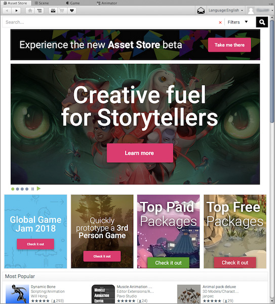
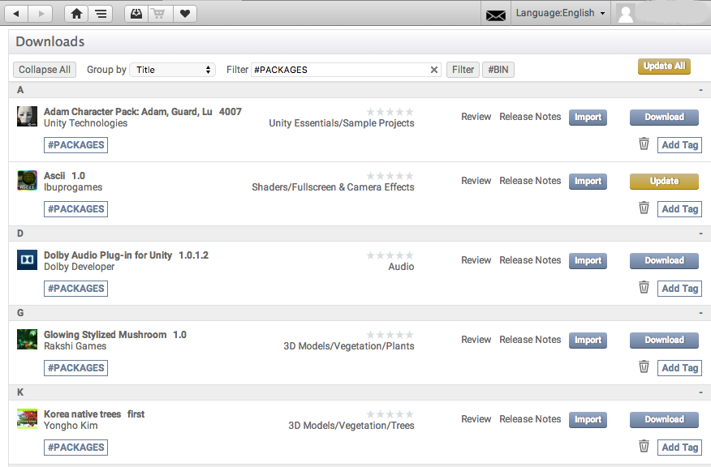

# Using the Asset Store

The Unity __Asset Store__ is home to a growing library of free and commercial Assets created both by Unity Technologies and also members of the community. A wide variety of Assets is available, covering everything from Textures, Models and animations to whole Project examples, tutorials and Editor extensions. You can access the Assets from a simple interface built into the Unity Editor which allows you to [download and import Assets](AssetPackages#ImportingPackages) directly into your Project.

Unity users can become publishers on Asset Store, and sell the content they have created. To find out more, see Asset Store information on [Asset Store Publishing](https://unity3d.com/asset-store/sell-assets).

## Asset Store access and navigation

To open the Asset Store window, select __Window__ &gt; __General__ &gt; __Asset Store__ from the main menu in Unity. During your first visit, you can create a free user account which allows you to log into the Store on future visits and keep track of previous purchases and downloads.

 

The Store provides a browser-like interface which allows you to navigate either by free text search or by browsing packages and categories. Standard navigation buttons appear to the left of the main toolbar which you can use to navigate through your browsing history:

 

The Download Manager and Shopping Cart buttons appear to the right of the navigation buttons which allow you to open the [Download Manager](#downloadmgr) or view the current contents of your shopping cart:

 

The Download Manager allows you to view the packages you have already bought as well as find and install any updates. You can also use it to view the Standard Asset packages supplied with Unity and add them to your Project.

 

## Location of downloaded Asset files

You rarely need to access the files downloaded from the Asset Store directly. However, if you do need to, you can find them in the following paths:

* macOS: `~/Library/Unity/Asset Store`
* Windows: `C:\Users\accountName\AppData\Roaming\Unity\Asset Store`

These folders contain subfolders that correspond to particular Asset Store vendors. The actual Asset files are contained inside the subfolders using a structure defined by the package publisher.

---

*  2018-05-11  <!-- include IncludeTextAmendPageSomeEdit -->

*  2018-04-25  <!-- include IncludeTextAmendPageSomeEdit -->

*  2018-01-31  <!-- include IncludeTextAmendPageSomeEdit -->