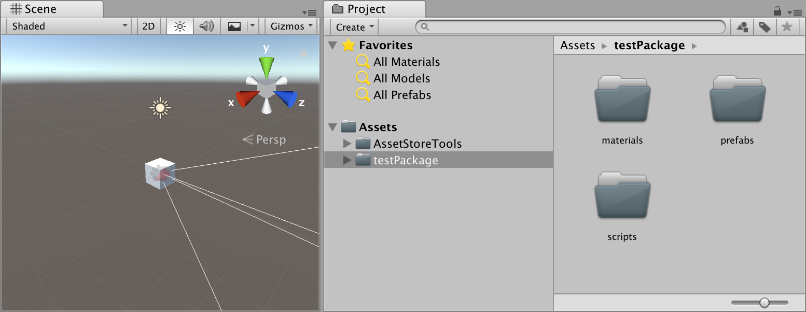
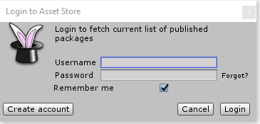
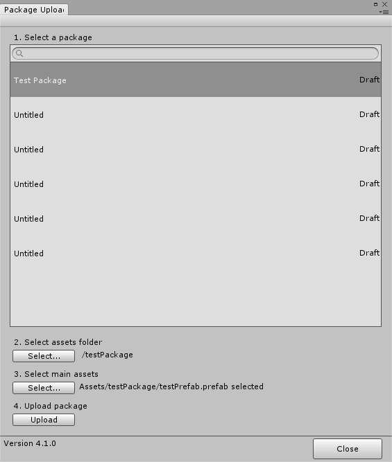
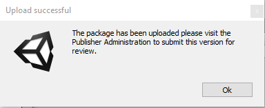
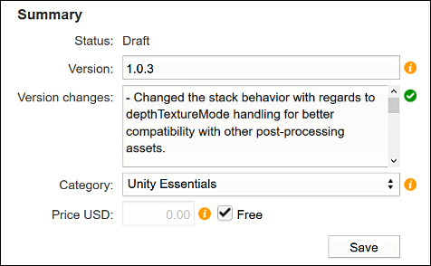
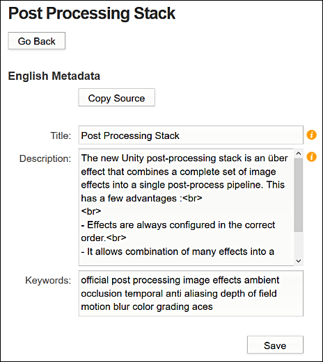
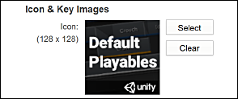
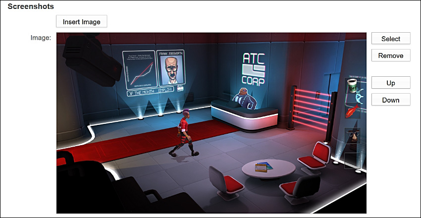
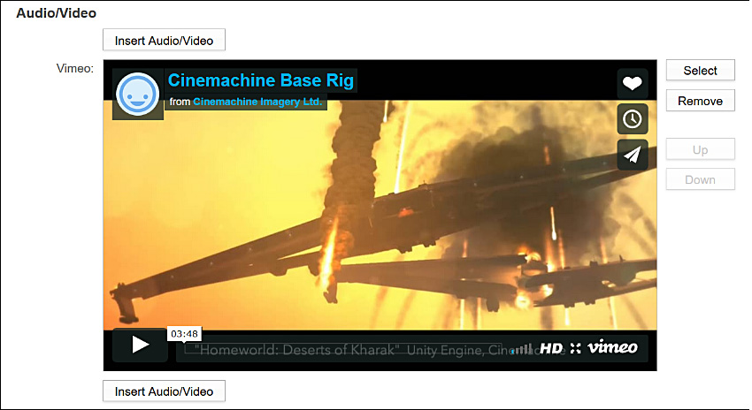

Asset Store Publishing Guide
======================

Creating a Publisher Account
-----

Visit the [Publisher Administration](https://publisher.assetstore.unity3d.com/) page and log in with your Unity Account. If you are not already a Publisher, you will be prompted to create an Asset Store Publisher Account. Fill out the form and save the data to create your account. Unless otherwise noted, the information you provide will be displayed on the Asset Store on your customer-facing Publisher Page ([*Example*](https://www.assetstore.unity3d.com/en/#!/publisher/1950)).

Creating a new package
-----

The first thing you want to do if you are ready to submit an asset is to create a draft for your package. Go to the Packages tab of your [Publisher Administration](https://publisher.assetstore.unity3d.com/packages.html) page and click the button *"Create New Package"*

 

## Uploading a package

To prevent confusion during upload and import for your users, make sure that your submission content is inside a top-level folder that has the same title as your submission. This folder contains all of the components for your Project:

To upload your Asset to the Publisher Administration portal:

1. In the Unity Editor, import the [Asset Store Tools](https://assetstore.unity.com/packages/KATEGORY-MISSING/asset-store-tools-115) into your Project.

1. Go to __Asset Store Tools > Package Upload__. This dialog box appears:

    

1. Enter your Unity Publisher account information into this box. The Package Upload tool fetches your drafts and packages via your Publisher Portal. When the tool has fetched your packages from the Portal, the Package Upload window appears. 

1. Select the folder that contains your entire Project, and then select an Asset to showcase within that Project. If you have multiple draft packages in your publisher account, make sure you click on the package for the Asset you are submitting. The Package Upload window shows the folder and Assets you are uploading:

    

1. Click __Upload__ to connect your Assets to your Publisher Portal. The status bar next to the title of your selected folder shows the progress of the upload. 

When upload is complete, the Editor displays a dialog box to verify that the package is now on your Publisher Portal:

Your package is now available on the Publisher Portal:

Continue to prepare your package submission for review on the Publisher Portal.

Summary
-----

In the summary of your asset you can change things like the ***Version Number*** and the ***Price USD*** of your asset. 

| | |
|:---|:---|
| **Status:** | Current Status of the asset. (*Draft, Published, Declined, Pending*)|
| **Version:** | The version number for your asset ( *eg; 1.5, 1.6, 1.7* ) |
| **Version Changes:** | A place to enter notes on what you have changed to the asset (*mainly used for updates*) |
| **Price USD:** | The price you wish for customers to buy your asset for. |

Naming your asset and adding a description
-----
You can change the name of your asset by clicking the Edit link below the *"Metadata"* tab under **Metadata and Artwork**.

| | |
|:---|:---|
| **Title:** | This is the name of your asset. *This field is required*|
| **Description:** | This is the description of your asset ( *Description may only contain the EM, STRONG, A, P and BR tags* ) |

**Tagging your Description:**

The description section of your asset requires tags in order to use bold text or break to a new line. Here is a table below to help you.

| | |
|:---|:---|:---|
| **Bold:** |This allows you to make the containing text bold | &lt;strong&gt;Bold Text&lt;/strong&gt;|
| **Italic:** | This allows you to make the containing text italic|&lt;e&gt;italic text &lt;/em&gt; |
| **Link:** | This allows you to add a URL link|&lt;a href = "url"&gt;My Link&lt;/a&gt;|
| **Break:** |This allows you to make a line break| &lt;br&gt;|
| **Paragraph:** | This Defines a paragraph.| &lt;p&gt;A Paragraph &lt;/p&gt;|

Adding Key Images
-----

You can change the Key Images of your asset by clicking the Edit link below the ***"Key Images"*** tab under **Metadata & Artwork**.

**Upload and Remove Image:**
Click on the ***Select*** button to upload the image and Click ***Clear*** to remove it.

**Icon & Key Image Sizes:**

| | |
|:---|:---|
| **Icon:** | 128 x 128 (*pixels*)|
| **Small:** | 200 x 258 (*pixels*) |
| **Large:** | 860 x 389 (*pixels*) |

**Eye Catching:**
These key images must aim to capture the eyes of customers just as a colorful cartoon captures the eyes of children. A lot of customers browse on the asset store and can commonly buy under impulse. Your Key images must help your asset stand out.

Icon Images:

The Icon Image is the most common key image that users will see. Here are a few well made icon images from the asset store as examples:

Adding Screenshots
-----
You can change the screenshots attached to your asset by clicking the Edit link below the ***"Screenshots"*** tab under **Metadata & Artwork**.

Click the **"Insert Image"** button in order to upload the image and add it as a screenshot for your asset. You can add multiple screenshots this way. Remove a screenshot by clicking the **"Remove"** button next to the image you wish to remove.

The **"Up"** and **"Down"** buttons allow you to put your screenshots into any order you like.

**How screenshots :**

Screenshots are just as important as key images when trying to sell your asset. Your asset may be the best asset in the world, however, if your screenshots do not communicate that then it will not sell.

Adding screenshots and making them help sell your asset

Adding Audio and Video
-----

You can change the name of your asset by clicking the Edit link below the ***"Audio/Video"*** tab under **Metadata & Artwork**.

This allows you to add Audio or Video to the asset and embed it in the show reel with the screenshots of your asset. This is done by providing a link to either of the services below:

| |
|:---|
| **YouTube** |
| **Vimeo** |
| **SoundCloud** |
| **MixCloud** |
| **SketchFab** |

Adding Audio/Video to your asset

Deleting a Draft
-----

You can delete a draft by clicking the drop down text field under the Packages tab of your [Publisher Administration](https://publisher.assetstore.unity3d.com/) page and selecting draft. This will deisplay your drafts.

Click on the name of the draft you wish to delete and click on the ***"Delete Draft"*** button below the **Metadata & Artwork** section at the bottom of the page.

----
* 2018-06-29 <!-- include IncludeTextNewPageSomeEdit -->
