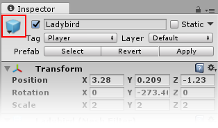
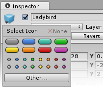
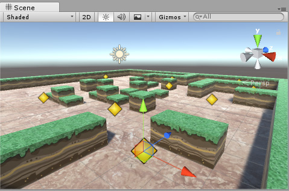
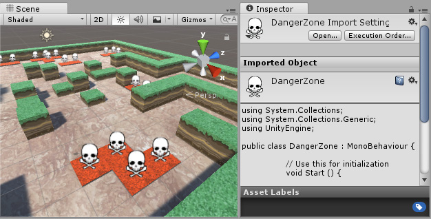

# Assigning icons

Unity allows you to assign custom icons for GameObjects and scripts. These icons display in the Scene view, along with built-in icons for items such as Lights and Cameras. Use the [Gizmos menu](GizmosMenu) to control how icons are drawn in the Scene view.

### GameObject Select Icon button

To change the icon for a GameObject, select the GameObject in the Heirarchy window or Scene view, then click the __Select Icon__ button (the blue cube, highlighted with a red square in the image below) in the Inspector window to the left of the GameObject’s name.

When you assign an icon to a GameObject, the icon displays in the Scene view over that GameObject (and any duplicates made afterwards). You can also assign the icon to a Prefab to apply the icon to all instances of that Prefab in the Scene.

### Script Select Icon button

To assign a custom icon to a script, select the script in the Project window, then click the __Select Icon__ button (the C# file icon, highlighted with a red square in the image below) in the Inspector window to the left of the script’s name.

When you assign an icon to a script, the icon displays in the Scene view over any GameObject which has that script attached.

## The Select Icon menu

Whether you are assigning an icon to a GameObject or a Script, the pop-up __Select Icon__ menu is the same:

The __Select Icon__ menu has built-in icons. Click on an icon to select it, or click __Other…__ to select an image from your project Assets to use as the icon.

The built-in icons fall into two categories: __label icons__ and __image-only icons__. 

__Label icons__

Assign a label icon to a GameObject or script to display the name of the GameObject in the Scene view.

__Image-only icons__

Image-only icons do not show the GameObject’s name. These are useful for assigning to GameObjects that may not have a visual representation (for example, navigation waypoints). With an icon assigned, you can see and click on in it the Scene view to select and move an otherwise invisible GameObject.

Any Asset image in your project can also be used as an icon. For example, a skull and crossbones icon could be used to indicate danger areas in your level.

**Note:** When an Asset’s icon is changed, the Asset itself is marked as modified and therefore picked up by version control systems.