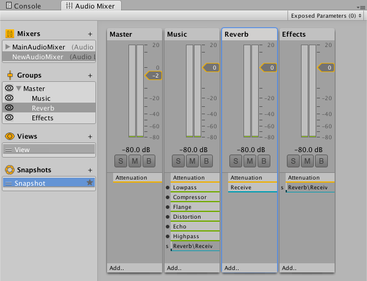

#Audio Mixer

The Unity Audio Mixer allows you to mix various audio sources, apply effects to them, and perform mastering.

##Audio Mixer Window

The window displays the Audio Mixer which is basically a tree of Audio Mixer Groups.  An Audio Mixer group is essentially a mix of audio, a signal chain which allows you to apply volume attenuation and pitch correction; it allows you to insert effects that process the audio signal and change the parameters of the effects.  There is also a send and return mechanism to pass the results from one bus to another.

 

An Audio Mixer is an asset. You can create one or more Audio Mixer and have more than one active at any time. An Audio Mixer always contains a master group. Other groups can then be added to define the structure of the mixer.

###How it works

You route the output of an [Audio Source](class-AudioSource) to a group within an Audio Mixer.  The effects will then be applied to that signal.

The output of an Audio Mixer can be routed into any other group in any other Audio Mixer in a scene enabling you to chain up a number of Audio Mixers in a scene to produce complex routing, effect processing and snapshot applying.

###Snapshots

You can capture the settings of all the parameters in a group as a snapshot.  If you create a list of snapshots you can then transition between them in gameplay to create different moods or themes.

###Ducking

Ducking allows you to alter the effect of one group based on what is happening in another group.  An example might be to reduce the background ambient noise while something else is happening.

###Views

Different views can be set up.  You can disable the visibility of certain groups within a mixer and set this as a view.  You can then transition between views as required.

