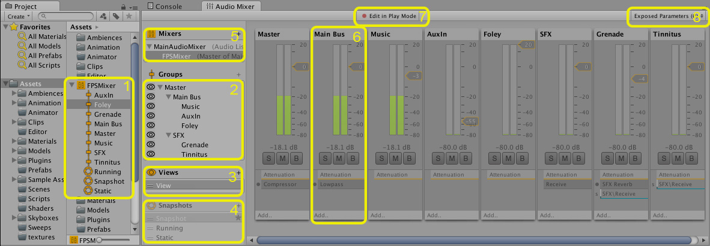
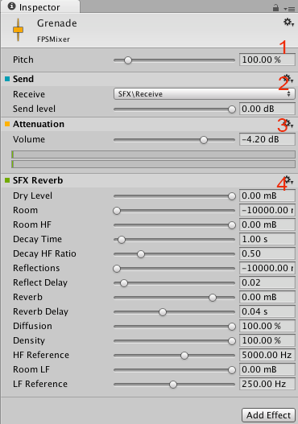
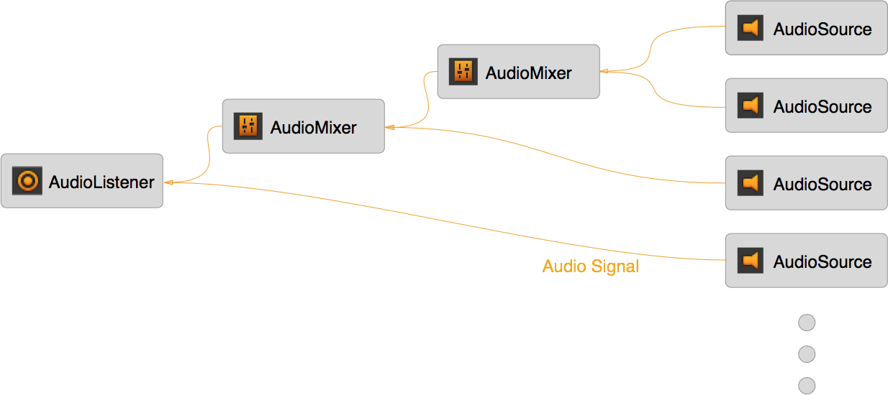
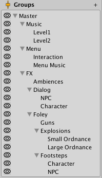

#An overview of the concepts and AudioMixer

The AudioMixer is an Asset that can be referenced by AudioSources to provide more complex routing and mixing of the audio signal generated from AudioSources. It does this category based mixing via the AudioGroup hierarchy that is constructed by the user inside the Asset.

DSP effects and other audio mastering concepts can be applied to the audio signal as it is routed from the AudioSource to the AudioListener.

##AudioMixer View

 

1. The Asset - Containing all AudioGroups and AudioSnapshots as sub-assets.
1. The Hierarchy view - This contains the entire mixing hierarchy of AudioGroups within the AudioMixer.
1. The Mixer Views - This is a list of cached visibility settings of the mixer. Each view only shows a sub-set of the entire hierarchy in the main mixer window.
1. Snapshots - This is a list of all the AudioSnapshots within the AudioMixer Asset. Snapshots capture the state of all the parameter settings within an AudioMixer, and can be transitioned between at runtime.
1. The Output AudioMixer - AudioMixers can be routed into AudioGroups of other AudioMixers. This property field allows one to define the output AudioGroup to route this AudioMixer signal into.
1. AudioGroup Strip View - This shows an overview of an AudioGroup, including the current VU levels, attenuation (volume) settings, Mute, Solo and Effect Bypass settings and the list of DSP effects within the AudioGroup.
1. Edit In Play Mode - This is a toggle that allows you to edit the AudioMixer during play mode, or prevent edits and allow the game runtime to control the state of the AudioMixer.
1. Exposed Parameters - This shows a list of Exposed Parameters (any parameter within an AudioMixer can be exposed to script via a string name) and corresponding string names.

##AudioMixer Inspector

 

1. The Pitch and Ducking settings are present at the top of all AudioGroups.
1. An example Send Effect, positioned before where the attenuation is applied.
1. The Attenuation (volume setting) is done here for an AudioGroup. The Attenuation can be applied anywhere in the effect stack. The VU meter here shows the volume levels at that point in the effect stack (different from the VU meters shown in the AudioMixer view which show the levels of the signal as it leaves the AudioGroup.
1. An example effect with parameters, in this case a Reverb. Parameters can be exposed by right clicking on them and choosing to expose them.

##Concepts 

###Routing and Mixing

[http://en.wikipedia.org/wiki/Audio_mixing](http://en.wikipedia.org/wiki/Audio_mixing) 

Audio routing is the process of taking a number of input audio signals and outputting 1 or more output signals. The term signal here refers to a continuous stream of digital audio data, which can be broken down into digital audio channels (such as stereo or 5.1 (6 channels)).

Internally there is usually some work on these signals being done, such as mixing, applying effects, attenuation etc. For various reasons that will be covered, this is an important aspect of audio processing and this is what the AudioMixer is designed to allow you to do.

With the exception of Sends and Returns (which will be covered later), the AudioMixer contains AudioGroups that allow any number of input signals, mix those signals and have exactly 1 output.

 

In the land of audio processing, this routing and mixing is usually done ORTHOGONAL to the scene graph hierarchy, as audio behaves and designers interact with audio very differently to objects and concepts shown in the scene.

In previous versions of Unity, the concept of routing and mixing was not available. Users were able to place AudioSources within the scene, and the audio signal that they produced (via AudioClips for example) was routed directly to the AudioListener, where all the audio signals were mixed together at one point. Remember here that this is happening orthogonal to the scene graph and no matter where your AudioSources are in the scene, 

AudioMixers now sit between the AudioSource and the AudioListener in the audio signal processing space and allow you to take the output signal from the AudioSource perform whatever routing and mixing operations they wish until finally all audio is output to the AudioListener and is heard from the speakers.

####Why do any of this stuff?

Mixing and routing allows you to categorise the audio within their game into whatever concepts they desire. Once sound is mixed together into these categories, effects and other operations can be applied to these categories as a whole. This is powerful not only applying game logic changes to the various sound categories, but also for allowing designers to tweak the various aspects of the mix to perform whats knows as "Mastering" of the entire soundscape dynamically at runtime.

####Relation to 3D spatial attenuation

Some sound concepts are related to the scene graph and the 3D world. The most obvious of those is the application of attenuation based on 3D distance, relative speed to the AudioListener and environmental Reverb effects.

As these operations are related to the scene and not to the categories of sounds in an AudioMixer, the effects are applied at the AudioSource, before the signal enters an AudioMixer. For example, the attenuation applied to an AudioSource based on its distance from the AudioListener is applied to the signal before it leaves the AudioSource and is routed into an AudioMixer.

###Sound Categories

As stated above, AudioMixers allow you to effectively categorise types of sounds and do stuff to these categories. This is an important concept, because without such categorisations, the entire soundscape quickly becomes a mess of indistinguishable noise as every sound is played back equally and without any mixing applied to them. With concepts such as ducking, categories of sounds can also influence each other, adding additional richness to the mix.

Examples of operations that designers might want to do on a category are;

* Apply attenuation to a group of ambiences.
* Trigger a lowpass filter on all the foley sounds in a game, simulating being underwater.
* Attenuate all sounds in the game except the Menu music and interaction sounds.
* Reduce the volume of all the gun and explosion sounds in a game to ensure that an NPC talking to you can be heard.
* etc...
 
These categories are really quite game specific and vary between different projects, but an example of such categorisation might be described as follows;

* All sounds are routed into the "Master" AudioGroup
* Into the Master group, there is a category for Music, Menu sounds and all game sounds
* The game sounds group is broken down into dialog from NPCs, environmental sounds from ambiences and other foley sounds like gunshots and footsteps
* These categories are broken further down as required

The category hierarchy of this layout would look something like this:

 

Note that the scene graph layout would look nothing like the layout for sound categories.

###Moods and Themes of the Mix

Mixing and routing of the games sounds can also be used to create the immersion the designer is looking for. For example, reverb can be applied to all of the game sounds and the music attenuated to create the feeling of being in a cave.

The AudioMixer can be used effectively to create moods within the game. Using concepts such as snapshots (explained later) and other different mixers within a game, the game can transition its mood easily and emote the player into feeling what the designer wishes, which is super powerful in the immersion of the game.

###The Global Mix

The AudioMixer is used to control the overall mix of all the sounds within a game. These AudioMixers control the global mix and can be seen as the static singleton mix that sound instances are routed through.

In other worlds, the AudioMixers are always present through the lifetime of a scene, and sound instances are created and destroyed as the game progresses and play through these global AudioMixers.

###Snapshots

Snapshots allow you to capture the state of an AudioMixer, and transition between these different states as the game progresses. This is a great way to define moods or themes of the mix and have those moods change as the player progresses through the game.

Snapshots capture the values of all of the parameters within the AudioMixer;

* Volume
* Pitch
* Send Level
* Wet Mix Level
* Effect Parameters

Combining Snapshots with game logic is a great way to change many aspects of the soundscape.