# Best Practice: Setting up the Lighting Pipeline

## Definitions

First, let’s go through the definitions of several important graphics rendering terms that you will encounter frequently in this guide.

* A **render pipeline** determines how the objects in your scene are displayed, in three main stages. 
    * The first step is **culling**; it lists the objects that need to be rendered, preferably the ones visible to the camera (frustum culling) and unoccluded by other objects ([occlusion culling](https://docs.unity3d.com/Manual/OcclusionCulling.html)). 
    * The second stage, **rendering**, is the drawing of these objects, with the correct lighting and some of their properties, into pixel-based buffers. 
    * Finally, **post-processing** operations can be carried out on these buffers, for instance applying color grading, bloom and depth of field, to generate the final output frame that is sent to a display device. These operations are repeated many times a second, depending on the frame rate.
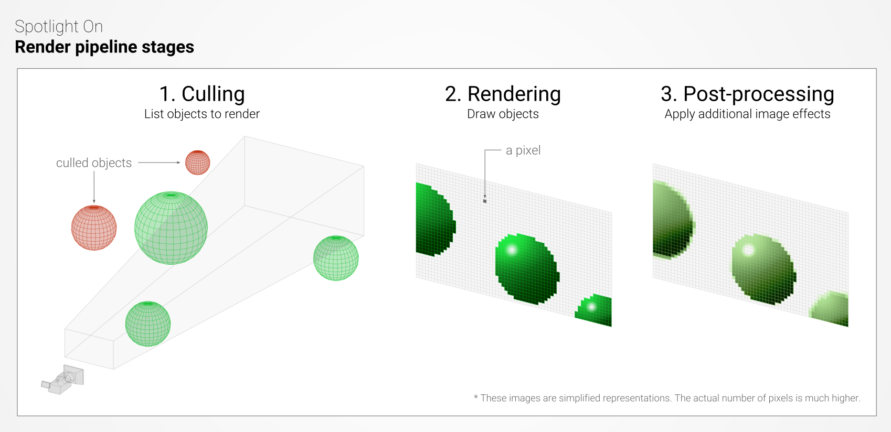

* A **Shader** is a generic name for a program, or a collection of programs, running on the graphics processing unit (GPU). For instance, after the culling stage is completed, a vertex shader is used to transform the vertex coordinates of the visible objects from “object space” into a different space called “clip space”; these new coordinates are then used by the GPU to rasterize the scene, i.e. convert the vectorial representation of the scene into actual pixels. At a later stage, these pixels will be colored by pixel (or fragment) shaders; the pixel color will generally depend on the material properties of the respective surface and the surrounding lighting. Another common type of shader available on modern hardware is **compute shaders**: they allow programmers to exploit the considerable parallel processing power of GPUs for any kind of mathematical operations, such as light culling, particle physics, or volumetric simulation.

* **Direct lighting** refers to lighting which originates from a self-emitting source of light, such as a light bulb, and isn’t the result of light bouncing off a surface. Depending on the size of the light source and its distance to the receiver, such lighting typically produces clear distinct shadows.
    * Direct lighting should not be confused with **directional lighting**, which is light emitted by an infinitely-distant light source (e.g. the computer-simulated sun). The noticeable properties of a directional light are the ability to cover the entire scene with parallel light rays, and the lack of distance falloff (or light decay); that is, the amount of lighting received does not decay as the distance to the light source increases. 
    * In reality, the sunlight, like any other source of light, falls off over distance, based on the inverse-square law. Simply put, the amount of received light drops very quickly when increasing the distance between the receiver and the light source. For example, the illuminance on Mercury is almost [7 times higher](https://www.nasa.gov/audience/foreducators/9-12/features/F_How_Far_How_Faint.html) than on Earth, and Mars receives nearly half of Earth’s sunshine, whereas Pluto enjoy a mere 0.06%. Nevertheless, for most real-time applications with a very limited altitude range, the sunlight decay is insignificant. Therefore, the directional light is perfectly adequate to simulate sunlight in most Unity scenes, including large, planet-centric, open worlds. For other types of light such as Point and Spot, Unity now offers physically-based falloffs when you choose the High-Definition Render Pipeline.

* **Indirect lighting** results from light bouncing off surfaces and being transmitted and scattered through a medium, such as the atmosphere or a translucent material. Under these conditions, occluders generally cast soft to indiscernible shadows.

* **Global illumination (GI)** is used to generate the indirect lighting in the scene, primarily as a function of the direct lighting. There are several methods for GI, such as baked/dynamic lightmaps, irradiance volumes, light propagation volumes, baked/dynamic light probes, voxel-based GI, and distance field-based GI. Out of the box, Unity supports baked/dynamic lightmaps and light probes. 
    * A **lightmapper** is the underlying system that generates the data for the lightmaps and light probes by shooting light rays, calculating the light bounces, and applying the resulting lighting into textures. Different lightmappers will therefore often produce different lighting looks, as they might rely on different techniques to produce the lighting data. Currently, Unity offers two lightmappers: Enlighten and the Progressive Lightmapper. Many more details about the GI systems and their lightmappers will be provided in an upcoming section of this guide.

## Overview

The following flowchart provides a high-level perspective of the entire lighting pipeline in Unity, from the point of view of a content creator.

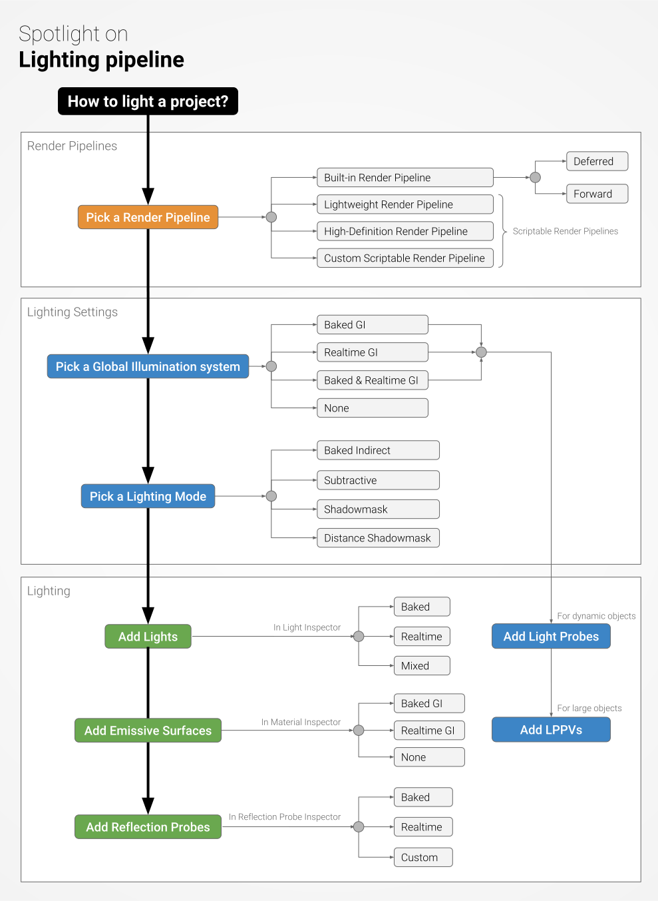

You start by selecting a render pipeline. Then you decide how the indirect lighting is generated and pick a Global Illumination system accordingly. After you’ve made sure all the global lighting settings are tuned appropriately for your project, you can continue adding [Lights](https://docs.unity3d.com/Manual/Lighting.html), [Emissive Surfaces](https://docs.unity3d.com/Manual/StandardShaderMaterialParameterEmission.html), [Reflection Probes](https://docs.unity3d.com/Manual/class-ReflectionProbe.html), [Light Probes](https://docs.unity3d.com/Manual/LightProbes.html), and [Light Probe Proxy Volumes (LPPVs)](https://docs.unity3d.com/Manual/class-LightProbeProxyVolume.html). Detailing the usage and features of all these lighting objects is beyond the scope of this article, therefore I encourage you to read the Lighting section of the manual to learn how to utilize them correctly in your projects.

## Render pipelines

Until early 2018, only one render pipeline was available in Unity; it has been renamed the “Built-In Render Pipeline.” This renderer offers a choice between forward and deferred rendering. 

- In (multi-pass) forward mode, all objects in the scene are rendered one by one sequentially, potentially in multiple passes, depending on the number of lights affecting each object, thus the rendering cost can dramatically increase when objects are lit by multiple lights. This type of renderer commonly offers a wide variety of shaders and can handle transparency easily.
- In deferred mode, all the (opaque) geometries are first rendered into buffers that store information about their materials (color, specular, smoothness, etc.). In a later pass (hence “deferred”), each pixel is shaded sequentially: the rendering time will depend mainly on the number of lights affecting each pixel. The transparent objects, and certain objects with complex shaders, will still require additional forward rendering passes. Deferred rendering is usually recommended when dealing with scenes containing many dynamic lights, such as artificially lit interiors or projects with a combination of outdoor and indoor lighting. 

In January 2018, we unveiled the Scriptable Render Pipeline (SRP), which allows you to customize the rendering loop via C# scripting. This is actually a minor revolution in the realm of game engines: users are finally able to personalize the culling of objects, their drawing, and the post-processing of the frame without having to use a low-level programming language like C++.

Unity currently provides two preview SRPs that are designed with performance in mind and for modern hardware:

- The High-Definition Render Pipeline (HDRP) is a hybrid deferred/forward tile/cluster renderer. It offers advanced rendering and shading features and is designed for PC and console projects that require a high degree of visual fidelity.

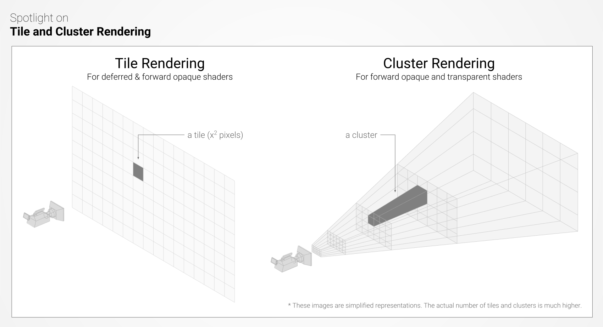

A tile is a small 2-dimensional square pixel section of the frame, and a cluster is a 3-dimensional volume inside the camera frustum. Both the tile and cluster rendering techniques rely on the listing of the lights affecting every single tile and cluster, whose lighting can then be computed in one single pass with the corresponding list of known lights. Opaque objects will most likely be shaded using the tile system, whereas transparent ones will rely on the cluster system. The main advantage this renderer offers are the faster processing of the lighting and the considerable reduction in bandwidth consumption compared to the Built-In Render Pipeline (deferred), which depends on much slower multi-pass light accumulation.

- The Lightweight Render Pipeline (LWRP) is a fast single-pass forward renderer; it has been designed for  devices with lower real-time lighting requirements in mind, such as smartphones, tablets and XR devices. The lights are culled per-object and allow for the lighting to be computed in one single pass, which results in reduced draw calls compared to the Built-In Render Pipeline.

You can now use the following decision chart to quickly find out which render pipeline you should select based on a few critical criterias.

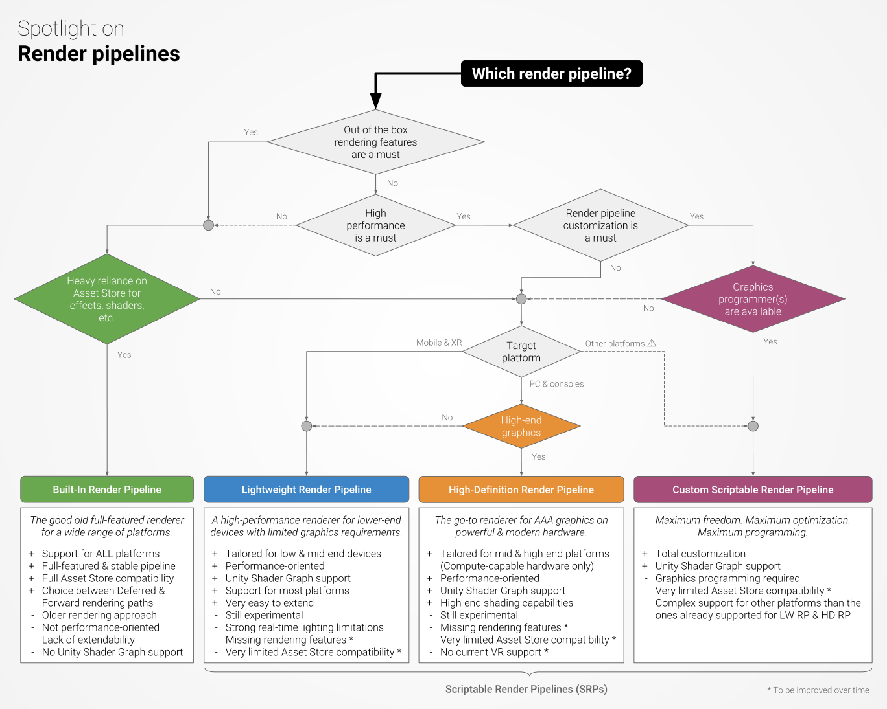

### Templates

You can download the latest versions of the HDRP and LWRP via the Unity Package Manager (Window > Package Manager). The easiest way to get started with one of these SRPs is to create a new project with the [Unity Hub](https://docs.unity3d.com/Manual/GettingStartedInstallingHub.html) and use one of the corresponding templates.

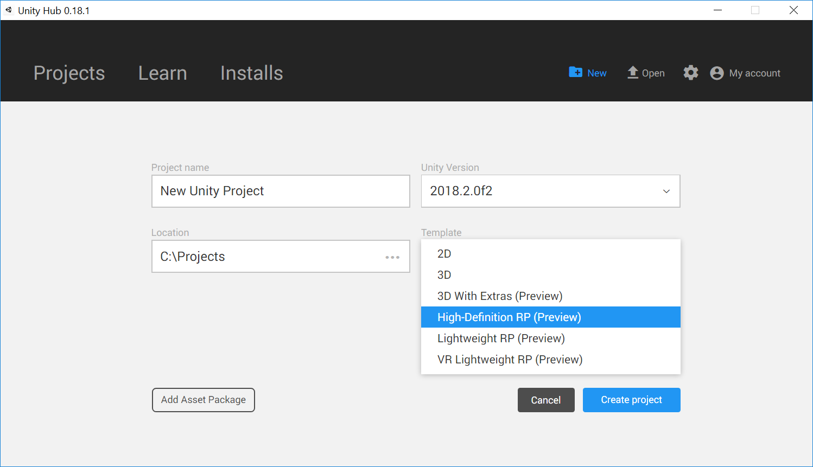

### Manual setup

If you want to set up your project for the HDRP or LWRP by hand, ensure you have the required package installed. Then create a new asset in your Project window via Create > Rendering > High Definition Render Pipeline Asset. Drag this asset into the [Graphics](class-GraphicsSettings) settings. In case you selected the HDRP, ensure the linear color space is selected in the **Player** settings for your platform and add a Rendering > Scene Settings object into your scene.

When no pipeline asset is assigned in the [Graphics](class-GraphicsSettings) Project Settings window, Unity will use the default Built-In Render Pipeline.

### Extensibility

If you have some rendering knowledge and are familiar with C#, experimenting with the SRP concept to create your own Custom Scriptable Render Pipeline is definitely recommended if you need to fully tailor the renderer for your project. The LWRP is especially easy to extend, due to its smaller shader library and the ability to inject, remove and swap rendering passes easily.

### Compatibility

Porting your project’s materials from the Built-In Render Pipeline to the HDRP or to the LWRP is relatively easy in Unity, thanks to a 1-click material converter under Edit > Render Pipeline > Upgrade…; be aware, however, that it is a non-reversible action. Backing up your project beforehand is highly recommended!

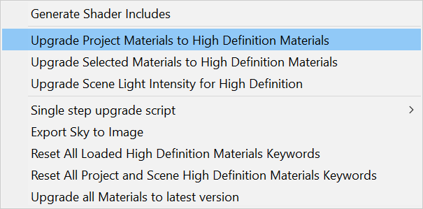

Nevertheless, custom shaders will have to be ported by hand, so transitioning from the Built-In Render Pipeline to the HDRP or LWRP during production might be time-consuming, depending on the number of custom shaders you would have to rewrite.

Additionally, because the High-Definition Render Pipeline is more physically correct than the Built-In Render Pipeline, especially regarding light attenuation and distribution, you should not expect your project to look identical after switching to HDRP. 

Furthermore, the HDRP and the LWRP are not cross-compatible, as they do not share the same rendering features. Porting your project from HDRP to LWRP and vice versa is possible, but it is not a 1-click operation and will require manual rework of the lighting, the materials and the shaders!

Finally, the HDRP and the LWRP are still in preview and Unity is hard at work ensuring they will be production-ready very soon. Please be aware that not all features have been implemented yet for both pipelines. For instance, certain lighting modes that I detail below are not yet fully available for the LWRP, and XR is not yet properly supported by the HDRP.

## Global Illumination systems

Two Global Illumination systems are available in Unity. These can be enabled in Window > Rendering > Lighting Settings.

1. (Precomputed) Realtime Global Illumination: This system entirely relies on [Enlighten](https://docs.unity3d.com/Manual/GI-Enlighten.html), a third-party lighting middleware. During the precomputation in Unity, Enlighten goes through two lengthy stages, among others: Clustering and Light Transport. The first one consists in simplifying the scene into a collection of surface patches called clusters, and the second, in calculating the visibility between these clusters. This precomputed data is used at runtime to generate the indirect lighting interactively. The strength of Enlighten relies the ability to edit the lighting in realtime, as the precomputed data relies on the relation between clusters. However, like in other traditional lightmapping techniques, editing the static geometries in your scene will trigger a new precomputation. 

2. Baked Global Illumination: The lighting is baked into textures called lightmaps, and into Light Probes. The Baked GI system can use one of the following lightmappers: 

    1. [Progressive Lightmapper](https://docs.unity3d.com/Manual/ProgressiveLightmapper.html)
    2. [Enlighten](https://docs.unity3d.com/Manual/GI-Enlighten.html)

The Progressive Lightmapper can prioritize the computation of the lighting for objects visible to the camera and greatly speed up the iteration on the lighting, at the cost of increasing the overall baking time for the entire scene. The Progressive Lightmapper uses the CPU to calculate the indirect lighting using path tracing. A new [GPU Progressive Lightmapper](https://www.youtube.com/watch?v=cRFwzf4BHvA) is currently in development and will radically reduce the baking time for your scenes. 

Because both Enlighten and the Progress Lightmapper use different methods to produce the baked lighting, you should not expect the resulting lighting to match exactly when comparing them.

Have a look at the diagram below to decide which Global Illumination system is recommended for your project, as well as its main advantages and disadvantages

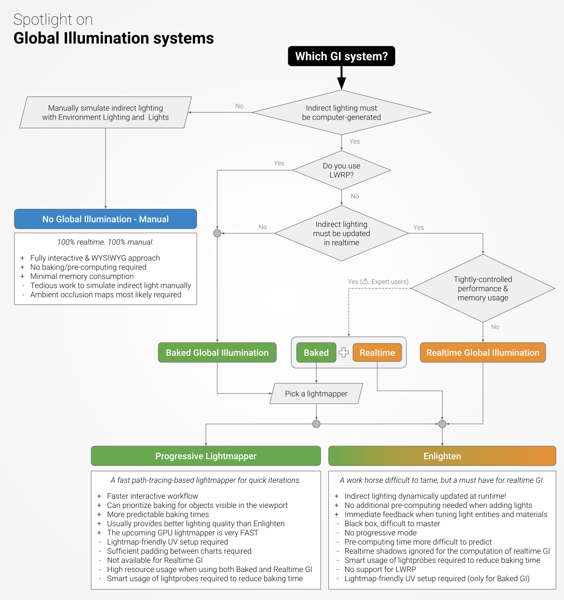

### Static versus Dynamic

No matter which Global Illumination system you use, Unity will only consider objects that are marked as “Lightmap Static” during the baking/precomputing of the lighting. Dynamic (i.e. non-static) objects have to rely on the Light Probes you placed throughout the scene to receive indirect lighting.

Because the baking/precomputing of the lighting is a relatively slow process, only large and complex assets with distinct lighting variations, such as concavity and self-shadowing, should be tagged as “Lightmap Static”. Smaller and convex meshes that receive homogeneous lighting should not be marked as static, and they should therefore receive indirect lighting from the [Light Probes](https://docs.unity3d.com/Manual/LightProbes.html) which store a simpler approximation of the lighting. Larger dynamic objects can rely on [LPPVs](https://docs.unity3d.com/Manual/class-LightProbeProxyVolume.html), in order to receive better localized indirect lighting. Limiting the number of objects tagged as “Lightmap Static” in your scene is absolutely crucial to minimize baking times while maintaining an adequate lighting quality. You can learn more about this optimization process and the importance of Probe lighting in this [tutorial](https://unity3d.com/learn/tutorials/topics/graphics/introduction-precomputed-realtime-gi?playlist=17102).

### Warning

Unity allows both the Baked and Realtime GI systems to be active simultaneously, which gives you access to all lighting features. However, you must be warned that enabling both systems greatly increases the baking time and the memory usage at runtime because these systems do not rely on the same data sets. Furthermore, the interactive update of the indirect lighting at runtime will put additional strain on the CPU, and you can expect discrepancies when visually comparing the indirect lighting provided by the Baked and the Realtime GI systems, as they rely on different techniques to simulate the indirect lighting and often operate at significantly different resolutions. 

You should restrict the usage of both GI systems to high-end platforms and/or to projects that have tightly controlled scenes with predictable costs. This approach should only be used by expert users who have a very good understanding of all lighting settings because managing both systems adds great complexity. Consequently, picking one of the two GI systems is usually a safer strategy for most projects. Using both systems is rarely recommended!

## Light modes

The mode of a light is a property that is a common source of confusion. Most importantly, the mode of a light is only relevant if the Baked Global Illumination system is enabled.

There are three modes available in the Light Inspector:

1. Baked: The direct and indirect lighting from these lights are baked into lightmaps, which can be a time-consuming process. There is no runtime cost to process these lights, however applying the resulting lightmaps to the scene does have a minor cost.
2. Realtime: The direct lighting and shadows from these lights are real-time and therefore not baked into lightmaps. Their runtime cost can be high, depending on the complexity of the scene, the number of shadow casting lights, the number of overlapping lights, etc. Furthermore, if you enable Realtime Global Illumination, further performance loss will incur in order to update the indirect lighting at runtime. 
3. Mixed: This is a hybrid mode that offers a mix of baked and real-time features, such as baked indirect lighting and real-time direct lighting. The behavior of all Mixed lights in your scene and their performance impact will depend on the chosen global mixed Lighting Mode that I describe in the next section.

If you do not use any GI system or only use the Realtime GI system, then all Baked and Mixed lights will be overridden to Realtime!

 

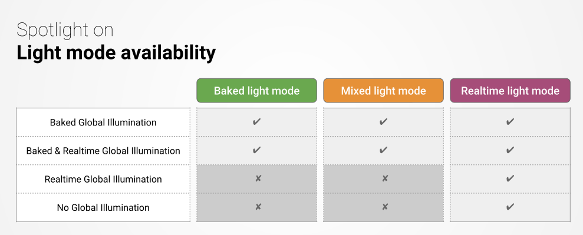

The following diagram combines a decision flowchart with a comparison table; it can help you decide which light mode is appropriate every time a new light is added into the scene.

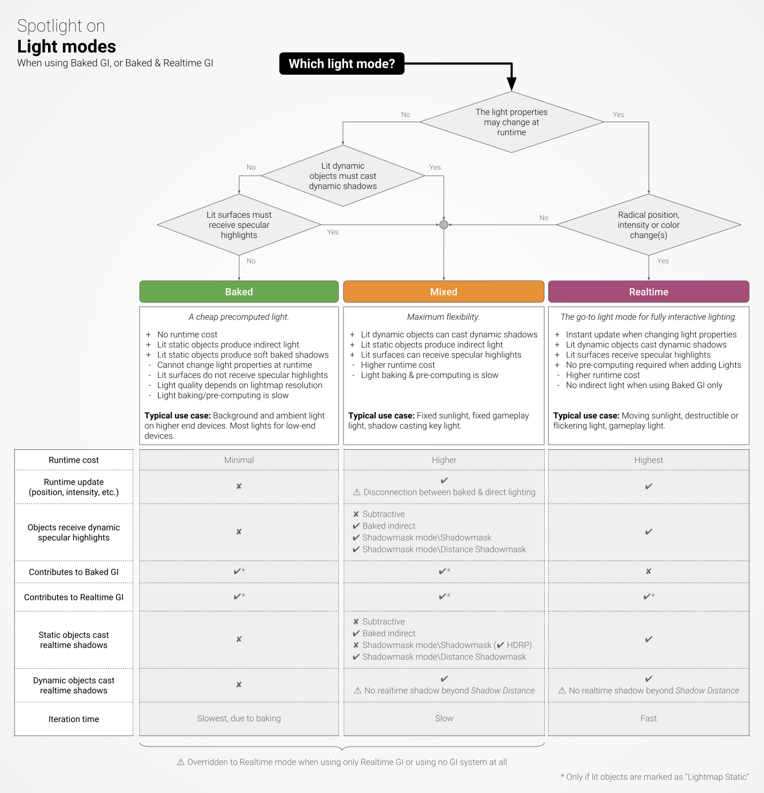

### Mixed lighting modes

As you can see in the previous diagram, Mixed lights have specific baked and real-time capabilities, depending on the global mixed Lighting Mode that you picked in the Lighting > Settings window.

There are four modes to choose from:

1. Subtractive
2. Baked Indirect
3. Shadowmask Mode: Shadowmask
4. Shadowmask Mode: Distance Shadowmask

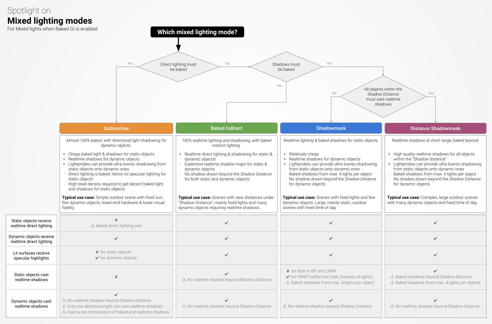

The Shadowmask mode and the Shadow Distance can be tuned under **Edit** > **Settings** > **Quality**. When using the HDRP, the Shadowmask mode is enabled in the HDRenderPipelineAsset assigned in the **Graphics** settings, whereas the shadow Max Distance is set in the Scene Settings object.

The HDRP supports a new hybrid Shadowmask Mode. You can control whether a specific light should cast real-time shadows via the Non Lightmapped Only checkbox in Additional Settings. If this parameter is used, then the light will cast real-time dynamic shadows when the camera is within the Fade Distance of the light, otherwise it will fall back to the baked Shadowmask. The main advantage of this new mode for HDRP is the ability to use the baked Shadowmask for specific lights that are within the Shadow Distance used by the main directional light, instead of real-time shadows.

## Pipeline comparison table

The LWRP and HDRP are still in preview, which means that on the one hand they bring exciting new features to the table, but on the other hand, they might not support certain functions offered by the Built-In Pipeline yet, or drop support for others. The following table gives you an overview of the current state of the lighting pipeline for Unity 2018.3.

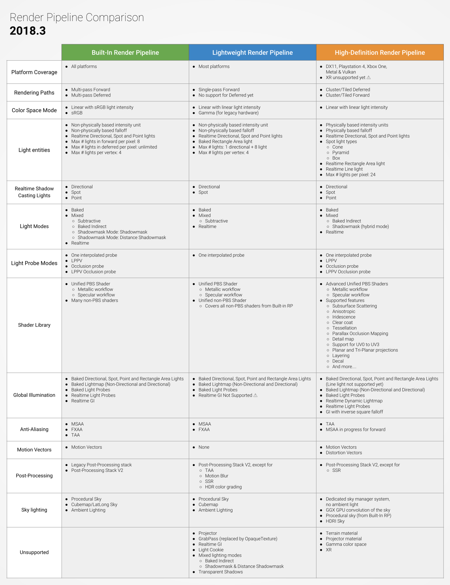

## Lighting scenarios

Now that we have introduced the render pipelines and the main lighting features, let’s have a look at a few examples of projects and see which settings could be used to light them. Since every project is unique, you might use slightly different options based on your requirements.

### 1. Prototype or quick previsualization

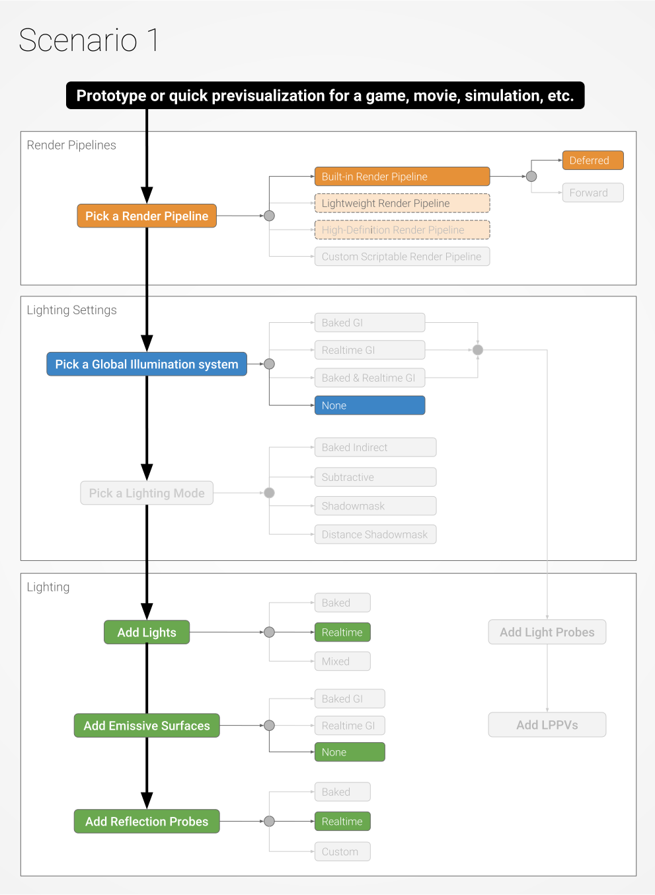

If you heavily rely on the Asset Store to build your prototype, the Built-In Render Pipeline could be the only suitable render pipeline, as most assets found on the Store are not fully compatible with the HDRP and LWRP; nonetheless, asset compatibility will improve over time. If you are building all the assets from the ground up and already have a clear idea of your project’s requirements, then you could pick one of the two SRPs (i.e. LWRP or HDRP) or create a custom one.

When you are in the early stage of (pre-)production and need a quick turnaround and maximum flexibility for the lighting, you might prefer a full real-time approach that does not require any precomputation, therefore you might want to turn off both the Baked and Realtime GI systems. To alleviate the lack of proper indirect lighting, you can enable Screen Space Ambient Occlusion from the [Post Processing Stack V2](https://github.com/Unity-Technologies/PostProcessing): it can help ground the object in the scene by offering cheap real-time contact shadows.

### 2. 3D Mobile strategy game

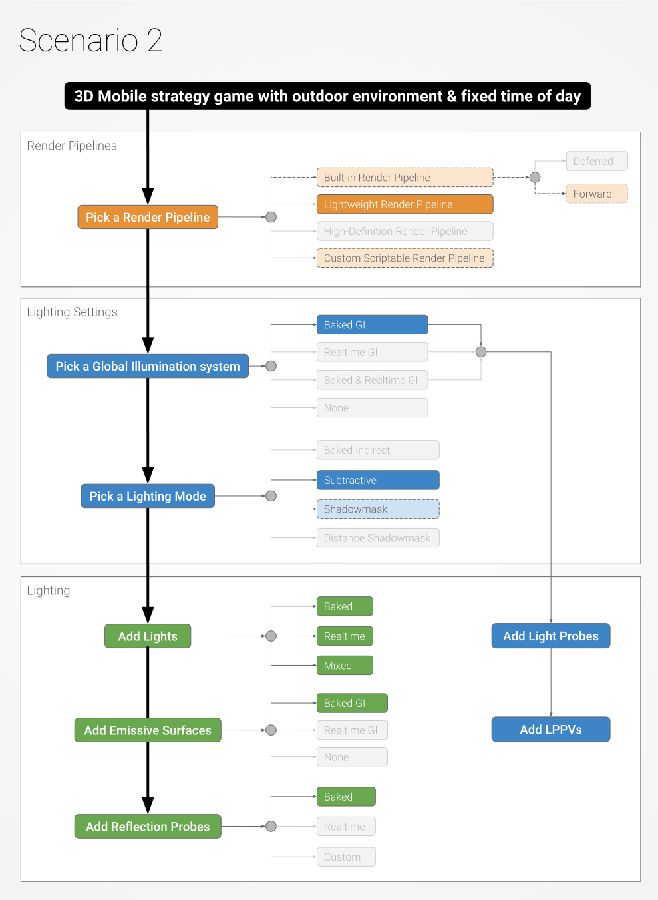

If you are targeting mobile devices, the LWRP could be a great candidate to ensure solid performance for your strategy game. If the rendering pipeline needs to be customized to better suit your game, a graphics programmer will probably find extending the LWRP straightforward.

If you pick the LWRP and use Baked Global Illumination, be aware that at the moment, only the Subtractive Lighting Mode is available for the Mixed lights. Support for Baked Indirect and Shadowmask will be added in a later release.

Alternatively, if you decide to stick to the older Built-In Render Pipeline because, for example, you rely on many assets from the Asset Store, all global mixed lighting modes are supported. In this case, an approach with the Shadowmask Lighting Mode will provide baked shadows while still allowing dynamic objects to cast real-time shadows. If Shadowmasks are too expensive for your project, you can fall back to the cheapest Subtractive mode. Finally, the forward rendering path is probably the best option if you have a very small number of lights in your level(s), and if you’re targeting older hardware.

### 3. AAA corridor shooter (fixed time of day)

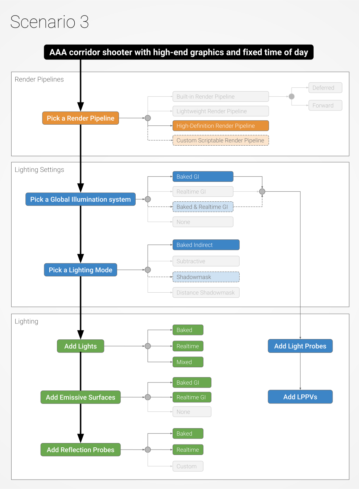

If you are aiming for AAA-quality visuals on PC and consoles for your linear first-person shooter, the HDRP should be the preferred render pipeline. Again, with the help of graphics programmers, a custom SRP could also be developed.

If your levels contain many real-time shadow casting lights (e.g. destructible light props and moving lights), then using the Baked GI system with the Baked Indirect mode should ensure you get great looking indirect lighting from the Mixed directional light and the Baked lights in static light props. If your levels consist of a larger proportions of fixed shadow casting lights, then an approach with Shadowmasks could be recommended because the HDRP offers a great hybrid Shadowmask mode which gives you more control over the blend between real-time and baked shadows.

Because this type of linear game is generally highly-predictable in terms of performance and memory consumption, both the Baked and Realtime GI systems could be activated simultaneously. However, as explained in the [Global Illumination section](https://docs.google.com/document/d/1eEhL5VvQb1AhoQQaK_DIQBVKjo1ETAB8HtxbgPV7b2o/edit#heading=h.joffqn5j7ada), using both systems concurrently will significantly increase the performance cost and the baking time, and it should only be used by expert users who understand all the technical implications!

### 4. Battle royale (day-night cycle)
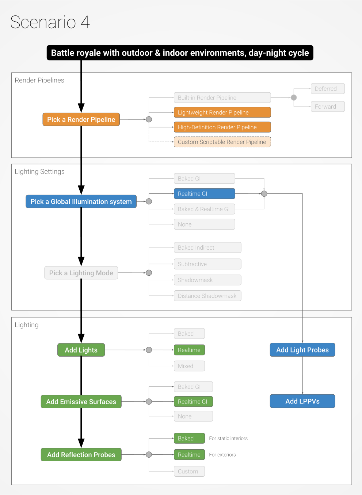

If you plan to release a battle royale game for PC and consoles, that features large-scale environments and fully dynamic lighting, you should select the HDRP, or extend it to tailor the rendering pipeline to your project. You could consider the LWRP if you are not aiming for AAA visual fidelity and are targeting mobile devices or systems with lower specifications.

In order to accommodate for the day-night cycle, if you selected the HDRP, the Realtime GI system should be activated to simulate the indirect lighting at any time of day. To maximize performance in certain densely lit interiors, you could set the Indirect Multiplier of certain lights at 0, if you want the Realtime GI system to ignore these and minimize their rendering cost. 

The LWRP does not support the Realtime Global Illumination system: the day-night cycle would have to be handled with a custom script that would, for instance, modulate the sun and ambient color throughout the day.

For this particular scenario, activating both the Realtime GI and the Baked GI systems is not recommended, because the resulting overhead in terms of performance and scene management for an immense level could be critical. Another argument against the use of both GI systems is the unpredictable nature of such large-scale multiplayer game: performance estimations are for instance more difficult than in a highly-scripted single player adventure.

## Final words

The rendering landscape has changed radically in Unity over the past months thanks to the introduction of the Scriptable Render Pipelines. Therefore, keeping up with all these changes and their implications for the lighting pipeline can be exhausting. 

Hopefully, this guide and its many illustrations have given you a better understanding of the capabilities of each render pipeline so that you can confidently light your projects in Unity with the appropriate lighting settings!

You can learn more about the lighting in Unity and the rendering pipelines with the following articles:

- [Introduction to Lighting and Rendering tutorial](https://unity3d.com/learn/tutorials/topics/graphics/introduction-lighting-and-rendering?playlist=17102)
- [Use the Unity Hub to get started with HDRP, LWRP or Built-In RP](https://docs.unity3d.com/Manual/ProjectTemplates.html)
- [Creating Believable Visuals tutorial (Built-In RP)](https://unity3d.com/learn/tutorials/s/creating-believable-visuals)
- [Lightweight Render Pipeline on GitHub](https://github.com/Unity-Technologies/ScriptableRenderPipeline/wiki/Lightweight-Render-Pipeline)
- [High-Definition Render Pipeline on GitHub](https://github.com/Unity-Technologies/ScriptableRenderPipeline/wiki/High-Definition-Render-Pipeline-overview)

---

* 2018-08-17<!-- include IncludeTextNewPageNoEdit -->
