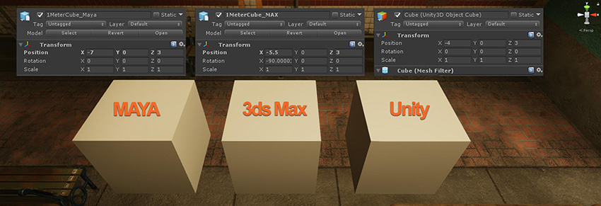
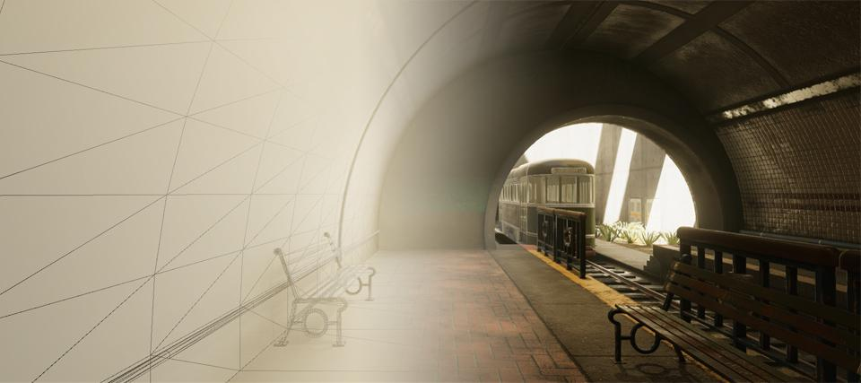
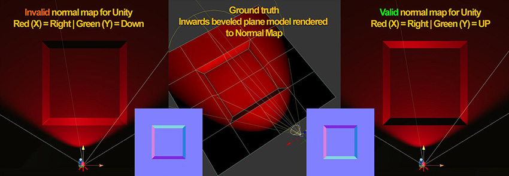

# Preparing Assets for Unity

The first step is to get your Assets into a format suitable for what you want to do. It’s very important to set up a proper workflow from your 3D modeling application, such as Autodesk® 3ds Max®, Autodesk® Maya®, Blender, and Houdini, into Unity. When [exporting assets from 3D modeling applications for import into Unity](HOWTO-importObject), you need to consider:

* [Scale and units](#scale)
* [Point of reference scale model](#scaleModel)
* [Texture output and channels](#textures)
* [Normal map direction](#normalMap)

## Scale and units

Your project scale, and your preferred unit of measurement, play a very important role in a believable Scene. In many “real world” setups, we recommend you assume 1 Unity unit = 1 meter (100cm), because many physics systems assume this unit size. For more advice, see the [Art Asset best practice guide](HOWTO-ArtAssetBestPracticeGuide).

To maintain consistency between your 3D modeling application and Unity, always validate the imported GameObject scale and size. 3D modeling applications have units and scale settings in the FBX export configuration (see the documentation for your 3D modelling software for configuration advice). Generally, the best way to match the scale when importing to Unity is to set these tools to work in centimeters, and export FBX at automatic scale. However, you should always check that the unit and scale settings match when starting a new project.

To quickly validate your export settings, 
In your 3D modeling application, create a simple 1x1x1m cube and import it into Unity.
In Unity, create a default Cube (__GameObject__ > __3D Object__ > __Cube__). This is 1x1x1m. Use this as a scale reference to compare with your imported model. 
These cubes should look identical when the Transform component’s __Scale__ property is set to 1,1,1 in the Inspector:

**Note**:

* Autodesk® Maya® and Autodesk® 3ds Max® can override your default unit, depending on the last opened file.
* 3D modeling applications can display different units in the workspace to their internal unit settings, which might cause some confusion.

## Point of reference scale model

When blocking out a Scene with placeholders or sketching geometry, having a point of reference scale model can be helpful. Choose a point of reference scale model that is appropriate for the Scene you’re making. In the Spotlight Tunnel Sample Scene case, we use a park bench:

Your Scene doesn’t have to use exactly the same proportions as real life. Using a point of reference scale model simply allows consistencies of scale to be relative between GameObjects, even if the Scene is intended to have exaggerated proportions.

## Texture output and channels

The information inside a texture needs to contain the correct information to give a proper result when added to a Material. Texture authoring software, such as Photoshop and Substance Painter, outputs consistent and predictable textures when you configure them correctly. 

Here’s an example of a pre-set configuration for Substance Painter to output textures for use with a Unity Standard Opaque material:

The texture assignment in the Unity Standard Material is:

|**Output maps for export** |**Assignment in Unity Standard Shader Material** |
|:---|:---|
|$textureSet_Albedo| Assigned to Albedo. |
|$textureSet_MetallicAOGloss | Assigned to Metallic and Occlusion.Smoothness Source set to Metallic Alpha. |
|$textureSet_Normal | Assigned to Normal Map Slot. |

**Note**: Packing multiple channels to a single texture, such as the MetallicAOGloss, saves texture memory compared to exporting Ambient Occlusion (AO) as a separate texture. This is the best way of working with a Unity Standard Material.

When creating textures, it’s important not to mix up the alpha channel. The example below shows how transparency in a PNG file can be confusing to author in Photoshop because of the way Photoshop deals with a PNG alpha channel (without using an external plugin). In this case, an uncompressed 32-bit TGA with a dedicated alpha channel might be a better option, assuming the source texture file size is not an issue:

The transparent PNG file shown above was created in Photoshop with its alpha channel coming through as a black value. The TGA with a dedicated alpha channel shows the expected value. As you can see above, when each texture assigned to the Standard Shader material reads smoothness data from the alpha channel, the smoothness of the material with PNG textures is unexpectedly inverted, while the smoothness of the material with TGA textures is normal.

## Normal map direction

Unity reads tangent space normal maps with the following interpretation:

* Red channel X+ as __Right__
* Green channel Y+ as __Up__

For example, a Autodesk® 3ds Max® __Render to Texture__ normal map outputs the Green Channel Y+ as __Down__ by default. This causes an inverted surface direction along the Y axis and creates invalid results when lit. To validate the normal map direction, create a simple plane with concave bevel (middle picture on the example below) and bake it to a flat plane. Then assign the baked normal map into a plane in Unity with identifiable light direction and see if any of the axes are inverted.

For advice on axis settings, refer to your 3D modelling application’s documentation.

---

* 2018-04-19  <!-- include IncludeTextNewPageSomeEdit -->
* Making believable visuals Best Practice Guide added in Unity 2017.3
