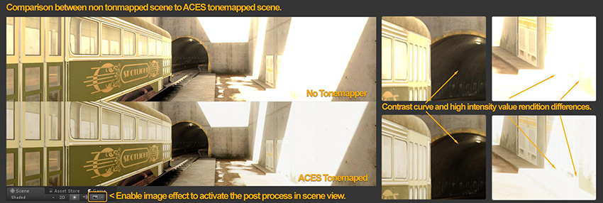

# Preparing render settings in Unity

The following advice helps you understand how to use Unity’s rendering features to realistically mimic the real world, and quickly achieve your project’s believable visual goal. This covers:

* [Linear rendering mode](#linear)
* [Rendering mode](#rendering)
* [Enabling post-processing](#enablePP)
* [High Dynamic Range (HDR) Camera](#hdrCamera)
* [HDR Light map encoding (optional)](#hdrLightmap)
* [Enabling Image Effects for viewport](#imageEffects)

For more in-depth information, see Unity’s [lighting and rendering tutorial](https://unity3d.com/learn/tutorials/topics/graphics/introduction-lighting-and-rendering).

## Linear rendering mode

In simple terms, the linear rendering mode prepares Unity to do lighting and shading calculations using physically accurate mathematics before transforming the final output into the format that works best for monitors. 

To specify a gamma or linear workflow: 

1. In Unity, navigate to __Edit__ > __Project Settings__ from the main menu, and then select the __Player__ category. 

2. Go to __Other Settings__ > __Rendering__ and change the __Color Space__ to __Linear__.

Defining your color space should be one of the earliest decisions in your project because of the drastic impact on the final shading and lighting results. For more advice on each workflow, see [Linear or gamma workflow](LinearRendering-LinearOrGammaWorkflow).

## Rendering mode

The Spotlight Tunnel Sample Scene uses the deferred shading rendering path. This allows you to:

* Work with multiple dynamic lights efficiently

* Combine multiple reflection cubemaps

* Use the existing Screen Space Reflection features in Unity 2017+

To set the rendering path in the Editor, select __Edit__ > __Project Settings__, and then select the __Graphics__ category. Alternatively, you can select the __Main Camera__ in your Scene, and then set the __Rendering Path__ in the Inspector window.

For more information on the rendering mode, see [Rendering Pipeline Details](Rendering-Tech).

## Enabling post-processing

To display HDR lighting properly, install the [Unity post-processing stack V1](https://assetstore.unity.com/packages/essentials/post-processing-stack-83912) in your project, and follow these steps to set it up and enable tonemapping:

1. Create a __Post-Processing Profile__ Asset in your project and configure it:

    * Enable __Color Grading__ > __Tonemapper__ > __Filmic (ACES)__ (Academy Color Encoding Standards). For advice on using ACES tonemapping to handle high intensity color values, such as colored light or fire, see [High intensity color](BestPracticeMakingBelievableVisuals8.html#highIntensityColor).
    * __Enable Dithering__. Dithering allows the Scene to alleviate banding artifacts introduced by 8 Bit/channel output from an HDR Scene. Modern engines use this technique to circumvent the limitation of 16M color output.
    * Leave the rest of the __Tonemapper__ settings with their default values.

1. Select the __Main Camera__ in your Scene, click __Add Component__ in the Inspector window, and choose __Post-Processing Behaviour__.

1. In the __Profile__ field, enter the post-processing profile you created.

The Spotlight Tunnel sample scene uses the post-processing stack V1. For advice on using post-processing stack V2, refer to the [package readme](https://github.com/Unity-Technologies/PostProcessing).

## High Dynamic Range (HDR) Camera

When rendering believable lighting, you’re dealing with lighting values and emissive surfaces that have a brightness higher than 1 (high dynamic range), much like real life. You then need to remap these values to the proper screen range (see [tonemapping](PostProcessing-ColorGrading)). The high dynamic range setting is crucial because it allows the Unity camera to process high values, rather than clip them. 
To enable HDR, select the __Main Camera__ in your Scene and ensure that __Allow HDR__ is checked in the Inspector window.

## HDR Lightmap encoding (optional)

The Spotlight Tunnel Sample Scene doesn’t use baked lighting. However, if you’re planning to use HDR baked lighting, set the light map encoding to HDR light map for consistent results.

To set lightmap encoding in Unity, go to __Edit__ > __Project Settings__, and then select the __Player__ category, expand the __Other Settings__ panel, and navigate to __Lightmap Encoding__. For more information, see [Lightmaps: Technical information](Lightmaps-TechnicalInformation).

## Enabling image effects in the viewport

To see the tonemapper while working with the Scene, enable __Image Effects__ in the drop-down toolbar menu at the top of the Scene view. In the following image, notice the highlight rendition and the dark tunnel value separation improvements in the tonemapped Scene. If you look at the non-tonemapped Scene, you can see how the highlights didn’t converge to a unified color (the yellowish burning sun in this case).

This setup essentially tries to replicate how a digital camera captures a Scene with a fixed exposure (without exposure adaptation/eye adaptation features enabled).

At this point, you have a proper foundational Scene rendering setup that should give believable results with a wide range of content:

---

* 2018-03-23  <!-- include IncludeTextNewPageSomeEdit -->
* Making believable visuals Best Practice Guide added in Unity 2017.3

