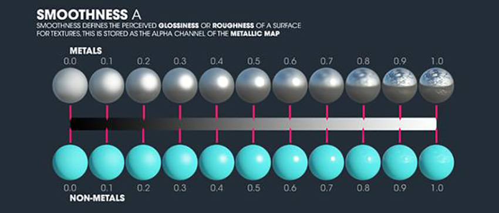
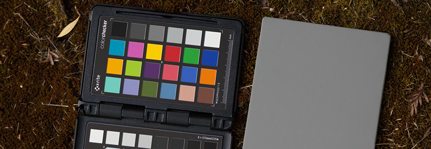

# Shading

Materials define how light reacts with the surface of a model, and are an essential ingredient in making believable visuals. When you’ve created a model, you use a shader to define its surface properties. The Unity [Standard Shader](shader-StandardShader) is a built-in shader with a comprehensive set of features, which allow you to create plausible materials easily, and incorporates an advanced lighting model called Physically Based Shading (PBS). You should master the use of the Standard Shader before making custom surface shaders in ShaderLab, ShaderGraph (Scriptable Render Pipeline) or other Shader creation tools.

Most real-life surfaces are made up of multiple materials, so when texturing a GameObject with the Unity Standard Shader, you need to consider:

* [Standard or Standard Specular Setup](#setup)
* [Albedo values and Material Validator](#albedo)
* [Metallic values](#metallic)
* [Smoothness value](#smoothnessValue)
* [Normal map](#normalMap)
* [Occlusion map](#occlusionMap)
* [Reference picture, color chart and photo source](#photo)

**Note**: Only Albedo, Smoothness, Normal Map and AO covered here. For further advice, see documentation on [Standard Shader material parameters](StandardShaderMaterialParameters).

## Standard or Standard Specular setup

In Unity, you can set up a Material as being __Standard__ or __Standard Specular__. When working with either of these, be aware that it’s generally easier to use a Standard Material, because the Specular brightness and color are calculated automatically based on Albedo, Smoothness and Metallic input.

In Standard setup material, setting Metallic at 1 means the albedo drives the color of the specular and its brightness in tandem with smoothness, which adjusts the brightness and glossiness of the surface.

 

Use Standard Specular when you want to un-tether the specular color from the material’s albedo. This is the case with non-metal materials or materials that aren’t standard metals, where it’s better to control the specular color manually. For more information, see [Specular mode: Specular parameter](StandardShaderMaterialParameterSpecular).

## Albedo values and Material Validator

While a Physically Based Shader works hard to automatically calculate specular brightness and distribution from the light, the albedo of your material needs to be plausible. A material’s albedo affects both direct and indirect lighting, and propagates an unrealistic value through the rest of your Scene’s lighting.

A very dark albedo significantly absorbs light, and causes an unusual lighting response. An albedo that is too bright reflects significant amounts of light and indirect colors that do not occur in real life.

There’s no defined value for non-metal painted surfaces, which are very common in real life. For example, you could choose to paint a wooden wall with charcoal black or snow white, but there’s no single definitive value of that wall albedo. To help you decide on albedo values, there is a chart of PBS values (see [Material charts](StandardShaderMaterialCharts)). As a general guideline, for a non-metal painted surface, an albedo value below 0.2 is too dark and an albedo value above 0.8 is too bright. For darker dielectric material information, see [Materials authoring guidelines 1 : dark dielectric materials (PDF)](https://docs.unity3d.com/uploads/ExpertGuides/Dark_Dielectric_Materials.pdf)

The Material chart is fairly simple to use when dealing with a single albedo surface. However, deciding on complex albedo textures can be difficult. The Material Validation tool allows you to check whether material values follow the guidelines or not. You can enable this tool in the Scene view by selecting __Material Validation__ from the drop down menu in the top left corner of the viewport. **Note**: Material Validation is only available when you’re not using the Scriptable Render Pipeline (SRP). To disable SRP, go to __Edit__ > __Project Settings__, select the __Graphics__ category, and then set __Scriptable Render Pipeline Settings__ to __None__.

## Metallic values

The Metal value of a material defines how much of the environment gets reflected to the surfaces, while also determining how much of the albedo color is visible on the surface. When a surface is pure metal, the surface color (albedo) drives the color of the environment reflection. When working with metal materials, consider the following:

* Pure metal gloss materials don’t bounce diffuse lighting. If your entire room is made out of metal, your room is very dark and you can only see specular highlights and reflection.

* Deciding whether a surface is a metal or not can be difficult. Instead of considering the GameObject’s core material, focus on the final surface of a GameObject. For example, metal railings that are painted blue should only have their unpainted area designated as metal.

Note: While the chipped area of the painted metal bar is metallic, rust is not metal on a surface.

* While it is easy to imagine that a material only needs either a metal value of 0 or 1, there are cases where surface materials are mixed in, or blended. For example, metal GameObjects partially covered with dust or dirt have a metal value between 0 and 1 due to blending. Other than that, try to avoid using a metal value between 0 and 1 when creating plausible materials.

For more information about metal, see [Metallic mode: Metallic Parameter](StandardShaderMaterialParameterMetallic).

## Smoothness value

Smoothness controls the microsurface detail of the surface. A value of 0 yields a very rough, dull surface, and a value of 1 yields a pure reflective mirror-like surface. This is often straightforward and intuitive, but it is useful to consider the following:

* Focus on the final surface quality of the GameObject. For example, an object made of concrete could have a rough surface or have a gloss paint on top of it. The smoothness value of unpainted wood depends on whether the wood is polished or not.

* Don’t forget about scuffs, dirt, scratches and water stains. In real life, the surface of a material is affected by many variables. Materials rarely have a pure single surface. 

* To determine the characteristic of the material, consider how elements are blended between surfaces. For example, a water puddle on soil usually has a ring of absorbed water that has darkened the albedo, instead of just a direct smoothness blend.

​	
For more information on smoothness, see [Smoothness](StandardShaderMaterialParameterSmoothness).

## Normal map

A normal map usually refers to a tangent space normal map that bends the surface normal of a polygon as if the light direction comes in from the other direction. This is usually used to add many details on a seemingly simple mesh.

You can also use normal maps to define a material. For example, you can show an original surface material for a piece of wood painted with high gloss red finish: 

For more information on normal maps, see documentation on [Normal maps (Bump mapping)](StandardShaderMaterialParameterNormalMap).

## Occlusion map

An occlusion map mimics the reduction of ambient light, and can enhance the perception of concavity and shape.

Using an occlusion map has the following benefits: 

* A detailed version of the occlusion map can be achieved at much higher quality during offline rendering, especially if the data is coming from a higher detailed model (similar to normal map baking from high-detailed model to low).

* Occlusion maps help dynamically lit GameObjects tremendously, because dynamic GameObjects don’t get occlusion from light baking, and only receive Light Probe or ambient lighting, and low detail Screen Space Ambient Occlusion (SSAO).

For more information on occlusion maps, see [Occlusion Map](StandardShaderMaterialParameterOcclusionMap).

## Reference pictures, color charts and photo sources

Like trying to learn any new field, studying the general principles behind digital content creation improves your results. Taking pictures of a real surface, whether for a reference or for a texture source, often speeds up the creation of a surface material in a 3D modelling application.

When capturing a reference, you simply need to take lots of pictures of the particular subject. It’s the equivalent of going to an image search engine and searching for a specific reference image.

When taking pictures for a texture source, always neutralize the color cast and negate the light brightness effect of the surface. Use white balancing and proper exposure of an 18% gray card (such as Kodak R-27 card). For example: 

The 18% grey card is a trusted value that you can use as an anchor when taking texture source pictures. Do not try to print your own 18% gray card, as this will most likely give you an inaccurate gray card and off balance color. A proper 18% gray card is equivalent to rgb(124,124,124) or #7C7C7C in sRGB color space. The camera uses this gray card to acquire the proper exposure (negating light brightness) and do white balancing (neutralizing the light color cast).

For more information on grey card, see [Middle gray (Wikipedia)] (https://en.wikipedia.org/wiki/Middle_gray).

For best results, use a Digital SLR / advanced camera. However, you can achieve a good result with the above setup on any camera, including a mobile phone with manual exposure control and RAW capability.

An X-Rite ColorChecker-profiled RAW image with polarized lighting and lens produces higher accuracy in capturing an albedo texture. 

Like the R-27 gray card, the ColorChecker chart is a trusted color reference that you can use as an anchor. You generate a camera sensor + lens + filter + lighting condition characteristic profile, and use it to correct RAW images. 

When capturing a texture source, choose diffused lighting conditions, such as a cloudy day, or evenly lit shades.

For purer albedo textures when the captured images are processed, you can apply additional processing using [Unity’s de-lighting tool](https://github.com/Unity-Technologies/DeLightingTool).

---

* 2018-03-21  <!-- include IncludeTextNewPageSomeEdit -->
* Making believable visuals Best Practice Guide added in Unity 2017.3
