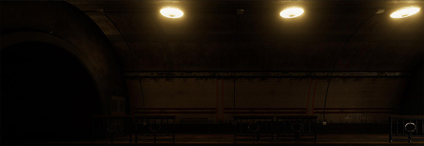

# Indoor and local lighting

For indoor and local lighting, consider the following:

* [Spot lights and Point lights](#spotLights)
* [Color and Intensity of light](#intensity)
* [Emissive surfaces](#emissive)

## Spot lights and Point lights

The staples of real-time local lighting are spot lights and point lights. Fundamentally, both of these types of lights emit light from one point in space and have a limited range. The spot light has an additional limit by angle. For more information, see documentation on [Types of light](Lighting).

The main difference between spot lights and point lights is how they cast shadows and interact with cookies. Shadowing with a point light requires 6 shadow maps, while a spot light only needs one. For this reason, point lights are much more performance-intensive, and you should use them sparingly. Note that baked lights do not require shadow maps.

Another difference is that a cookie texture on a spot light is a simple 2D texture, while a point light requires a cube map, usually authored in a 3D modelling application. For more information, see documentation on [Cookies](Cookies).

__Note__: You can only use area lighting when baking lighting, unless you’re using the HD Scriptable Render Pipeline. There are area lights that can be rendered in real time when in HD SRP mode.

## Light intensity and color

When selecting intensity for indoor lights, try to make sure no indoor lights have a greater intensity than the sun’s light. The sample Scene is set in a tunnel, so it’s very unlikely that there are any high intensity lights shining from the ceiling that exceed the brightness of the sun’s light: 

When choosing the right color for your lights, consider the effect of the color and value chosen. When selecting color, try not to completely leave out any one of the color channels completely. This creates a light that is difficult to converge with the white point. For example, although it is technically a valid light color, the light color on the left image below removes all blue color from the final output:

Try not to limit your final color palette in the Scene, especially if you expect to do color grading later on.

__Note__: For advice on using a tonemapper to handle high intensity color values, such as colored light or fire, see [High intensity color](#todo).

## Emissive materials

In Unity, emissive materials can contribute to lighting if __Realtime GI__ or __Baked__ lighting is enabled, giving the effect of area lighting. This is especially useful if __Realtime GI__ is enabled. You can modify the intensity and color of the emissive surface and get feedback immediately, assuming that pre-computations have been done ahead of time. 

For more information, see [Emission](StandardShaderMaterialParameterEmission).

At this point, you should have a good understanding of how to set up and light a Scene to look believable.

---

* 2018-03-21  <!-- include IncludeTextNewPageSomeEdit -->
* Making believable visuals Best Practice Guide added in Unity 2017.3
