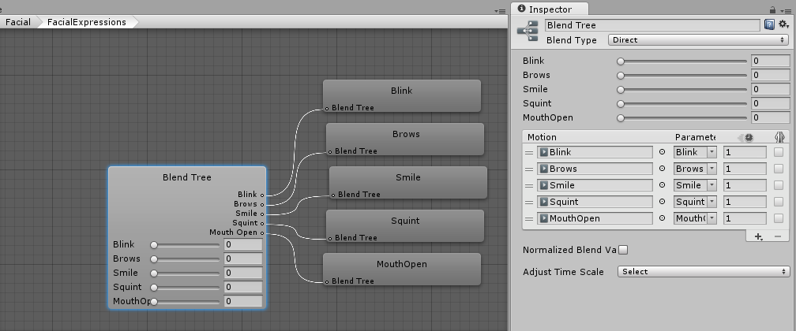

Direct Blending
===========

Using a Direct Blend Tree allows you to map animator parameters directly to the weight of a BlendTree child. This can be useful if you want to have exact control over the various animations that are being blended rather than blend them indirectly using one or two parameters (in the case of 1D and 2D blend trees).

 

When setting up a direct blend tree, the inspector allows you to add motions to the motion list. Each motion should then be assigned a corresponding parameter to directly control its blend weight in the tree. [Read more about creating Animator Parameters here](AnimationParameters).

In effect, this Direct mode simply bypasses the crossfading, or the various 2D blending algorithms (Freeform Directional, Freeform Cartesian, etc) and allows you to implement whatever code you like to control the mix of blended animations.

This can be particularly useful when mixing blendshape animations for facial expressions, or when blending together additive animations.

 
