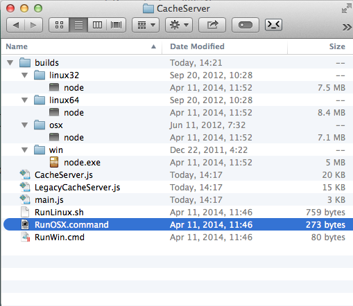
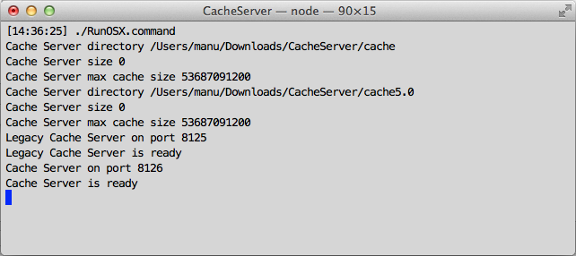

# Cache Server

Unity has a completely automatic Asset pipeline. Whenever a source Asset like a .psd or an .fbx file is modified, Unity detects the change and automatically re-imports it. The imported data from the file is subsequently stored by Unity in an internal format.

This arrangement is designed to make the workflow as efficient and flexible as possible for an individual user. However, when working in a team, you may find that other users might keep making changes to Assets, all of which must be imported. Furthermore, Assets must be reimported when you switch between desktop and mobile build target platforms. The switch can therefore take a long time for large projects.

Caching the imported Assets data on the __Cache Server__ drastically reduces the time it takes to import Assets.

Unity caches each Asset import based on: 

* The Asset file itself
* The Import settings
* The Asset importer version
* The current platform

If any of the above change, Unity re-imports the Asset. Otherwise, Unity downloads it from the Cache Server.

When you use a Cache Server, you can even share Asset imports across multiple projects (that is, the work of importing is done on one computer and the results are shared with others).

**Note:** Once the Cache Server is [set up](#setup) and [enabled](#enable), this process is completely automatic, so there are no additional workflow requirements. It reduces the time it takes to import projects without further intervention from the user.

##Enabling a Cache Server

To enable a Cache Server:

1. Open the Unity **Preferences** window (from the main menu: __Unity__ > __Preferences__ on MacOS or __Edit__ > __Preferences__ on Windows and Linux).
2. Select **Cache Server** from the category list on the left. The **Cache Server** settings appear in the details pane on the right. 
3. Choose __Remote__ or __Local__ from the __Cache Server Mode__ drop-down box. The properties unique to the selected mode appear.
4. Set the [Cache Server preferences](Preferences#Cache-Server) for the mode you selected.

**Tip:** It is better to host the Cache Server on a separate computer if possible because of hard drive size limitations. 

**Note:** If you have a local Cache Server with a custom location, and that location becomes unavailable, Unity displays the following warning:

> _Local cache directory does not exist - please check that you can access the cache folder and are able to write to it_

##Setting up a __Cache Server__ as an administrator

Administrators need to set up the __Cache Server__ computer that hosts the cached Assets. 

To set up the Cache Server on a remote server:

1. Download the Cache Server: 
	* Open Unity's [Download Archive](https://unity3d.com/get-unity/download/archive) page. 
	* Locate the Unity version you are using and click the **Downloads** button for your target server’s operating system. 
	* Click the **Cache Server** link to start the download.
2. Unzip the file, which looks like this:
   
3. Run the command script that matches your operating system.
  A terminal window appears, indicating that the Cache Server is running in the background:
   

**Important:** The Cache Server needs to be on a reliable computer with very large storage (much larger than the size of the project itself, as there will be multiple versions of imported resources stored). If the hard disk becomes full the Cache Server could perform slowly.

##Installing the Cache Server as a service

The provided `.sh` and `.cmd` scripts must be set up as a service on the server.
The Cache Server can be safely killed and restarted at any time, since it uses atomic file operations.

##New and legacy Cache Servers

Two Cache Server processes are started by default. The legacy Cache Server works with versions of Unity prior to version 5.0. The new Cache Server works with versions of Unity from 5.0 and up. See Cache Server configuration, below for details on configuring, enabling, and disabling the two different Cache Servers.

##Cache Server configuration

If you simply start by executing the script, it launches the legacy Cache Server on port 8125 and the new Cache Server on port 8126. It also creates "cache" and "cache5.0" directories in the same directory as the script, and keep data in there. The cache directories are allowed to grow to up to 50 GB by default. You can configure the size and the location of the data using command line options, like this:

`./RunOSX.command --path ~/mycachePath --size 2000000000`

or 

`./RunOSX.command --path ~/mycachePath --port 8199 --nolegacy`

You can configure the Cache Server by using the following command line options:

* Use `--port` to specify the server port. This only applies to the new Cache Server. The default value is `8126`.
* Use `--path` to specify the path of the cache location. This only applies to the new Cache Server. The default value is `./cache5.0`.
* Use `--legacypath` to specify the path of the cache location. This only applies to the legacy Cache Server. The default value is `./cache`.
* Use `--size` to specify the maximum cache size in bytes for both Cache Servers. Files that have not been used recently are automatically discarded when the cache size is exceeded.
* Use `--nolegacy` to stop the legacy Cache Server starting. Otherwise, the legacy Cache Server is started on port `8125`.

##Requirements for the computer hosting the Cache Server

For best performance there must be enough RAM to hold an entire imported project folder. In addition, it is best to have a computer with a fast hard drive and fast Ethernet connection. The hard drive should also have sufficient free space. On the other hand, the Cache Server has very low CPU usage.

One of the main distinctions between the Cache Server and version control is that its cached data can always be rebuilt locally. It is simply a tool for improving performance. For this reason it doesn't make sense to use a Cache Server over the Internet. If you have a distributed team, you should place a separate Cache Server in each location.

The Cache Server runs optimally on a Linux or Mac OS X computer. The Windows file system is not particularly well-optimized for how the Cache Server stores data, and problems with file locking on Windows can cause issues that don't occur on Linux or Mac OS X.

##Cache Server FAQ

###Will the size of my Cache Server database grow indefinitely as more and more resources get imported and stored?
The Cache Server removes Assets that have not been used for a period of time automatically (of course if those Assets are needed again, they are re-created on next usage). 

###Does the Cache Server work only with the Asset server?

The Cache Server is designed to be transparent to source/version control systems, so you are not restricted to using Unity's Asset server.

###What changes cause the imported file to get regenerated?

When Unity is about to import an Asset, it generates an MD5 hash of all source data.

For a Texture, this consists of:

* The source Asset: "myTexture.psd" file
* The meta file: "myTexture.psd.meta" (Stores all importer settings)
* The internal version number of the Texture Importer
* A hash of version numbers of all [AssetPostprocessors](ScriptRef:AssetPostprocessor.html)

If that hash is different from what is stored on the Cache Server, the Asset is reimported. Otherwise the cached version is downloaded. The client Unity Editor only pulls Assets from the server as they are needed - Assets don't get pushed to each project as they change.

###How do I work with Asset dependencies?

The Cache Server does not handle dependencies. Unity's Asset pipeline does not deal with the concept of dependencies. It is built in such a way as to avoid dependencies between Assets. The [AssetPostprocessor](ScriptRef:AssetPostprocessor.html) class is a common technique used to customize the Asset importer to fit your needs. For example, you might want to add MeshColliders to some GameObjects in an .fbx file based on their name or tag.

It is also easy to use `AssetPostprocessor` to introduce dependencies. For example you might use data from a text file next to the Asset to add additional components to the imported GameObjects. This is not supported in the Cache Server. If you want to use the Cache Server, you have to remove dependency on other Assets in the project folder. Since the Cache Server doesn't know anything about the dependency in your postprocessor, it does not know that anything has changed, and thus uses an old cached version of the Asset.

In practice there are plenty of ways you can do Asset postprocessing to work well with the Cache Server. You can use:

* The Path of the imported Asset
* Any import settings of the Asset
* The source Asset itself, or any data generated from it passed to you in the Asset postprocessor.

###Are there any issues when working with Materials?
Modifying Materials that already exist might cause problems. When using the Cache Server, Unity validates that the references to Materials are maintained, but because no postprocessing calls are invoked, the contents of the Material cannot be changed when a model is imported through the Cache Server. Because of this, you might get different results when importing with and without the Cache Server. 

Don't modify materials that already exist on disk from an Asset postprocessor because if you download an fbx file through the cache server, then there is no import process running for it. So if you rely on resetting the generated materials to some generated defaults every time the model importer runs, then this Asset postprocessor will not be run when importing a cached fbx file.

###Are there any Asset types which are not cached by the server?

There are a few kinds of Asset data which the server doesn't cache. There isn't really anything to be gained by caching script files, so the server ignores them. Also, native files used by 3D modeling software (Autodesk® Maya®, Autodesk® 3ds Max®, etc) are converted to FBX using the application itself. The Asset server does not cache the native file nor the intermediate FBX file generated in the import process. However, it is possible to benefit from the server, by exporting files as FBX from the modeling software and then adding those to the Unity project.

----
* 2018-11-09 <!-- include IncludeTextAmendPageSomeEdit -->
