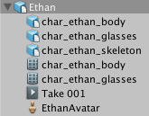
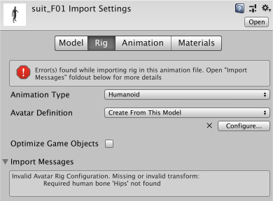
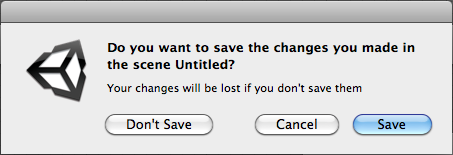
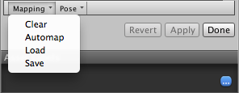

# Importing humanoid animations

When Unity imports Model files that contain __Humanoid__ Rigs and Animation, it needs to reconcile the bone structure of the Model to its Animation. It does this by mapping each bone in the file to a Humanoid Avatar so that it can play the Animation properly. For this reason, it is important to carefully prepare your Model file before importing into Unity.

1. [Define the Rig type and create the Avatar](#AvatarSetup).
2. [Correct or verify the Avatar's mapping](#AvatarConfig).
3. Once you are finished with the bone mapping, you can optionally click the __Muscles &amp; Settings__ tab to [tweak the Avatar's muscle configuration](MuscleDefinitions).
4. You can optionally [save the mapping of your skeleton's bones to the Avatar](class-Avatar#HumanTemplate) as a Human Template (.ht) file.
5. You can optionally limit the animation that gets imported on certain bones by [defining an Avatar Mask](#AvatarMask).
6. From the __Animation__ tab, enable the __Import Animation__ option and then set the other Asset-specific properties, .
7. If the file consists of multiple animations or actions, you can [define specific action ranges as Animation Clips](Splittinganimations). 
8. For each Animation Clip defined in the file, you can:
    * [Change the pose and root transform](class-AnimationClip#ClipProperties)
    * [Optimize looping](LoopingAnimationClips)
	* __Mirror__ the animation on both sides of the Humanoid skeleton.
    * [Add curves to the clip](AnimationCurvesOnImportedClips) in order to animate the timings of other items
    * [Add events to the clip](AnimationEventsOnImportedClips) in order to trigger certain actions in time with the animation
    * [Discard part of the animation](AnimationMaskOnImportedClips) similar to using a runtime [Avatar Mask](class-AvatarMask) but applied at import time
    * [Select a different Root Motion Node](AnimationRootMotionNodeOnImportedClips) to drive the action from
    * [Read any messages from Unity about importing the clip](class-AnimationClip#ImportMessages)
    * [Watch a preview of the animation clip](class-AnimationClip#AnimationPreview)
9. To save your changes, click the __Apply__ button at the bottom of the __Import Settings__ window or __Revert__ to discard your changes.

## Set up the Avatar

From the [Rig tab of the Inspector window](FBXImporter-Rig), set the __Animation Type__ to __Humanoid__. By default, the __Avatar Definition__ property is set to __Create From This Model__. If you keep this option, Unity attempts to map the set of bones defined in the file to a Humanoid Avatar. 

**Note:** In some cases, you can change this option to __Copy From Other Avatar__ to use an Avatar you already defined for another Model file. For example, if you create a Mesh (skin) in your 3D modeling application with several distinct animations, you can export the Mesh to one FBX file, and each animation to its own FBX file. When you import these files into Unity, you only need to create a single Avatar for the first file you import (usually the Mesh). As long as all the files use the same bone structure, you can re-use that Avatar for the rest of the files (for example, all the animations).

If you enable this option, you must specify which Avatar you want to use by setting the __Source__ property.

Click the __Apply__ button. Unity tries to match up the existing bone structure to the Avatar bone structure. In many cases, it can do this automatically by analyzing the connections between bones in the rig.

If the match succeeds, a check mark appears next to the __Configure__ menu. Unity also adds an Avatar sub-asset to the Model Asset, which you can find in the Project view. 

 

A successful match simply means that Unity was able to match all of the required bones. However, for better results, you also need to match the optional bones and set the model in a proper __T-pose__. 

If Unity can't create the Avatar, a cross appears next to the __Configure__ button, and no Avatar sub-asset appears in the Project view. 

 

Since the Avatar is such an important aspect of the animation system, it is important to configure it properly for your __Model__. 

For this reason, whether or not the automatic Avatar creation succeeds, you should always [check that your Avatar](#AvatarConfig) is valid and properly set up. 

## Configure the Avatar

If Unity failed to create the Avatar for your model, you must click the __Configure ...__ button on the __Rig__ tab to open the [Avatar window](class-Avatar) and fix your Avatar.

If the match was successful, you can either click the __Configure ...__ button on the __Rig__ tab or open the window from the Project view:

1. Click the Avatar sub-Asset in the __Project__ view. The __Inspector__ displays the name of the Avatar and a __Configure Avatar__ button.
2. Click the __Configure Avatar__ button.

 

If you haven't already saved the Avatar, a message appears asking you to save your scene:

 

The reason for this is that in __Configure__ mode, the Scene view is used to display bone, muscle and animation information for the selected model alone, without displaying the rest of the scene.

Once you have saved the scene, the __Avatar__ window appears in the __Inspector__ displaying any bone mapping.

Make sure the bone mapping is correct and that you map any optional bones that Unity did not assign.

Your skeleton needs to have at least the required bones in place for Unity to produce a valid match. In order to improve your chances for finding a match to the Avatar, name your bones in a way that reflects the body parts they represent. For example, "LeftArm" and "RightForearm" make it clear what these bones control. 

### Mapping strategies

If the model does *not* yield a valid match, you can use a similar process to the one that Unity uses internally: 

1. Choose __Clear__ from the __Mapping__ menu at the bottom of the __Avatar__ window to reset any mapping that Unity attempted. 
2. Choose __Sample Bind-pose__from the __Pose__ menu at the bottom of the __Avatar__ window to approximate the Model's initial modeling pose. 
3. Choose __Mapping__ &gt; __Automap__ to create a bone-mapping from an initial pose.
4. Choose __Pose__ &gt; __Enforce T-Pose__ to set the Model back to to required T-pose.

If automapping fails completely or partially, you can manually assign bones by either dragging them from the __Scene__ view or from the __Hierarchy__ view. If Unity thinks a bone fits, it appears in green in the __Avatar Mapping__ tab; otherwise it appears in red. 

### Resetting the pose

The __T-pose__ is the default pose required by Unity animation and is the recommended pose to model in your 3D modeling application. However, if you did not use the T-pose to model your character and the animation does not work as expected, you can choose the :

 

If the bone assignment is correct, but the character is not in the correct _pose_, you will see the message "Character not in T-Pose". You can try to fix that by choosing __Enforce T-Pose__ from the __Pose__ menu. If the pose is still not correct, you can manually rotate the remaining bones into a T-pose.

## Creating an Avatar Mask

Masking allows you to discard some of the animation data within a clip, allowing the clip to animate only parts of the object or character rather than the entire thing.  For example, you may have a standard walking animation that includes both arm and leg motion, but if a character is carrying a large object with both hands then you wouldn't want their arms to swing to the side as they walk. However, you could still use the standard walking animation while carrying the object by using a mask to only play the upper body portion of the carrying animation over the top of the walking animation.

You can apply masking to animation clips either during import time, or at runtime. Masking during import time is preferable, because it allows the discarded animation data to be omitted from your build, making the files smaller and therefore using less memory. It also makes for faster processing because there is less animation data to be blended at runtime. In some cases, import masking may not be suitable for your purposes. In that case, you can apply a mask at runtime by creating an __Avatar Mask__ Asset, and [using it in the layer settings](AnimationLayers) of your __Animator Controller__. 

To create an empty Avatar Mask Asset, you can either:

* Choose __Create__ &gt; __Avatar Mask__ from the __Assets__ menu.
* Click the Model object you want to define the mask on in the __Project__ view, and then right-click and choose __Create__ &gt; __Avatar Mask__.

The new Asset appears in the __Project__ view:

You can now [add portions of the body to the mask](class-AvatarMask) and then add the mask to either an [Animation Layer](AnimationLayers) or add a reference to it under the [Mask](AnimationMaskOnImportedClips) section of the [Animation tab](class-AnimationClip).

---

*  2018-04-25  <!-- include IncludeTextAmendPageSomeEdit -->
