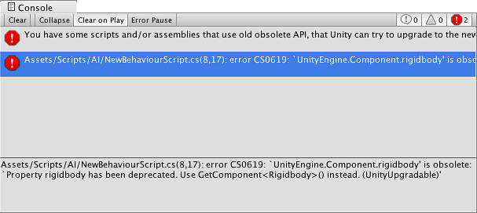
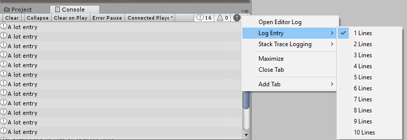
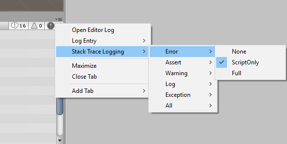

#Console Window

The __Console__ Window (menu: __Window__ &gt; __General__ &gt; __Console__) shows errors, warnings and other messages generated by Unity. To aid with debugging, you can also show your own messages in the Console using the [Debug.Log](ScriptRef:Debug.Log.html), [Debug.LogWarning](ScriptRef:Debug.LogWarning.html) and [Debug.LogError](ScriptRef:Debug.LogError.html) functions.

 

The toolbar of the console window has a number of options that affect how messages are displayed.

The _Clear_ button removes any messages generated from your code but retains compiler errors. You can arrange for the console to be cleared automatically whenever you run the game by enabling the _Clear On Play_ option.

You can also change the way messages are shown and updated in the console. The _Collapse_ option shows only the first instance of an error message that keeps recurring. This is very useful for runtime errors, such as null references, that are sometimes generated identically on each frame update. The _Error Pause_ option will cause playback to be paused whenever Debug.LogError is called from a script (but note that Debug.Log will not pause in this way). This can be handy when you want to freeze playback at a specific point in execution and inspect the scene.

Finally, there are two options for viewing additional information about errors. The _Open Player Log_ and _Open Editor Log_ items on the console tab menu access Unity's log files which record details that may not be shown in the console. See the page about [Log Files](LogFiles) for further information.


##Obsolete API Warnings and Automatic Updates

Among other messages, Unity shows warnings about the usage of obsolete API calls in your code. For example, Unity once had "shortcuts" in MonoBehaviour and other classes to access common component types. So, for example, you could access a [Rigidbody](class-Rigidbody) on the object using code like:

````
	// The "rigidbody" variable is part of the class and not declared in the user script.
	Vector3 v = rigidbody.velocity;
````

These shortcuts have been deprecated, so you should now use code like:

````
	// Use GetComponent to access the component.
	Rigidbody rb = GetComponent<Rigidbody>();
	Vector3 v = rb.velocity;
````

When obsolete API calls are detected, Unity will show a warning message about them. When you double-click this message, Unity will attempt to upgrade the deprecated usage to the recommended equivalent automatically.

## Adjusting the line count

To adjust the number of lines that a log entry displays in the list, click the exclamation button, go to __Log Entry__, and choose the number of lines.

 

This allows you to set the granularity you want for the window in terms of the amount of context versus how many entries fit in the window.

##Stack trace logging

You can specify how accurate stack trace should be captured when log message is printed to the console or log file.

 

This is especially helpful when the error message is not very clear, by looking at the stack trace, you can deduct from what engine area the error appears.
There are three options for logging stack trace:

* **None** - stack trace won't be printed
* **ScriptOnly** - only managed stack trace will be printed
* **Full** - both native and managed stack trace will be printed, note - resolving full stack trace is an expensive operation and should be only used for debugging purposes

You can also control stack trace logging via scripting API. See API reference documentation on [Application.stackTraceLogType](ScriptRef:Application-stackTraceLogType.html) for more details.

---

* <span class="page-edit">2017-09-18  <!-- include IncludeTextAmendPageSomeEdit --></span>

* <span class="page-history">Log entry line count added in [2017.3](https://docs.unity3d.com/2017.3/Documentation/Manual/30_search.html?q=newin20173) <span class="search-words">NewIn20173</span></span>
