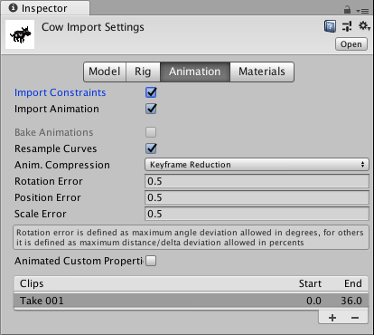

# Constraints

A Constraint component links the position, rotation, or scale of a GameObject to another GameObject. A constrained GameObject moves, rotates, or scales like the GameObject it is linked to.

Unity supports the following types of Constraint components:

* [Aim](class-AimConstraint): Rotate the constrained GameObject to face the linked GameObject.

* [Look At](class-LookAtConstraint): Rotate the constrained GameObject to the linked GameObject (simplified Aim Constraint).

* [Parent](class-ParentConstraint): Move and rotate the constrained GameObject with the linked GameObject.

* [Position](class-PositionConstraint): Move the constrained GameObject like the linked GameObject.

* [Rotation](class-RotationConstraint): Rotate the constrained GameObject like the linked GameObject.

* [Scale](class-ScaleConstraint): Scale the constrained GameObject like the linked GameObject.

## Linking to GameObjects

Use the __Sources__ list in a Constraint component to specify the GameObjects to link to.

For example, to make a crosshair follow the player’s spaceship in a 2D shooter, add a __Position Constraint__ component to the crosshair. To link the crosshair to the spaceship, navigate to the __Position Constraint__ component and add the spaceship GameObject to the __Sources__ list. As the player moves the spaceship, the crosshair follows.

A Constraint can link to several source GameObjects. In this case, the Constraint uses the averaged position, rotation, or scale of its source GameObjects. For example, to point a Light at a group of GameObjects, add an __Aim Constraint__ component to the Light GameObject. Then, add the GameObjects to illuminate in the __Sources__ list. The __Aim Constraint__ orients the light to face the averaged position of its sources.

Unity evaluates source GameObjects in the order that they appear in the __Sources__ list. The order has no effect for the __Position__ and __Scale Constraints__. However, order has an effect on __Parent__, __Rotation__, and __Aim Constraints__. To get the result you want, reorder the __Sources__ list by dragging and dropping items.

You can constrain a series of GameObjects. For example, you want ducklings to follow their mother in a row. You add a __Position Constraint__ component to GameObject _Duckling1_. In the __Sources__ list, you link to _MotherDuck_. You then add a __Position Constraint__ to _Duckling2_ that links to _Duckling1_. As the _MotherDuck_ GameObject moves in the Scene, _Duckling1_ follows _MotherDuck_, and _Duckling2_ follows _Duckling1_. 

Avoid creating a cycle of Constraints, because this causes unpredictable updates during gameplay. 

## Setting Constraint properties

Use the [Inspector window](UsingTheInspector) to change common properties in a Constraint. 

Use __Weight__ to vary the influence of a Constraint. A weight of 1 causes the Constraint to update a GameObject at the same rate as its source GameObjects. A weight of 0 removes the effect of the Constraint completely. Each source GameObject also has an individual weight.

In __Constraint Settings__, use the __At Rest__ properties to specify the X, Y, and Z values to use when __Weight__ is 0 or when the corresponding property in __Freeze Axes__ is not checked.

Use the __Offset__ properties in __Constraint Settings__ to specify the X, Y, and Z values to use when constraining the GameObject. 

Use the __Freeze Axes__ settings to toggle which axes the Constraint can actually modify.

## Activating and locking Constraints

There are two aspects to working with Constraints: activating and locking. 

You activate a Constraint to allow it to evaluate the position, rotation, or scale of the constrained GameObject. Unity does not evaluate inactive Constraints. 

You lock a Constraint to allow it to move, rotate, or scale the GameObject. A locked Constraint takes control of the relevant parts of the [Transform](Transforms) of the GameObject. You cannot manually move, rotate, or scale a GameObject with a locked Constraint. You also cannot edit the __Constraint Settings__. 

To manually edit the position, rotation, or scale of a GameObject, unlock its Constraint. If the Constraint is active while unlocked, the Constraint updates __Constraint Settings__ for you as you move, rotate, or scale the constrained GameObject or its source GameObjects. 

When you add a Constraint component to a GameObject, the Constraint is inactive and unlocked by default. This lets you fine-tune the position, rotation, and scale of the constrained and source GameObjects before you activate and lock the Constraint.

For convenience, the __Activate__ and __Zero__ buttons update __Constraint Settings__ for you:

* __Activate__: Saves the current offset from the source GameObjects, then activates and locks the constrained GameObject__.__ 

* __Zero__: Resets the position, rotation, or scale to match the source GameObjects, then activates and locks the constrained GameObject. 

## Animating and combining Constraints

Use animation clips to modify the source GameObjects that your constrained GameObject links to. As the animation modifies the source GameObjects, the Constraint modifies your constrained GameObject.

You can also animate properties in a Constraint component. For example, use a Parent Constraint to move a character’s sword from their hand to their back. First, add a Parent Constraint to the sword GameObject. In the __Sources__ list, link the Constraint to the character’s hand and the character’s spine. To animate the sword, add keyframes for the weight of each source. To animate the sword moving from back to hand, add keyframes to change the weight of the hand from 0 to 1 with keyframes for the weight of the spine from 1 to 0.

You can add more than one kind of Constraint component to the same GameObject. When updating the GameObject, Unity evaluates Constraint components from first to last as they appear in the [Inspector window](UsingTheInspector). A GameObject can only contain one Constraint component of the same kind. For example, you cannot add more than one Position Constraint.

## Importing Constraints

When importing FBX files into the Unity Editor from Autodesk® Maya® and MotionBuilder®, you can include Constraints. Click the [Animation tab](class-AnimationClip) of the Import Settings window and check __Import Constraints__:

For every constraint in the FBX file, Unity automatically adds a corresponding Constraint component and links it to the correct GameObjects. 

## Adding and editing Constraints

To add a Constraint component:

1. Select the GameObject to constrain.

2. In the Inspector window, click __Add Component__ search for the type of Constraint you want to add, and click it to add it.

3. To add a source GameObject to your new Constraint, drag that GameObject from the Hierarchy (or from the Scene view) into the __Sources__ list.

4. Move, rotate, or scale the constrained GameObject and its source GameObjects.

5. To activate the Constraint, click __Activate__ or __Zero__, or check __Is Active__ and __Lock__.

To edit a Constraint component:

1. Select the constrained GameObject in the Editor. 

2. To adjust the __At Rest__ or __Offset__ fields, use the Inspector window to expand __Constraint Settings__, uncheck __Lock__, then edit the values.

3. To specify the axes that the Constraint updates, expand __Constraint Settings__, then check the properties in __Freeze Axes__.

4. To add a source GameObject to the Constraint:

    * If there are no empty slots in the Sources list, click + at the bottom of the list.

    * Drag the GameObject you want to use as a Constraint source from your scene into the __Sources__ list. 

5. To remove a source GameObject, select it in the __Sources__ list and click the minus symbol (__-__) at the bottom of the list.

6. To re-order the source GameObjects in the __Sources__ list, click the double bar icon on the left side of each GameObject you want to move, and drag it up or down.

    __Note:__ In the __Sources__ list, order has no effect on the Position, Rotation, and Scale
    Constraints. However, order does affect how Parent and Aim Constraints move or rotate a
    GameObject.

7. Check __Is Active__ and __Lock__.

---

*  2018-04-11  <!-- include IncludeTextNewPageYesEdit -->

* Constraints added in [2018.1](https://docs.unity3d.com/2018.1/Documentation/Manual/30_search.html?q=newin20181) NewIn20181