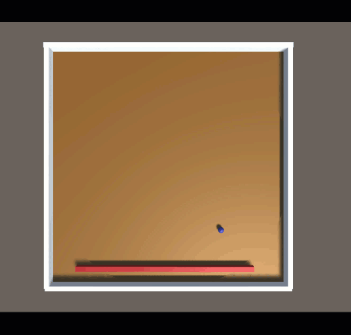
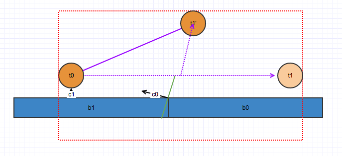
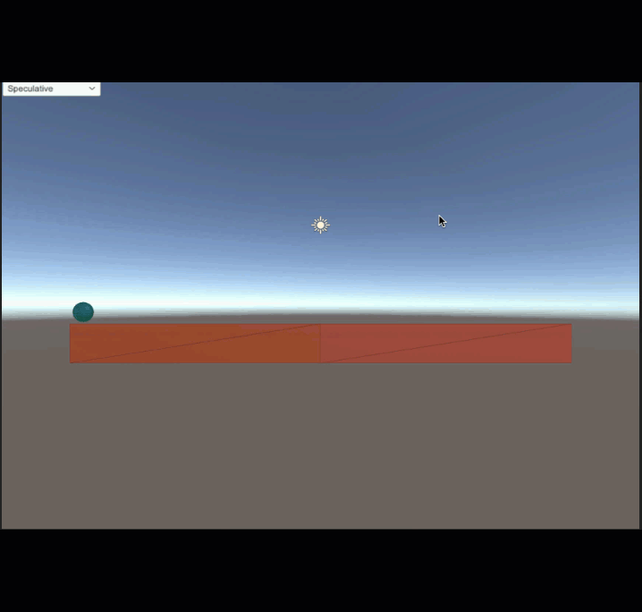
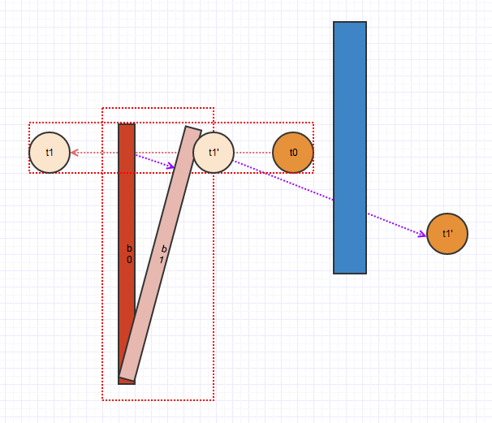

# Continuous collision detection (CCD)

CCD ensures that fast-moving bodies collide with objects instead of passing, or tunnelling, through those objects. Unity provides the following CCD methods:

* [Sweep-based CCD](#sweep)
* [Speculative CCD](#speculative)

To use sweep-based CCD, select a [RigidBody](class-Rigidbody) in the Inspector window and set __Collision Detection__ to __Continuous__ or __Continuous Dynamic__. For speculative CCD, set __Collision Detection__ to __Continuous Speculative__.

## Sweep-based CCD

Sweep-based CCD uses a Time Of Impact (TOI) algorithm to compute potential collisions for an object by sweeping its forward trajectory using its current velocity. If there are contacts along the object's moving direction, the algorithm computes the time of impact and moves the object until that time. The algorithm can perform sub steps from that time onwards, computing the velocity after TOI then re-sweep, at the expense of more CPU cycles.

However, because this method relies on linear sweep, it ignores the body's angular motion, which can cause tunnelling effects when objects are rotating at speed. For example, the flipper in a pinball machine is fixed at one end and rotates around a fixed point. The flipper only has angular motion and no linear motion. Therefore, it can easily miss the collision with the pinball:

Another issue with this method is performance. If you have a large number of high-speed objects with CCD in close proximity, the CCD overhead increases quickly because of the extra sweeping, and the physics engine has to perform more CCD sub-steps.

## Speculative CCD

Speculative CCD works by increasing an object's broad-phase axis-aligned minimum bounding box (AABB), based on the object's linear and angular motion. The algorithm is speculative because it picks all potential contacts during the next physics step. All contacts are then fed into the solver, which makes sure that all contact constraints are satisfied so that an object does not tunnel through any collision.

The following diagram shows how a sphere moving from __t0__ could have an expected position at __t1__ if there were no walls in its path. By inflating the AABB with its target pose, the speculative algorithm picks up two contacts with the __n1__ and __n2__ normals. The algorithm then tells the solver to respect those contacts so that the sphere doesn’t tunnel through the walls.

Inflated AABB based on current velocity helps detect all potential contacts along the moving trajectory, which enables the solver to prevent tunnelling.

Speculative CCD  is generally cheaper than the sweep-based method because contacts are only computed during the collision detection phase, not during the solving and integrating phase. Also, because Speculative CCD expands the broad-phase AABB based on the object's linear and angular motion, it finds the contacts that sweep-based CCD can miss.

However, speculative CCD can cause a ghost collision, where an object’s motion is affected by a speculative contact point when it shouldn’t be. This is because speculative CCD collects all potential contacts based on the closest point algorithm, so the contact normal is less accurate. This can often make high speed objects slide along tessellated collision features and jump up, even though they shouldn't. For example, in the following diagram, a sphere starts at __t0__ and moves horizontally towards the right, with a predicted position at __t1__ after integration. An inflated AABB overlaps the boxes __b0__ and __b1__, and the CCD yields two speculative contacts at __c0__ and __c1__. Because speculative CCD generates contacts using the closest point algorithm, __c0__ has a very inclined normal, which appears to be a ramp to the solver.

Such a very inclined normal causes __t1__ to jump upward after integration, rather than moving straight forward:

Speculative CCD can also cause tunneling because speculative contacts are only computed during the collision detection phase. During contact solving, if an object gains too much energy from the solver, it may end up outside the initial inflated AABB after integration. If there are collisions just outside the AABB, the object will tunnel right though.

For example, the following diagram shows a sphere is moving left from __t0__ while a stick is rotating clockwise. If the sphere gains too much energy from the impact, it may end up exiting the inflated AABB (red dotted rectangle) at __t1__. If there are collisions just outside the AABB, as shown by the blue box below, the sphere may end up tunneling right through it. This is because the solver only computes contacts inside the inflated AABB, and collision detection isn’t performed during the solving and integrating phase.

 
---
* 2018-10-12 <!-- include IncludeTextNewPageYesEdit -->

* Speculative collision detection added in [2018.3](https://docs.unity3d.com/2018.3/Documentation/Manual/30_search.html?q=newin20183) NewIn20183
