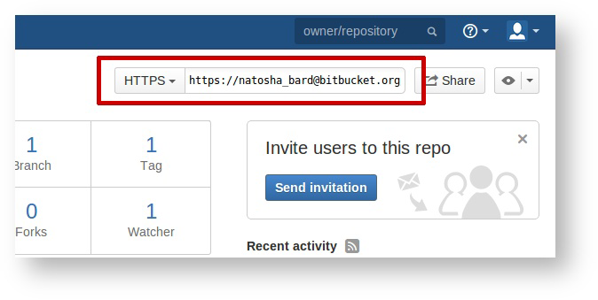
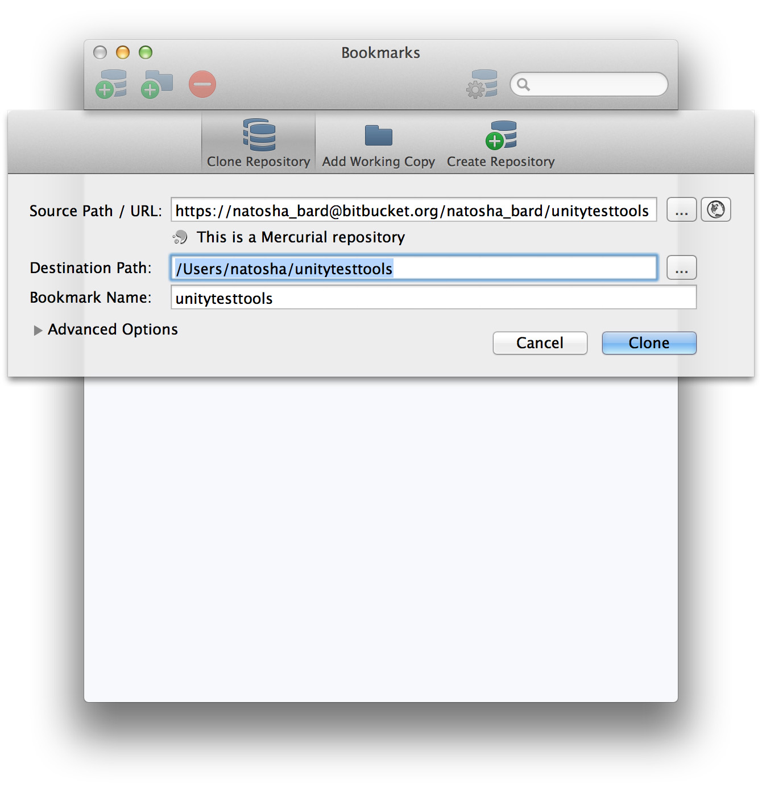

Step 3: Clone your fork
============

Next, clone your fork locally so that you can make your modifications. If the repository is a Mercurial repository, you'll need to get a Mercurial client. If it's a Git repository, you'll need to get a Git client. Atlassian (the company that owns Bitbucket) maintains an application called [SourceTree](https://www.atlassian.com/software/sourcetree/overview), which runs on both Windows and OS X and works with both Mercurial and Git repositories. We use SourceTree heavily within Unity to interact with our own Mercurial repositories. Explore the download page for [Mercurial](http://mercurial.selenic.com/downloads) and [Git](http://git-scm.com/downloads) to see the different options available.

Once you have your Mercurial or Git client ready, you can [clone](https://confluence.atlassian.com/display/BITBUCKET/Clone+a+repository) it via the URL on your fork's page:

 

This an example of cloning our fork in SourceTree:

