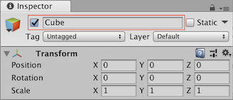

#Deactivating GameObjects

You can mark a GameObject as inactive to temporarily remove it from the Scene. To do this, navigate to the Inspector and uncheck the checkbox next to the GameObject's name (see image below), or use the [activeSelf](ScriptRef:GameObject-activeSelf.html) property in script.


 

##Deactivating a parent GameObject

When you deactivate a parent GameObject, You also deactivate all of its child GameObjects.

The deactivation overrides the `activeSelf` setting on all child GameObjects, so Unity makes the whole hierarchy inactive from the parent down. This does not change the value of the `activeSelf` property on the child GameObjects, so they return to their original state when you re-activate the parent. This means that you can't determine whether or not a child GameObject is currently active in the Scene by reading its __activeSelf__ property. Instead, you should use the [activeInHierarchy](ScriptRef:GameObject-activeInHierarchy.html) property, which takes the overriding effect of the parent into account.

If you want to change the __activeSelf__ settings of a GameObject's child Gameobjects, but not the parent, you can use code like the following:

```
void DeactivateChildren(GameObject g, bool a) 
{
	g.activeSelf = a;
	
	foreach (Transform child in g.transform) 
	{
		DeactivateChildren(child.gameObject, a);
	}
}
```
