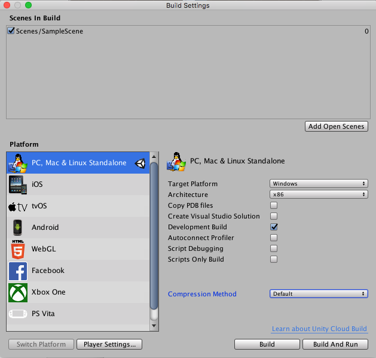
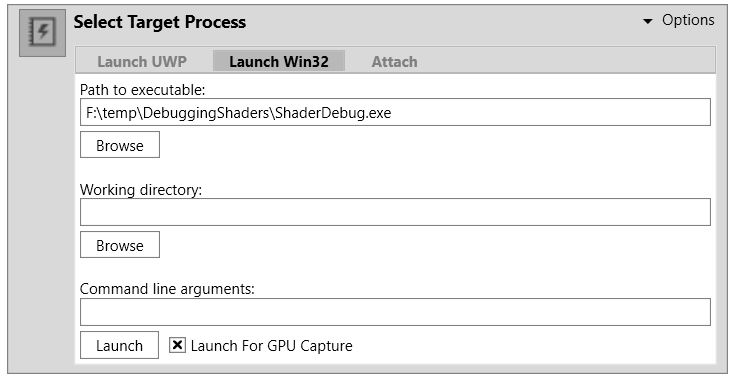
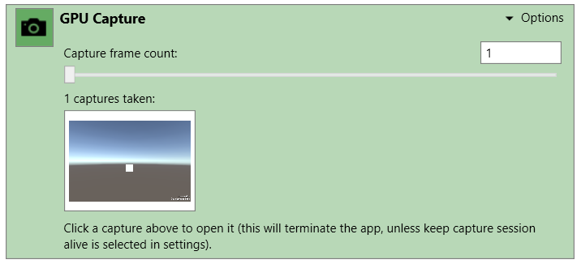
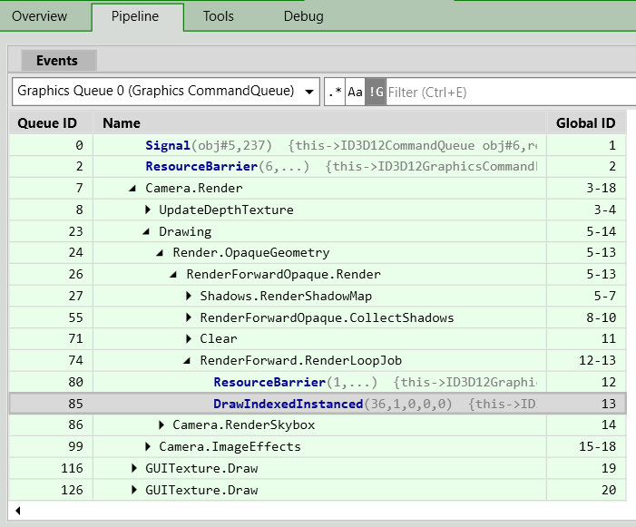
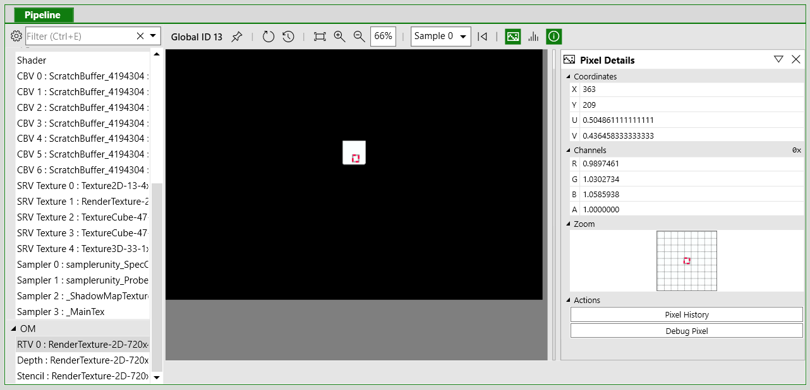
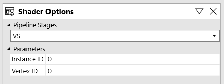

# Debugging DirectX 12 shaders with PIX

PIX is a performance tuning and debugging tool by Microsoft, for Windows developers. It offers a range of modes for analyzing an application’s performance, and includes the ability to capture frames of DirectX projects from an application for debugging.

Use PIX to investigate issues in Windows 64-bit (x86_64) Standalone or Universal Windows Platform applications.

To install PIX, [download and run the Microsoft PIX installer](https://blogs.msdn.microsoft.com/pix/download/) and follow the instructions.

For more information about PIX, see Microsoft’s [PIX Introduction](https://blogs.msdn.microsoft.com/pix/introduction/) and [PIX Documentation](https://blogs.msdn.microsoft.com/pix/documentation/).

## Debugging DirectX shaders with PIX

You should use a built version of your Unity application to capture frames, rather than a version running in the Unity Editor. This is because you need to launch the target application from within PIX to capture GPU frames.

Using a development build adds additional information to PIX, which makes navigating the scene capture easier.

### Create a project with a debug-enabled Shader

To debug the shader with source code in PIX, you need to insert the following pragma into the shader code: `#pragma enable_d3d11_debug_symbols`

### Example

The following walkthrough uses a basic example to demonstrate the entire process.

####Create a basic project:

1. Create a new Unity project (see documentation on [Getting Started](#GettingStarted)).

2. In the top menu, go to __Assets__ &gt; __Create__ &gt; __Shader__ &gt; __Standard Surface Shader__. This creates a new shader file in your __Project__ folder.

3. Select the shader file, and in the Inspector window, click __Open__. This opens the shader file in your scripting editor. Insert `#pragma enable_d3d11_debug_symbols` into the shader code, underneath the other `#pragma` lines.

4. Create a new Material (menu: __Assets__ &gt; __Create__ &gt; __Material__).

5. In the Material’s Inspector window, select the __Shader__ dropdown, go to __Custom__, and select the shader you just created. 

6. Create a 3D cube GameObject (menu: __GameObject__ &gt; __3D Object__ &gt; __Cube__).

7. Assign your new Material to your new GameObject. To do this, drag the Material from the __Project__ window to the 3D cube.

###Capture a frame from a Windows Standalone application:

1. Go to __File__ &gt; __Build Settings__, and under __Platform__, select __PC, Mac & Linux Standalone__. Set the __Target Platform__ to __Windows__, set the __Architecture__ to __x86_64__, and click the __Development Build__ checkbox.
    

2. Click __Build__.

3. Launch __PIX.__

4. Click on __Home__, then __Connect__

5. Select Computer __localhost __to use your PC for capturing, and click __connect__.

6. In the __Select Target Process__ box, select the __Launch Win32__ tab and use the __Browse__ button to select your application’s executable file. Note that here, "Win32" means a non-UWP application; your application file must be a 64-bit binary file.

7. Enable __Launch for GPU Capture__, then use the __Launch__ button to start the application.
    

8. Use your application as normal until you are ready to capture a frame. To capture a frame, press __Print Screen__ on your keyboard, or click the camera icon on the GPU Capture Panel. A thumbnail of the capture appears in the panel. To open the capture, click the thumbnail.
    

9. To start analysis on the capture, click the highlighted text or the small __Play__ icon on the menu bar.
    

10. Select the __Pipeline __tab and use the__ Events__ window to navigate to a draw call you are interested in.
    

11. In the lower half of the __Pipeline__ tab, select a render target from the __OM__ (Output Merger) list to view the output of draw call. Select a pixel on the object you want to debug. Note that you can right-click a pixel to view the draw call history, as a way of finding draw calls you are interested in.

12. Select __Debug Pixel__ on the __Pixel Details__ panel.
    

13. On the debug panel, use the Shader Options to select which shader stage to debug.
    

14. Use the toolbar or keyboard shortcuts to step through the code.
    

For more information on debugging shaders with PIX, see Microsoft’s video series [PIX on Windows](https://www.youtube.com/playlist?list=PLeHvwXyqearWuPPxh6T03iwX-McPG5LkB), particularly [Part 5 - Debug Tab](https://www.youtube.com/watch?v=jRflMYmXv2g).

For more information on GPU capture in PIX, see Microsoft’s documentation on [GPU Captures](https://blogs.msdn.microsoft.com/pix/gpu-captures/). 

* 2018-09-17  <!-- include IncludeTextNewPageYesEdit -->
