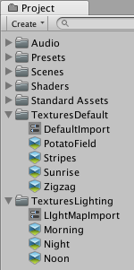

# Applying defaults to assets by folder

For large projects, you might use several Presets for importing the same type of asset. For example, for texture assets, you might have a Preset for importing Default textures and another for Lightmap textures. In the *Assets* folder of your project, you have separate folders for each of these types of textures.



The following script applies a Preset based on the folder that you add an asset to. This script chooses the Preset that is in the same folder as the asset. If there is no Preset in the folder, this script searches parent folders. If there are no Presets in parent folders, Unity uses the default Preset that the [Preset](class-PresetManager) window specifies.

To use this script, create a new folder named *Editor* in the Project window, create a new C# Script in this folder, then copy and paste this script.

````
using System.IO;
using UnityEditor;
using UnityEditor.Presets;

public class PresetImportPerFolder : AssetPostprocessor
{
    void OnPreprocessAsset()
    {
        // Make sure we are applying presets the first time an asset is imported.
        if (assetImporter.importSettingsMissing)
        {
            // Get the current imported asset folder.
            var path = Path.GetDirectoryName(assetPath);
            while (!string.IsNullOrEmpty(path))
            {
                // Find all Preset assets in this folder.
                var presetGuids = AssetDatabase.FindAssets("t:Preset", new[] { path });
                foreach (var presetGuid in presetGuids)
                {
                    // Make sure we are not testing Presets in a subfolder.
                    string presetPath = AssetDatabase.GUIDToAssetPath(presetGuid);
                    if (Path.GetDirectoryName(presetPath) == path)
                    {
                        // Load the Preset and try to apply it to the importer.
                        var preset = AssetDatabase.LoadAssetAtPath<Preset>(presetPath);
                        if (preset.ApplyTo(assetImporter))
                            return;
                    }
                }

                // Try again in the parent folder.
                path = Path.GetDirectoryName(path);
            }
        }
    }
}
````
<span class="page-edit"> 2017-03-27  <!-- include IncludeTextNewPageSomeEdit --></span>
<span class="page-history">New feature in [2018.1](https://docs.unity3d.com/2018.1/Documentation/Manual/30_search.html?q=newin20181) <span class="search-words">NewIn20181</span></span>
