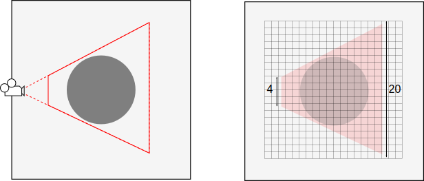
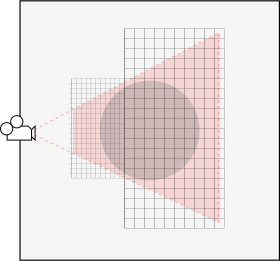
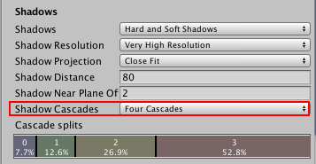
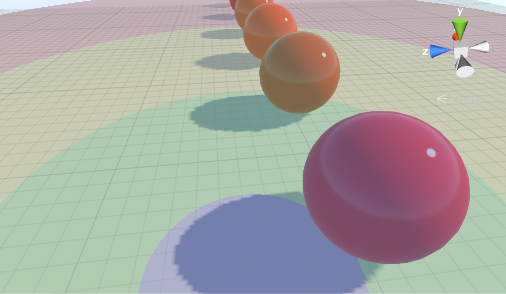
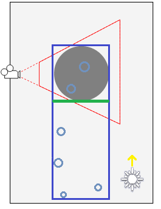
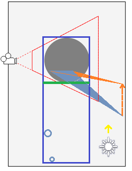

#Directional light shadows

A directional light typically simulates sunlight and a single light can illuminate the whole of a scene. This means that the shadow map will often cover a large portion of the scene at once and this makes the shadows susceptible to a problem called perspective aliasing. Perspective aliasing means that shadow map pixels seen close to the camera look enlarged and chunky compared to those farther away.

Perspective aliasing is less noticeable when you are using soft shadows and a high resolution for the shadow map. However, using these features will increase demands on the graphics hardware and so framerate might suffer.

## Shadow cascades

The reason perspective aliasing occurs is that different areas of the shadow map are scaled disproportionately by the camera's perspective. The shadow map from a light needs to cover only the part of the scene visible to the camera, which is defined by the camera's [view frustum](UnderstandingFrustum). If you imagine a simple case where the directional light comes directly from above, you can see the relationship between the frustum and the shadow map.

The distant end of the frustum is covered by 20 pixels of shadow map while the near end is covered by only 4 pixels. However, both ends appear the _same size_ onscreen. The result is that the resolution of the map is effectively much less for shadow areas that are close to the camera. (Note that in reality, the resolution is much higher than 20x20 and the map is usually not perfectly square-on to the camera.)

Using a higher resolution for the whole map can reduce the effect of the chunky areas but this uses up more memory and bandwidth while rendering. You will notice from the diagram, though, that a large part of the shadow map is wasted at the near end of the frustum because it will never be seen; also shadow resolution far away from the camera is likely to be too high. It is possible to split the frustum area into two zones based
on distance from the camera. The zone at the near end can use a separate shadow map at a reduced size (but with the same resolution) so that the number of pixels is evened out somewhat.

These staged reductions in shadow map size are known as **cascaded shadow maps** (sometimes called "Parallel Split Shadow Maps"). From the [Quality](class-QualitySettings) window, you can set zero, two or four cascades for a given quality level.

The more cascades you use, the less your shadows will be affected by perspective aliasing, but increasing the number does come with a rendering overhead. However, this overhead is still less than it would be if you were to use a high resolution map across the whole shadow.

## Shadow distance

Shadows from objects tend to become less noticeable the farther the objects are from the camera; they appear smaller onscreen and also, distant objects are usually not the focus of attention. Unity lets you take advantage of this effect by providing a _Shadow Distance_ property in the [Quality](class-QualitySettings) window. Objects beyond this distance (from the camera) cast no shadows at all, while the shadows from objects approaching this distance gradually fade out.

Set the shadow distance as low as possible to help improve rendering performance. This works because distant objects do not need to be rendered into the shadow map at all. Additionally, the Scene often looks better with distant shadows removed. Getting the shadow distance right is especially important for performance on mobile platforms, because they don't support shadow cascades. If the current camera far plane is smaller than the shadow distance, Unity uses the camera far plane instead of the shadow distance.

## Visualising shadow parameter adjustments

The Scene View has a [draw mode](ViewModes) called __Shadow Cascades__, which uses coloration to show the parts of the Scene using different cascade levels. Use this to help you get the shadow distance, cascade count and cascade split ratios just right. Note that this visualization use the Scene view far plane, which is usually bigger than the shadow distance, so you might need to lower the Shadow distance if you want to match the in-game behavior of the Camera with a small far plane.

## Shadow Pancaking

To further prevent shadow acne we are using a technique known as __Shadow pancaking__. The idea is to reduce the range of the light space used when rendering the shadow map along the light direction. This lead to an increased precision in the shadow map, reducing shadow acne.

In the above digram:

* The **light blue circles** represent the shadow casters
* The **dark blue rectangle** represents the original light space
* The **green line** represents the optimized near plane (excluding any shadow casters not visible in the view frustum)

Clamp these shadow casters to the near clip plane of the optimized space (in the Vertex Shader). Note that while this works well in general, it can create artifacts for very large triangles crossing the near clip plane:

In this case, only one vertex of the blue triangle is behind the near clip plane and gets clamped to it. However, this alters the triangle shape, and can create incorrect shadowing.

You can tweak the __Shadow Near Plane Offset__ property from the [Quality](class-QualitySettings) window to avoid this problem. This pulls back the near clip plane. However, setting this value very high eventually introduces shadow acne, because it raises the range that the shadow map needs to cover in the light direction. Alternatively, you can also tesselate the problematic shadow casting triangles. See the __bias__ section in [Shadow Overview](ShadowOverview) for more information.

