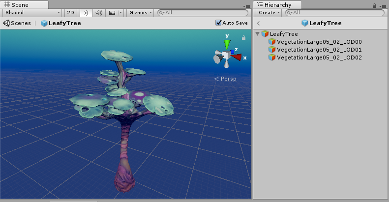

#Editing a Prefab in Prefab Mode

To edit a Prefab Asset, open it in Prefab Mode. Prefab Mode allows you to view and edit the contents of the Prefab Asset in isolation, separately from any other objects in your Scene. Changes you make in Prefab Mode affect all instances of that Prefab.

## Entering and exiting Prefab Mode

There are many ways to begin editing a Prefab in Prefab Mode, including:

* Double-clicking it in the Project window
* Using the arrow button next to the Prefab in the Hierarchy window
* Clicking the "Open" button in the Inspector window of a Prefab Asset

Entering Prefab Mode makes the Scene View and the Hierarchy window show only the contents of that Prefab. Here, the root of the Prefab is a regular GameObject - it doesn't have the blue Prefab instances icon.

In Prefab Mode, the Scene View displays a breadcrumb bar at the top. The rightmost entry is the currently open Prefab. Use the breadcrumb bar to navigate back to the main Scenes or other Prefab Assets that you might have opened.

Additionally, the Hierarchy window displays a Prefab header bar at the top which shows the currently open Prefab. You can use the back arrow in the header bar to navigate back one step, which is equivalent to clicking the previous breadcrumb in the breadcrumb bar in the Scene View.

## Auto Save

Prefab Mode has an __Auto Save__ setting in the top right corner of the Scene View. When it is enabled, any changes that you make to a Prefab are automatically saved to the Prefab Asset. *Auto Save* is on by default.

If you want to make changes without automatically saving those changes to the Preset Asset, turn __Auto Save__ off. In this case, you are asked if you want to save unsaved changes or not when you go out of Prefab Mode for the current Prefab. If editing a Prefab in Prefab Mode seems slow, turning off __Auto Save__ may help.

## Editing Environment

You can assign a Scene as an __editing environment__ to Prefab Mode, which allows you to edit your Prefab against a backdrop of your choosing rather than an empty Scene. This can be useful for seeing how your Prefab looks against typical scenery in your game.

The objects in the Scene that you assign as the editing environment are not selectable when in Prefab Mode, nor will they show in the Hierarchy. This is to allow you to focus on editing your Prefab without accidently selecting other unrelated objects, and without having a cluttered Hierarchy window.

To set a Scene as the editing environment, open the [Editor](class-EditorManager) window (top menu: __Edit &gt; Project Settings__, then select the __Editor__ category) and go to the __Prefab Editing Environment__ section. Use the __Regular Environment__ setting for "non-UI" Prefabs, and the __UI Environment__ setting for UI Prefabs. UI prefabs are those Prefabs that have a [Rect Transform](class-RectTransform) component on the root, rather than a regular Transform component. "non-UI" Prefabs are those which have a regular Transform component.

--------------------

* 2018-07-31  <!-- include IncludeTextNewPageSomeEdit -->

* Nested Prefabs and Prefab Variants added in 2018.3
