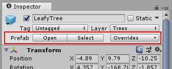
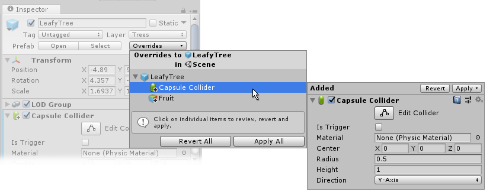
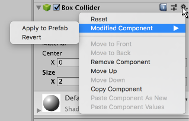
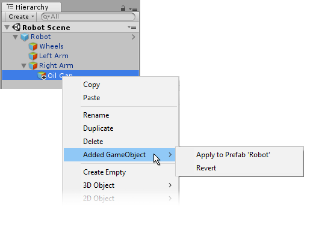

#Editing a Prefab via its instances

The Inspector for the root of a Prefab instance has three more controls than a normal GameObject: __Open__, __Select__ and __Overrides__.

The __Open__ button opens the Prefab Asset that the instance is from in Prefab Mode, allowing you to edit the Prefab Asset and thereby change all of its instances. The __Select__ button selects the Prefab Asset that this instance is from in the Project window. The __Overrides__ button opens the overrides drop-down window.

##Overrides dropdown

The __Overrides__ drop-down window shows all the overrides on the Prefab instance. It also lets you apply overrides from the instance to the Prefab Asset, or revert overrides on the instance back to the values on the Prefab Asset. The __Overrides__ drop-down button only appears for the root Prefab instance, not for Prefabs that are inside other Prefabs.

The __Overrides__ drop-down window allows you to apply or revert individual prefab overrides, or apply or revert all the prefab overrides in one go.

* **Applying** an override modifies the Prefab Asset. This puts the override (which is currently only on your Prefab instance) onto the Asset. This means the Prefab Asset now has that modification, and the Prefab instance no longer has that modification as an override.

* **Reverting** an override modifies the Prefab instance. This essentially discards your override and reverts it back to the state of the Prefab Asset.

The drop-down window shows a list of changes on the instance in the form of modified, added and removed components, and added GameObjects (including other Prefabs).

To inspect an entry, click it. This displays a floating view that shows the change and allows you to revert or apply that change.

For components with modified values, the view displays a side-by-side comparison of the component’s values on the Prefab Asset and the modified component on the Prefab instance. This allows you to compare the original Prefab Asset values with the current overrides, so that you can decide whether you would like to revert or apply those values.

In the example below, the "Fruit" child GameObject exists on both the Prefab Asset and the Prefab instance, however its scale has been increased on the instance. This increase in scale is an instance override, and can be seen as a side-by-side comparison in the __Overrides__ drop-down window.

The __Overrides__ drop-down window also has __Revert All__ and _Apply All__ buttons for reverting or applying all changes at once. If you have Prefabs inside other Prefabs, the __Apply All__ button always applies to the outermost Prefab, which is the one that has the __Overrides__ drop-down button on its root GameObject.

##Context menus

You can also **revert** and **apply** individual overrides using the context menu in the Inspector, instead of using the Overrides drop-down window.

Overridden properties are shown in bold. They can be reverted or applied via a context menu:

Modified components can be reverted or applied via the cog drop-down button or context menu of the component header:

Added components have a plus badge that overlays the icon. They can be reverted or applied via the cog drop-down button or context menu of the component header:

Removed components have a minus badge that overlays the icon. The removal can be reverted or applied via the cog drop-down button or context menu of the component header. Reverting the removal puts the component back, and applying the removal deletes it from the Prefab Asset as well:

GameObjects (including other Prefabs) that are added as children to a Prefab instance have a plus badge that overlays the icon in the Hierarchy. They can be reverted or applied via the context menu on the object in the Hierarchy:

--------------------

* 2018-07-31  <!-- include IncludeTextNewPageSomeEdit -->

* Nested Prefabs and Prefab Variants added in 2018.3