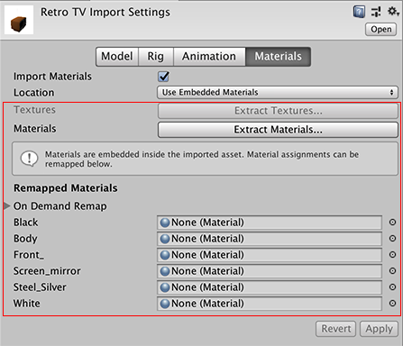
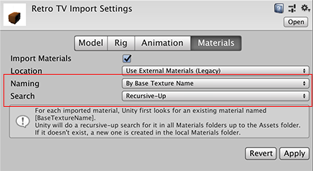

# Material tab

You can use this tab to change how Unity deals with Materials and Textures when importing your model.

When Unity imports a Model without any Material assigned, it uses the Unity diffuse Material. If the Model has Materials, Unity imports them as sub-Assets. You can extract Embedded Textures into your Project using the __Extract Textures__ button.

| __Property__|| __Function__ |
|:---|:---|:---| 
|__Import Materials__||Enable the rest of the settings for importing Materials.|
|__Location__||Define how to access the Materials and Textures. Different properties are available depending on which of these options you choose.|
||__Use Embedded Materials__ | Choose this option to [keep the imported Materials inside the imported Asset](#Embedded). This is the default option from Unity 2017.2 onwards. |
||__Use External Materials (Legacy)__ | Choose this option to [extract imported Materials as external Assets](#Legacy). This is a Legacy way of handling Materials, and is intended for projects created with 2017.1 or previous versions of Unity.  |

## Use Embedded Materials

When you choose Use __Embedded Materials__ for the __Location__ option, the following import options appear:

| __Property__|| __Function__ |
|:---|:---|:---| 
| __Textures__|| Click the __Extract Textures__ button to extract Textures that are embedded in your imported Asset. This is greyed out if there are no Textures to extract. |
| __Materials__|| Click the __Extract Materials__ button to extract Materials that are embedded in your imported Asset. This is greyed out if there are no materials to extract. |
| __Remapped Materials__|||
| __On Demand Remap__|| These settings match the settings that appear in the inspector if you set the __Location__ to [Use External Materials (Legacy)](#Legacy).  |
|| __Naming__ | Define how Unity names the Materials. |
|| _By Base Texture Name_ | Use the name of the diffuse Texture of the imported Material to name the Material. When a diffuse Texture is not assigned to the Material, Unity uses the name of the imported Material. |
|| _From Model’s Material_ | Use the name of the imported Material to name the Material. |
|| _Model Name + Model’s Material_ | Use the name of the model file in combination with the name of the imported Material to name the Material. |
|| __Search__ | Define where Unity tries to locate existing Materials using the name defined by the __Naming__ option. |
|| _Local Materials Folder_ | Find existing Materials in the "local" Materials folder only (that is, the *Materials* subfolder, which is the same folder as the model file). |
|| _Recursive-Up_ | Find existing Materials in all Materials subfolders in all parent folders up to the Assets folder. |
|| _Project-Wide_ | Find existing Materials in all Unity project folders. |
|| __Search and Remap__ | Click this button to remap your imported Materials to existing Material Assets, using the same settings as the Legacy import option. Clicking this button does not extract the Materials from the Asset, and does not change anything if Unity cannot find any materials with the correct name.  |
| __List of imported materials__|| This list displays all imported Materials found in the Asset. You can remap each material to an existing Material Asset in your Project. |

If you want to modify the properties of the Materials in Unity, you can extract them all at once using the __Extract Materials__ button. If you want to extract them one by one, go to __Assets__ &gt; __Extract From Prefab__. When you extract Materials this way, they appear as references in the __Remapped Materials__ list.

New imports or changes to the original Asset do not affect extracted Materials. If you want to re-import the Materials from the source Asset, you need to remove the references to the extracted Materials in the __Remapped Materials__ list. To remove an item from the list, select it and press the Backspace key on your keyboard.

## Use External Materials (Legacy)

When you choose __Use External Materials (Legacy)__ for the __Location__ option, the following import options appear:

| __Property__|| __Function__ |
|:---|:---|:---| 
| __Naming__ || Define how Unity names the Materials. |
|| __By Base Texture Name__ | Use the name of the diffuse Texture of the imported Material to name the Material. When a diffuse Texture is not assigned to the Material, Unity uses the name of the imported Material. |
|| __From Model’s Material__ | Use the name of the imported Material to name the Material. |
|| __Model Name + Model’s Material__ | Use the name of the model file in combination with the name of the imported Material to name the Material. |
| __Search__|| Define where Unity tries to locate existing Materials using the name defined by the __Naming__ option. |
|| __Local Materials Folder__ | Find existing Materials in the "local" Materials folder only (that is, the *Materials* subfolder, which is the same folder as the model file).  |
|| __Recursive-Up__ | Find existing Materials in all Materials subfolders in all parent folders up to the Assets folder. |
|| __Project-Wide__ | Find existing Materials in all Unity project folders. |

Before Unity version 2017.2, this was the default way of handling Materials. 

---

*  2018-04-25  <!-- include IncludeTextAmendPageSomeEdit -->
