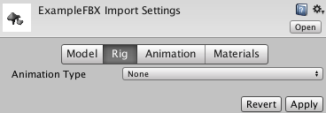
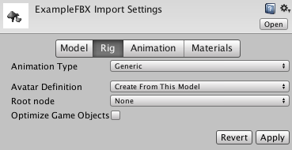
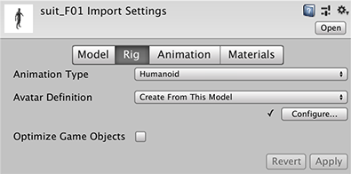

# Rig tab

The settings on the __Rig__ tab define how Unity maps the deformers to the Mesh in the imported Model so that you can animate it. For Humanoid characters, this means [assigning or creating an Avatar](ConfiguringtheAvatar). For non-Humanoid (_Generic_) characters, this means [identifying a Root bone in the skeleton](GenericAnimations). 

By default, when you select a Model in the __Project__ view, Unity determines which __Animation Type__ best matches the selected Model and displays it in the __Rig__ tab. If Unity has never imported the file, the Animation Type is set to __None__:

 

|**_Property:_** ||**_Function:_** |
|:---|:---|:---|
|__Animation Type__ ||Specfiy the type of animation.|
||__None__|No animation present|
||__Legacy__|Use the [Legacy Animation System](#LegacyRig). Import and use animations as with Unity version 3.x and earlier.|
||__Generic__|Use the [Generic Animation System](#GenericRig) if your rig is *non-humanoid* (quadruped or any entity to be animated). Unity picks a root node but you can identify another bone to use as the __Root node__ instead.|
||__Humanoid__|Use the [Humanoid Animation System](#HumanoidRig) if your rig is *humanoid* (it has two legs, two arms and a head). Unity usually detects the skeleton and maps it to the Avatar correctly. In some cases, you may need to set a change the __Avatar Definition__ and __Configure__ the mapping manually. |

## Generic animation types

 

[Generic Animations](GenericAnimations) do not use Avatars like Humanoid animations do. Since the skeleton can be arbitrary, you must specify which bone is the __Root node__. The Root node allows Unity to establish consistency between Animation clips for a generic model, and blend properly between Animations that have not been authored "in place" (that is, where the whole model moves its world position while animating).

Specifying the root node helps Unity determine between movement of the bones relative to each other, and motion of the Root node in the world (controlled from [OnAnimatorMove](ScriptRef:MonoBehaviour.OnAnimatorMove.html)).

|**_Property:_** ||**_Function:_** |
|:---|:---|:---|
|__Avatar Definition__||Choose where to get the Avatar definition. |
||__Create from this model__|Create an Avatar based on this model|
||__Copy from Other Avatar__|Point to an Avatar set up on another model. |
|__Root node__||Select the bone to use as a root node for this Avatar.    Only available if the __Avatar Definition__ is set to __Create From This Model__. |
|__Source__||Copy another Avatar with an identical rig to import its animation clips.   Only available if the __Avatar Definition__ is set to __Copy from Other Avatar__.|
|__Optimize Game Object__||Remove and store the GameObject transform hierarchy of the imported character in the Avatar and Animator component. If enabled, the SkinnedMeshRenderers of the character use the Unity animation system's internal skeleton, which improves the performance of the animated characters.   Only available if the __Avatar Definition__ is set to __Create From This Model__.   Enable this option for the final product.   **Note**: In optimized mode, skinned mesh matrix extraction is also multi-threaded. |

## Humanoid animation types

 

With rare exceptions, humanoid models have the same basic structure. This structure represents the major articulated parts of the body: the head and limbs. The first step to using Unity's [Humanoid animation features](ConfiguringtheAvatar) is to [set up and configure](class-Avatar) an __Avatar__. Unity uses the Avatar to map the simplified humanoid bone structure to the actual bones present in the Model's skeleton.  

|**_Property:_** ||**_Function:_** |
|:---|:---|:---|
|__Avatar Definition__||Choose where to get the Avatar definition. |
||__Create from this model__|Create an Avatar based on this model|
||__Copy from Other Avatar__|Point to an Avatar set up on another model. |
|__Source__||Copy another Avatar with an identical rig to import its animation clips.   Only available if the __Avatar Definition__ is set to __Copy from Other Avatar__.|
|__Configure...__||Open the [Avatar configuration](class-Avatar).   Only available if the __Avatar Definition__ is set to __Create From This Model__. |
|__Optimize Game Object__||Remove and store the GameObject transform hierarchy of the imported character in the Avatar and Animator component. If enabled, the SkinnedMeshRenderers of the character use the Unity animation system's internal skeleton, which improves the performance of the animated characters.   Only available if the __Avatar Definition__ is set to __Create From This Model__.   Enable this option for the final product.   **Note**: In optimized mode, skinned mesh matrix extraction is also multi-threaded. |

## Legacy animation types

](../uploads/Main/Rig-3.png) 

|**_Property:_** ||**_Function:_** |
|:---|:---|:---|
|__Generation__||Select the animation import method.|
||__Don't Import__|Do not import animation|
||__Store in Original Roots (Deprecated)__|Deprecated. Do not use. |
||__Store in Nodes (Deprecated)__|Deprecated. Do not use. |
||__Store in Root (Deprecated)__|Deprecated. Do not use. |
||__Store in Root (New)__|Import the animation and store it in the Model's root node. This is the default setting. |

---

*  2018-04-25  <!-- include IncludeTextAmendPageSomeEdit -->

*  2017-12-05  <!-- include IncludeTextAmendPageSomeEdit -->

* __Materials__ tab added in [2017.2](https://docs.unity3d.com/2017.2/Documentation/Manual/30_search.html?q=newin20172) NewIn20172