#Frame Debugger

The __Frame Debugger__ lets you freeze playback for a running game on a particular frame and view the individual _draw calls_ that are used to render that frame. As well as listing the drawcalls, the debugger also lets you step through them one-by-one so you can see in great detail how the Scene is constructed from its graphical elements.

##Using the Frame Debugger

The Frame Debugger window (menu: __Window__ &gt; __Analysis__ &gt; __Frame Debugger__) shows the drawcall information and lets you control the "playback" of the frame under construction.

The main list shows the sequence of drawcalls (and other events like framebuffer clear) in the form of a hierarchy that identifies where they originated from. The panel to the right of the list gives further information about the drawcall such as the geometry details and the shader used for rendering.

Clicking on an item from the list will show the Scene (in the Game view) as it appears up to and including that drawcall. The left and right arrow buttons in the toolbar move forward and backward in the list by a single step and you can also use the arrow keys to the same effect. Additionally, the slider at the top of the window lets you "scrub" rapidly through the drawcalls to locate an item of interest quickly. Where a drawcall corresponds to the geometry of a GameObject, that object will be highlighted in the main Hierarchy panel to assist identification.

If rendering happens into a RenderTexture at the selected draw call, then contents of that RenderTexture are displayed in the [Game view](GameView). This is useful for inspecting how various off-screen render targets are built up, for example diffuse g-buffer in deferred shading:

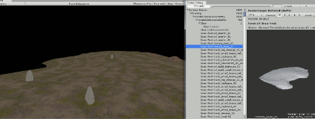

Or looking at how the shadow maps are rendered:

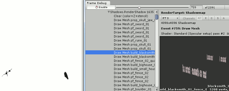

##Remote Frame Debugger

To use Frame Debugger remotely, the player has to support multithreaded rendering (for ex., WebGL, iOS don’t support it, thus frame debugger cannot be run on it), most of the Unity platforms support it, secondly you have to check ‘Development Build’ when building.

Note for Desktop platforms: be sure to check ‘Run In Background’ option before building, otherwise, when you’ll connect Frame Debugger to player, it won’t reflect any rendering changes until it has focus, assuming you’re running both Editor and the player on the same machine, when you’ll control Frame Debugger in Editor, you’ll take the focus from the player.

Quick Start:

* From Editor build the project to target platform (select Development Player)
* Run the player
* Go back to the Editor
* Open Frame Debugger window
* Click **Active Profiler**, select the player
* Click **Enable**, frame debugger should enable on the player

### Render target display options

At the top of the information panel is a toolbar which lets you isolate the red, green, blue and alpha channels for the current state of the Game view. Similarly, you can isolate areas of the view according to brightness levels using the _Levels_ slider to the right of these channel buttons. These are only enabled when rendering into a RenderTexture.

When rendering into multiple render targets at once you can select which one to display in the game view. Shown here are the diffuse, specular, normals and emission/indirect lighting buffers in 5.0 deferred shading mode, respectively:

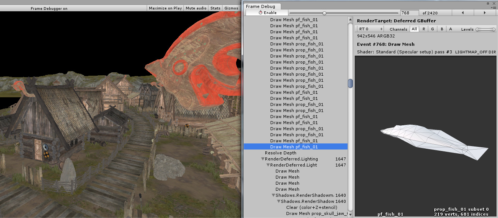

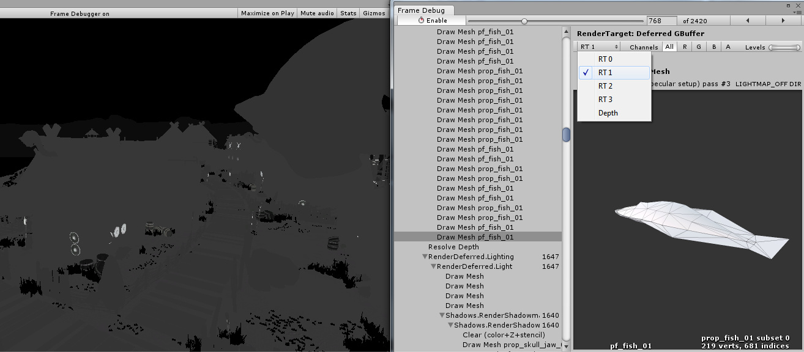

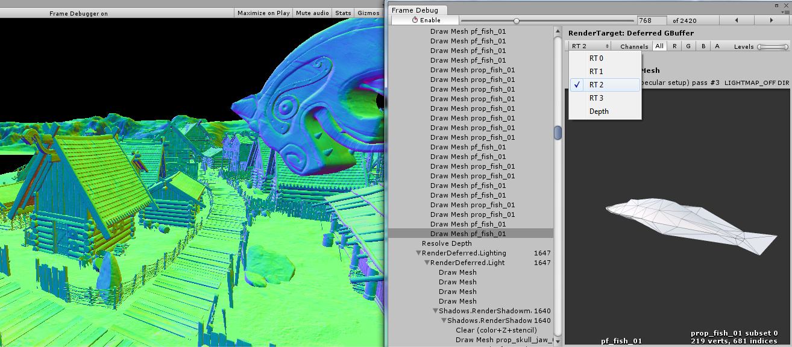

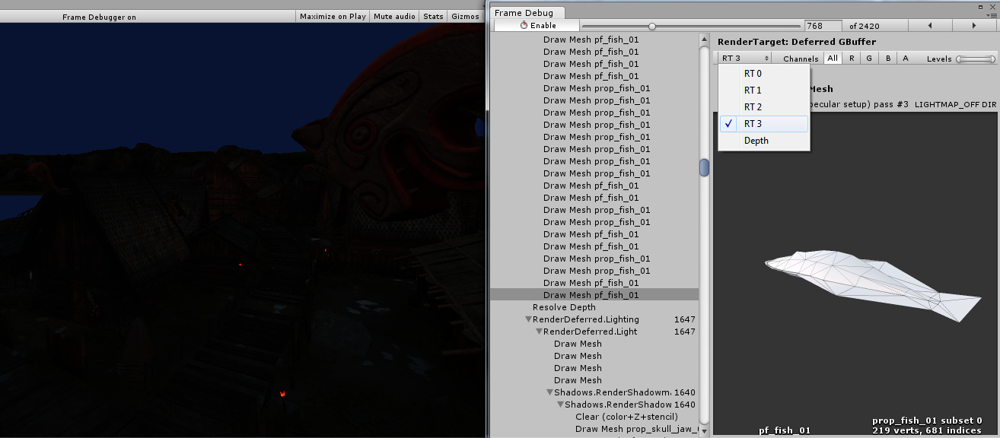

Additionally, you can see the depth buffer contents by picking "Depth" from the dropdown:

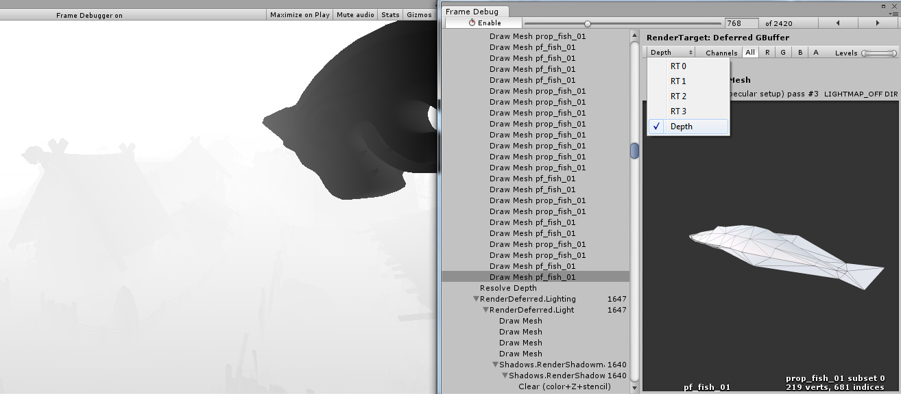

By isolating alpha channel of the render texture, you can see occlusion (stored in RT0 alpha) and smoothness (stored in RT1 alpha) of the deferred g-buffer:

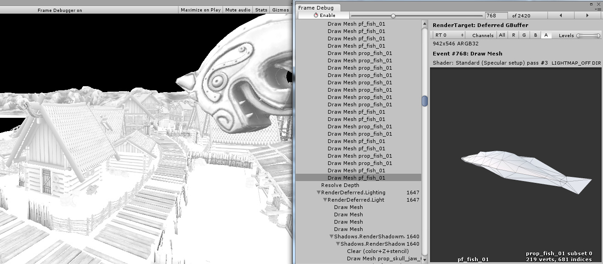

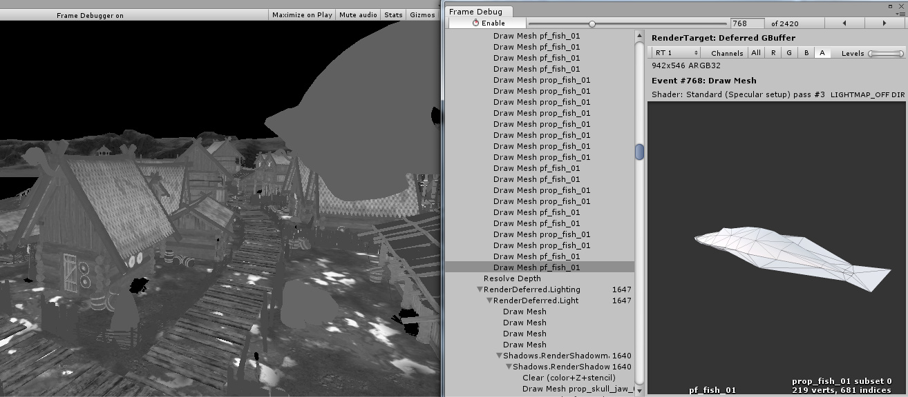

The emission and ambient/indirect lighting in this Scene is very dark; we can make it more visible by changing the Levels slider:

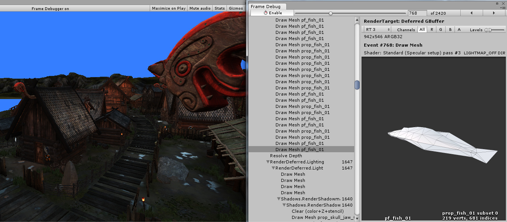

### Viewing shader property values

For draw calls, the Frame Debugger can also show [shader property
values](SL-PropertiesInPrograms) that are used. Click on "Shader Properties" tab to show them:

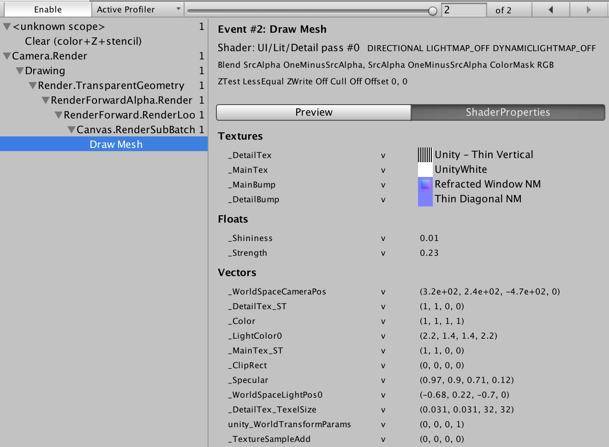

For each property, the value is shown, as well as which shader stages
it was used in (vertex, fragment, geometry, hull, domain). Note that when using OpenGL (e.g. on a Mac), all shader properties are considered to be part of vertex shader stage, due to how GLSL shaders work.

In the editor, thumbnails for textures are displayed too, and clicking
on them highlights the textures in the project window.

## Alternative frame debugging techniques

You could also use external tools to debug rendering. Editor integration exists for easily launching [RenderDoc](RenderDocIntegration) to inspect the Scene or Game view in the Editor.

You can also build a standalone player and run it through any of the following:

* [Visual Studio graphics debugger](http://msdn.microsoft.com/en-us/library/hh315751.aspx)
* [Intel GPA](https://software.intel.com/en-us/vcsource/tools/intel-gpa)
* [RenderDoc](https://github.com/baldurk/renderdoc)
* [NVIDIA NSight](http://www.nvidia.com/object/nsight.html)
* [AMD GPU PerfStudio](http://developer.amd.com/tools-and-sdks/graphics-development/gpu-perfstudio-2/)
* [Xcode GPU Frame Capture](https://developer.apple.com/library/ios/recipes/xcode_help-debugger/articles/debugging_opengl_es_frame.html)
* [GPU Driver Instruments](https://developer.apple.com/library/ios/documentation/DeveloperTools/Conceptual/InstrumentsUserGuide/Instrument-GPUDriver.html)
 
When you've done this, capture a frame of rendering, then step through the draw calls and other rendering events to see what’s going on. This is a very powerful approach, because these tools can provide you with a lot of information to really drill down.
