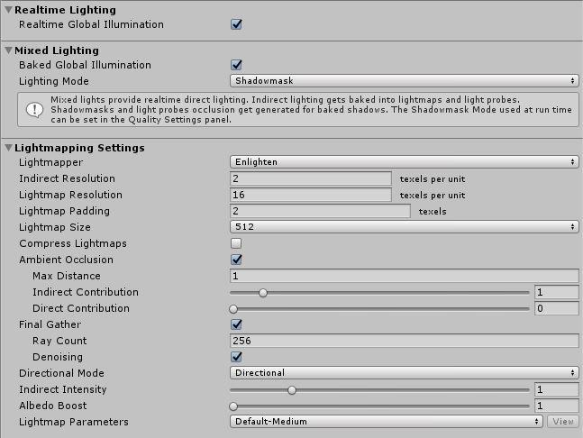

# Enlighten

Unity provides two distinct techniques for precomputing global illumination (GI) and bounced lighting. These are __Baked Global Illumination__ and __Precomputed Realtime Global Illumination__. The Enlighten lighting system provides solutions for both.

To find the following settings, navigate to Unity's top menu and go to __Window__ &gt; __Rendering__ &gt; __Lighting__.

| __Property:__| __Function:__ |
|:---|:---| 
| __Realtime Global Illumination__| Makes Unity calculate and update lighting in real time. For more information, see documentation on [Realtime Global Illumination](LightMode-Realtime), and the Unity tutorial on [Precomputed Realtime GI](https://unity3d.com/learn/tutorials/topics/graphics/introduction-precomputed-realtime-gi?playlist=17102). |
| __Lighting Mode__| Specifies which lighting mode to use for all mixed lights in the Scene. Options are [Baked Indirect](LightMode-Mixed-BakedIndirect), [Distance Shadowmask](LightMode-Mixed-DistanceShadowmask), [Shadowmask](LightMode-Mixed-Shadowmask), and [Subtractive](LightMode-Mixed-Subtractive).  |
| __Lightmapper__| Specifies which internal lighting calculation software to use to calculate lightmaps in the Scene. The options are __Progressive __and __Enlighten__. The default value is __Progressive__; set it to __Enlighten__ to use the system described in this page.  If you want to use the __Progressive__ system, see documentation on the [Progressive Lightmapper](ProgressiveLightmapper).  |
| __Indirect Resolution__| This property is only available when __Realtime Global Illumination__ is enabled. Use this value to specify the number of texels per unit to use for indirect lighting calculations. Increasing this value improves the visual quality of indirect light, but also increases the time it takes to bake lightmaps. The default value is 2. See the Unity tutorial on [Realtime Resolution](https://unity3d.com/learn/tutorials/topics/graphics/realtime-resolution?playlist=17102) for details about Indirect Resolution. |
| __Lightmap Resolution__| Specifies the number of texels per unit to use for lightmaps. Increasing this value improves lightmap quality, but also increases bake times. The default value in a new Scene is 40. |
| __Lightmap Padding__| Specifies the separation (in texel units) between separate shapes in the baked lightmap. The default value is 2. |
| __Lightmap Size__| The size (in pixels) of the full lightmap texture, which incorporates separate regions for the individual object textures. The default value is 1024. |
| __Compress Lightmaps__| Compresses lightmaps so that they require less storage space. However, the compression process can introduce unwanted visual effects into the texture. This property is checked by default. |
| __Ambient Occlusion__| Opens a group of settings which allow you to control the relative brightness of surfaces in [ambient occlusion](LightingBakedAmbientOcclusion). Higher values indicate a greater contrast between the occluded and fully lit areas. This only applies to the indirect lighting calculated by the GI system. This property is enabled by default. |
|     Max Distance| Sets a value to control how far the lighting system casts rays in order to determine whether or not to apply occlusion to an object. A larger value produces longer rays and contributes more shadows to the lightmap, while a smaller value produces shorter rays that contribute shadows only when objects are very close to one another. A value of 0 casts an infinitely long ray that has no maximum distance. The default value is 1. |
|     Indirect Contribution| Use the slider to scale the brightness of indirect light (that is, ambient light, or light bounced and emitted from objects) in the final lightmap, from a value between 0 and 10. The default value is 1. Values less than 1 reduce the intensity, and values greater than 1 increase it. |
|     Direct Contribution| Use the slider to scale the brightness of direct light from a value between 0 and 10. The default value is 0. The higher this value is, the greater the contrast applied to the direct lighting. |
| __Final Gather__| Enable this if you want Unity to calculate the final light bounce in the GI calculation at the same resolution as the baked lightmap. This improves the visual quality of the lightmap, but at the cost of additional baking time in the Editor. |
|     Ray Count| Defines the number of rays emitted for each final gather point. The default value is 256. |
|     Denoising| Applies a de-noising filter to the __Final Gather__ output. This property is checked by default. |
| __Directional Mode__| You can set up the lightmap to store information about the dominant incoming light at each point on the surfaces of your GameObjects. See documentation on [Directional Lightmapping](LightmappingDirectional) for further details. The default mode is __Directional__. |
|     Directional| In __Directional__ mode, Unity generates a second lightmap to store the dominant direction of incoming light. This allows diffuse normal-mapped materials to work with the GI. Directional mode requires about twice as much storage space for the additional lightmap data. Unity cannot decode directional lightmaps on SM2.0 hardware or when using GLES2.0. They fall back to non-directional lightmaps. |
|     Non-directional| In __Non-directional__ mode, Unity does not generate a second lightmap for the dominant direction of incoming light, and instead stores all lighting information in the same place.  |
| __Indirect Intensity__| Controls the brightness of the indirect light that Unity stores in real-time and baked lightmaps, from a value between 0 and 5. A value above 1 increases the intensity of indirect light, and a value of less than 1 reduces indirect light intensity. The default value is 1. |
| __Albedo Boost__| Controls the amount of light Unity bounces between surfaces by intensifying the albedo of Materials in the Scene, from a value between 1 and 10. Increasing this draws the albedo value towards white for indirect light computation. The default value is 1, which is physically accurate. |
| __Lightmap Parameters__| Unity uses a set of general parameters for the lightmapping in addition to Lighting window properties of the. A few defaults are available from the menu for this property, but you can also use the __Create New__ option to create your own lightmap parameter file. See the [Lightmap Parameters](class-LightmapParameters) page for further details. The default value is __Default-Medium__. |

See the [Precomputed Realtime GI tutorial](https://unity3d.com/learn/tutorials/topics/graphics/introduction-precomputed-realtime-gi?playlist=17102) to learn more about Enlighten optimizations. 

---

Progressive Lightmapper added in [2018.1](https://docs.unity3d.com/2018.1/Documentation/Manual/30_search.html?q=newin20181) NewIn20181

 2017-05-18  <!-- include IncludeTextNewPageSomeEdit -->

