#GI visualizations in the Scene view

The Scene view has a number of [Draw Modes](ViewModes) to help you visualize different aspects of the Scene’s content. Among these are a set of modes to let you see exactly how global illumination (GI) is affecting your Scene. This page goes into more detail about the visualisation modes that are most relevant to GI. 

Note that, in the [Lighting window](GlobalIllumination), the __Object__ tab displays some of the different modes for the selected GameObject, with its UV channel rendered in Texture space as a wireframe Mesh. Tick the __Show Lightmap Resolution__ checkbox to apply a checkerboard texture on top of each view, scaled to show the resolution.

GI visualizations are not designed to work in Play Mode.

##Shading Mode

###Shaded

The default __Shading Mode__ is __Shaded__. This shows the Scene fully lit according to the current lighting setup.

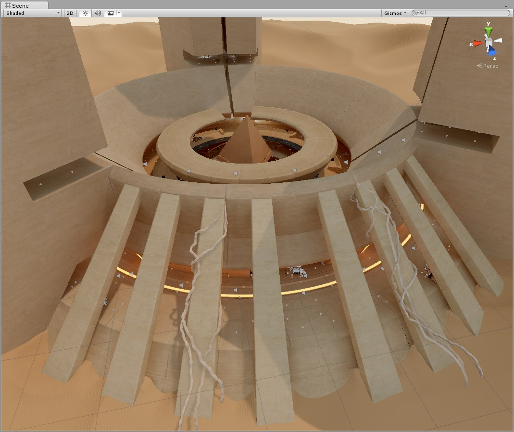

## Global Illumination

###Systems

The precompute stage will automatically subdivide the scene into systems (i.e. groups of objects sharing the same realtime lightmap) based on proximity and Lightmap Parameters. This is done to allow multithreading and optimizations when updating indirect lighting. This visualization shows the systems with different colors.

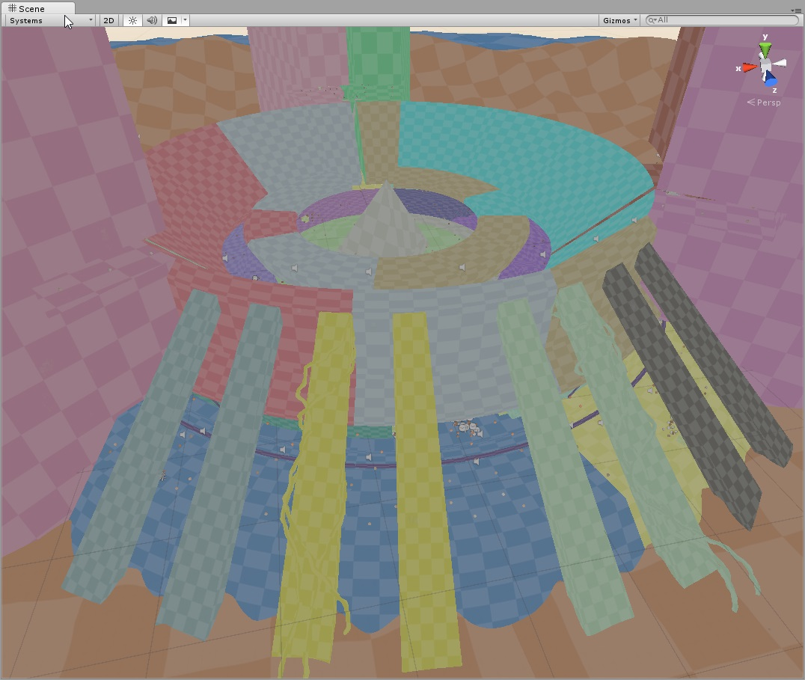

###Clustering

This shows the clusters that Enlighten generates from the lightmap static geometry. Enlighten calculates indirect lighting using clusters that are generated in the Clustering step. Resulting clusters should be larger than lightmap texels (the ratio is controlled by the Cluster Resolution parameter in [Lightmap Parameters](class-LightmapParameters). The step where geometry is converted to clusters can be quite memory intensive if the scale isn't set correctly.
If you are seeing high memory usage or long baking times it could be because the static geometry in your scene is getting cut up into many more clusters than what is actually needed. The clustering scene view mode can help you identify the geometry that needs to have UVs or Realtime Resolution tweaked.

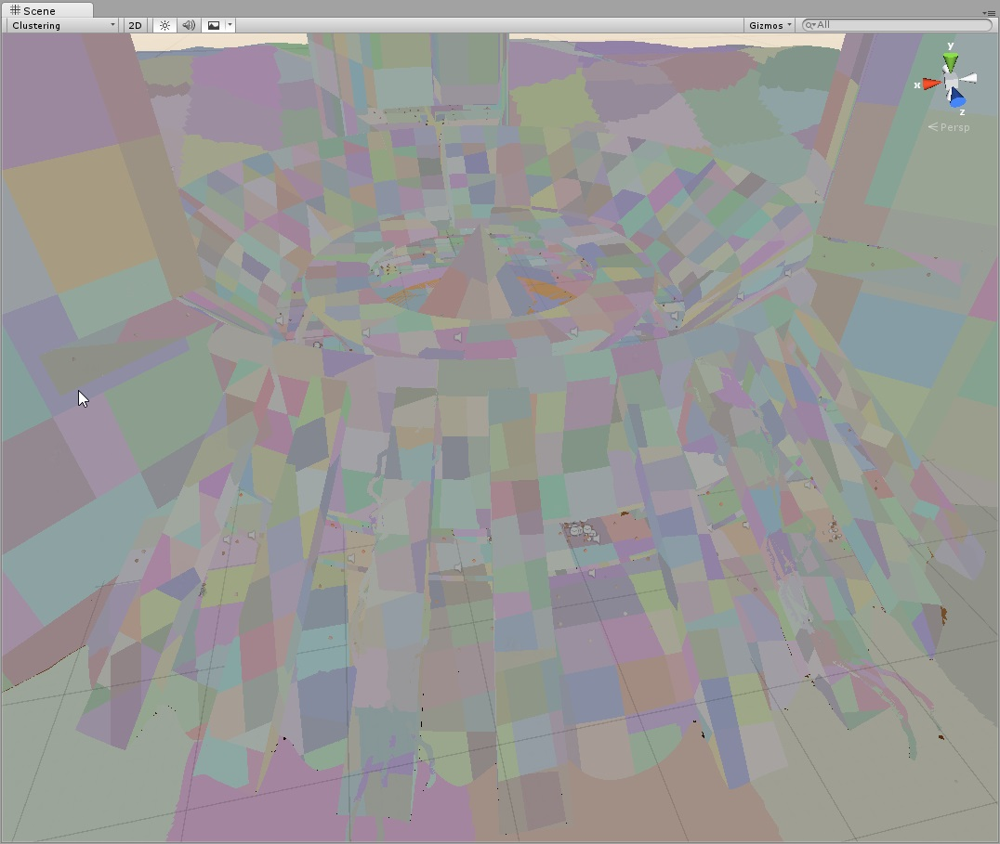

###Lit Clustering

Those are the same clusters as seen in the Clustering view, but with realtime GI applied.

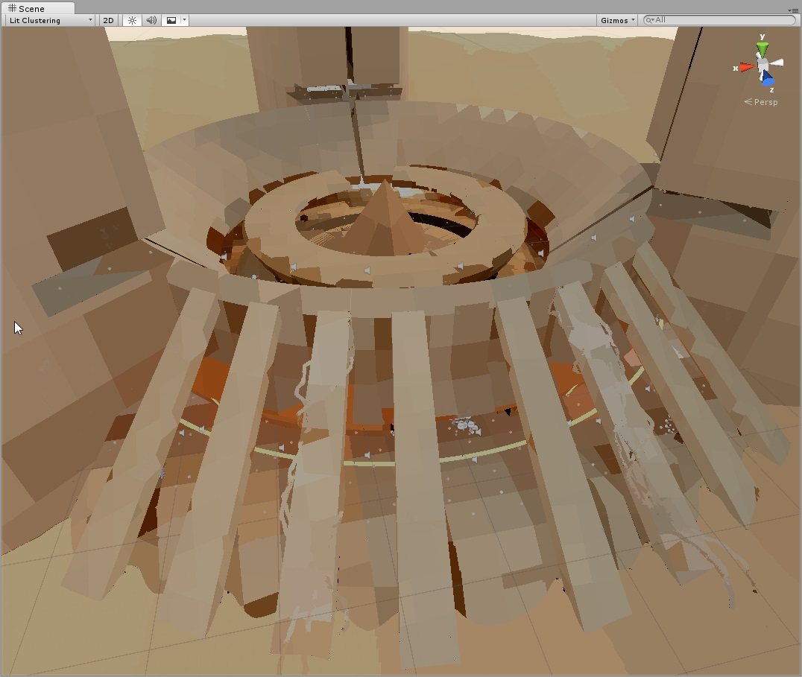

###UV Charts

This shows the optimized UV layout used when calculating precomputed realtime GI. It is automatically generated during the precompute process. It is available as soon as the Instance precompute stage is completed. The UV Charts scene view mode can help you identify the geometry that needs to have UVs or scale adjusted (use the Resolution parameter in Lightmap Parameters to change scale). This view is also useful when adjusting the Realtime Resolution. Each chart has a different color.

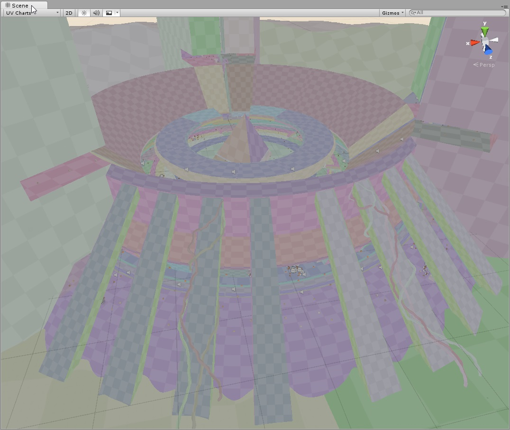

##Realtime Global Illumination

###Albedo

This shows the albedo used when calculating GI. The albedo is generated from the material information and can be customized fully by adding a custom meta pass. The checkered overlay shows the resolution of the albedo texture that is passed to Enlighten.

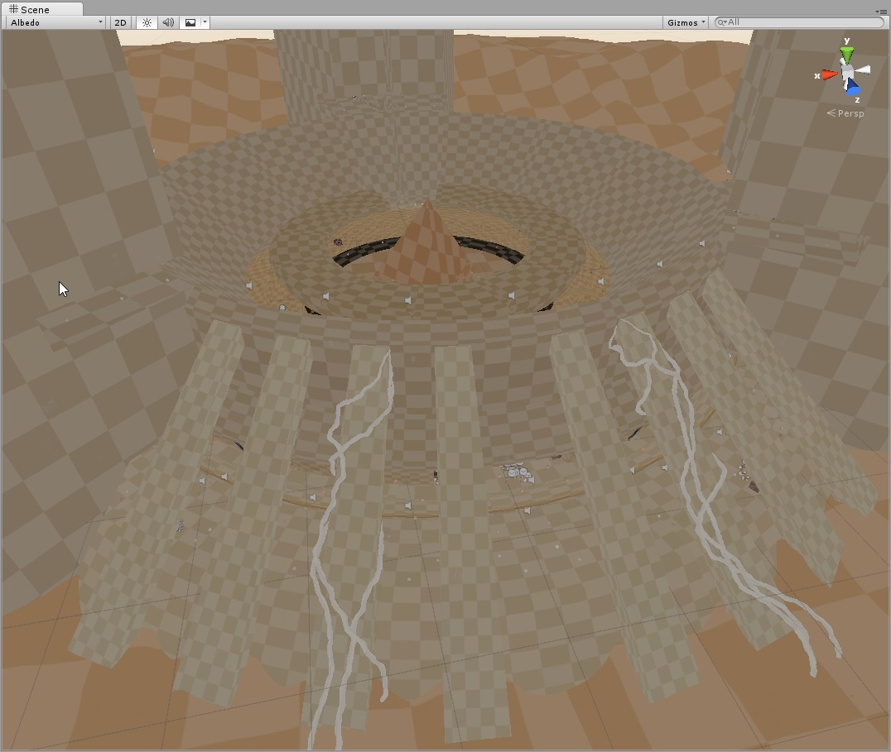

###Emissive

Shows the emission used when calculating the GI. It is generated from the material information and can be fully customized by adding a custom meta pass. The checkered overlay shows the resolution of the emission texture that is passed into Enlighten.

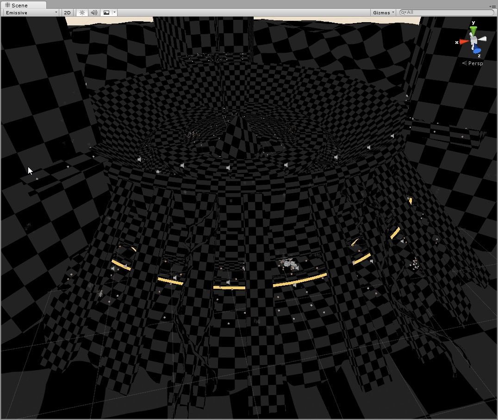

###Indirect

This shows the indirect lighting only (the contents of realtime GI lightmaps generated by Enlighten). The checkered overlay shows the resolution of the irradiance texture. If Realtime GI is disabled, this view mode isn’t selectable.

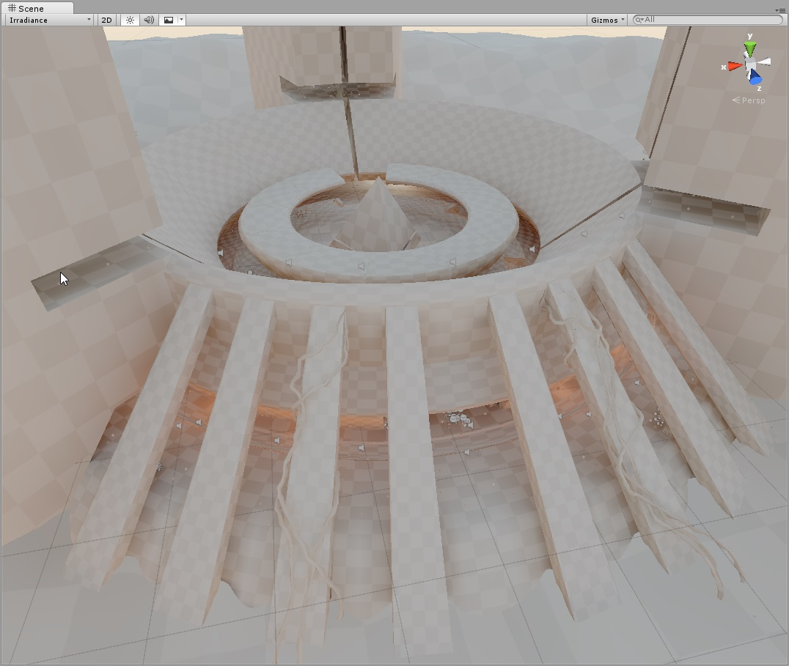

###Directionality

This view shows the most dominant light direction vector. Please refer to the [Directional Lightmapping](LightmappingDirectional) page for more info. The checkered overlay shows the resolution of the directionality texture.

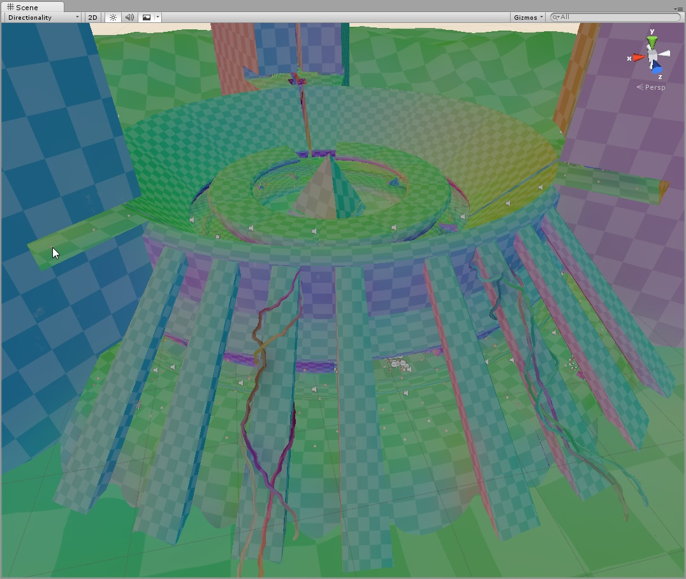

## Baked Global Illumination

###Baked Lightmap

This shows the baked lightmaps applied to the scene geometry. The checkered overlay shows the baked lightmap resolution.

###Shadowmask

This displays the shadowmask texture occlusion values. It colors the mesh and the light gizmo in the same color so one can verify that the light occlusion factors have been baked as expected.

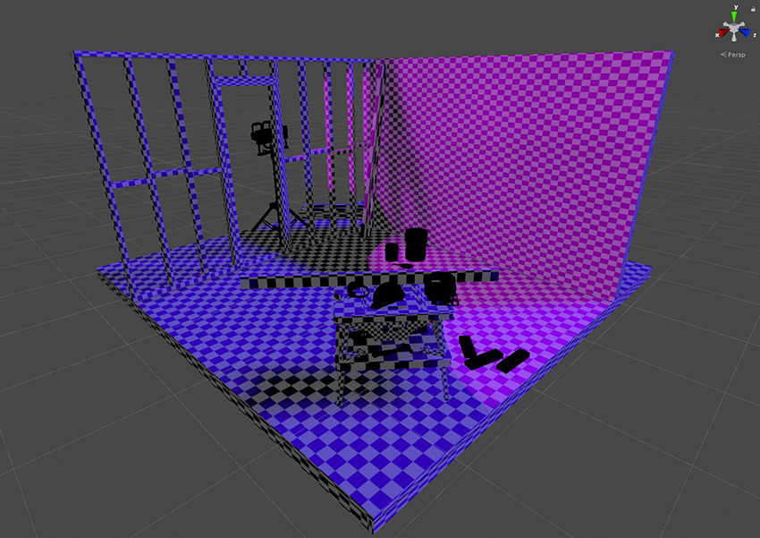

###Texel Validity

This mode shows which texels are marked invalid because they mostly "see" backfaces. During lightmap baking, Unity emits rays from each texel. If a significant portion of a texel's rays are hitting backface geometry, this texel is marked invalid. This is because the texel should not be able to see the backfaces in the first place. Unity handles this by replacing invalid texels with valid neighbors. You can adjust this behaviour using the __Backface Tolerance__ parameter (__LightmapParameters__ > __General GI__).

###UV Overlap
If lightmap charts are too close together in UV space, the pixel values inside them might bleed into one another when the lightmap is sampled by the GPU. This can lead to unexpected artifacts. This mode allows you to identify texels that are too close to texels in other charts. This is useful when you want to troubleshoot your UV issues.

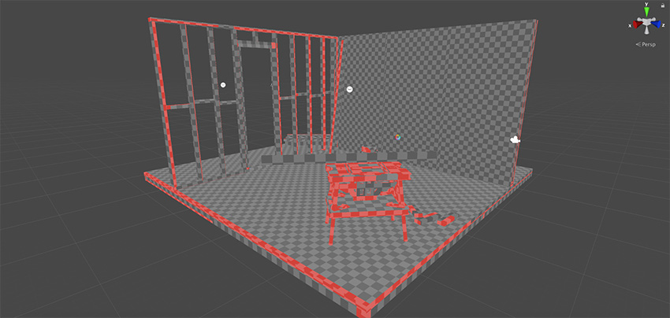

##Light Overlap

This mode allows you to see if all static lights have been baked to the shadowmask. If an area of the level is lit by more than four static lights, the exceeding lights will fallback to fully baked and be displayed in red. Relevant for this calculation is not the actual lit surface, but the intersection of the light sources’ volumes. So even though in the screenshot below it looks as if the colored spots on the mesh do not overlap, the cones of the four spotlights end up overlapping below the ground plane along with the directional light.

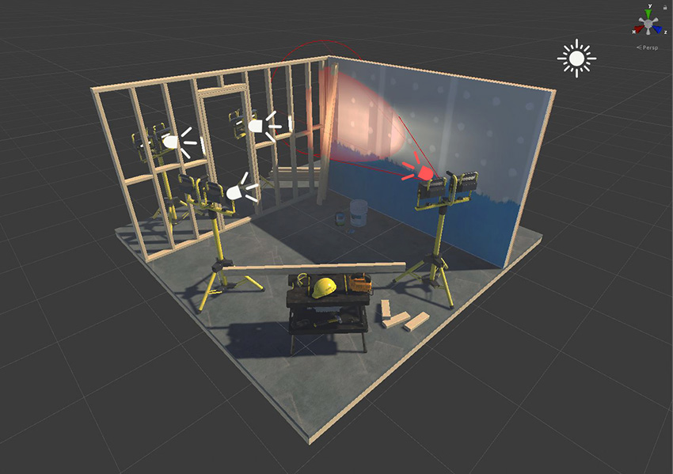

---
* 2018-03-28  <!-- include IncludeTextAmendPageSomeEdit -->

* Updated in 5.6

* Updated in 2018.1