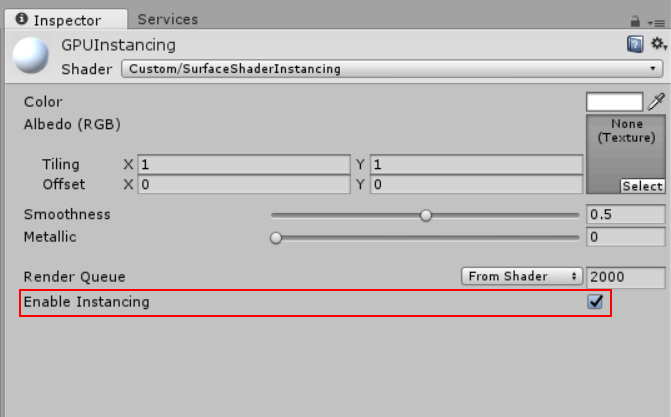
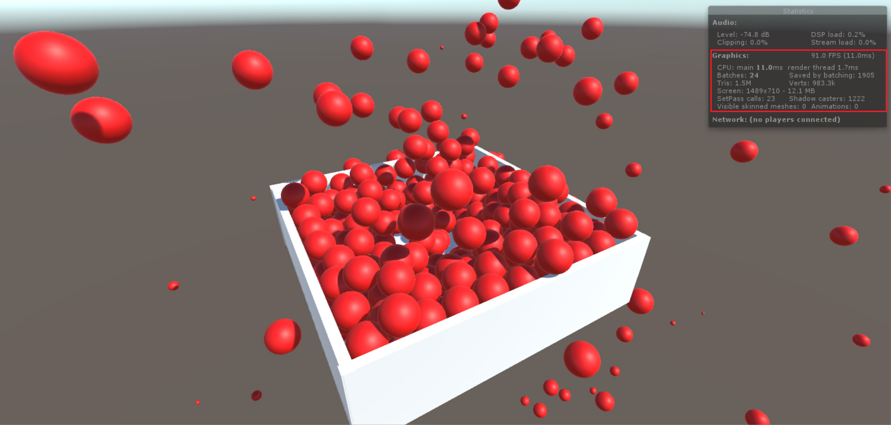
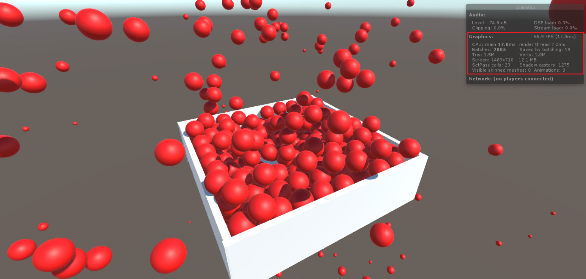

<!--  see https://unity3d.atlassian.net/browse/UNI-3131 -->

# GPU instancing

## Introduction

Use GPU Instancing to draw (or render) multiple copies of the same Mesh at once, using a small number of [draw calls](DrawCallBatching). It is useful for drawing objects such as buildings, trees and grass, or other things that appear repeatedly in a Scene. 

GPU Instancing only renders identical Meshes with each draw call, but each instance can have different parameters (for example, color or scale) to add variation and reduce the appearance of repetition. 

GPU Instancing can reduce the number of draw calls used per Scene. This significantly improves the rendering performance of your project.

## Adding instancing to your Materials

To enable GPU Instancing on Materials, select your Material in the Project window, and in the Inspector, tick the __Enable Instancing__ checkbox.



Unity only displays this checkbox if the Material Shader supports GPU Instancing. This includes Standard, StandardSpecular and all surface [Shaders](Shaders). See documentation on [standard Shaders](shader-StandardShader) for more information.

The screenshots below show the same Scene with multiple GameObjects; in the top image GPU Instancing is enabled, in the bottom image it is not.  Note the difference in __FPS__, __Batches __and __Saved by batching__.





When you use GPU instancing, the following restrictions apply:

* Unity automatically picks MeshRenderer components and `Graphics.DrawMesh` calls for instancing. Note that [SkinnedMeshRenderer](https://docs.unity3d.com/ScriptReference/SkinnedMeshRenderer.html) is not supported.

* Unity only batches GameObjects that share the same Mesh and the same Material in a single GPU instancing draw call. Use a small number of Meshes and Materials for better instancing efficiency. To create variations, modify your shader scripts to add per-instance data (see next section to learn more about this).

You can also use the calls [Graphics.DrawMeshInstanced](ScriptRef:Graphics.DrawMeshInstanced.html) and [Graphics.DrawMeshInstancedIndirect](ScriptRef:Graphics.DrawMeshInstancedIndirect.html) to perform GPU Instancing from your scripts.

GPU Instancing is available on the following platforms and APIs:

* __DirectX 11__ and __DirectX 12__ on Windows

* __OpenGL Core 4.1+/ES3.0+__ on Windows, macOS, Linux, iOS and Android

* __Metal__ on macOS and iOS

* __Vulkan__ on Windows and Android

* __PlayStation 4__ and __Xbox One__

* __WebGL__ (requires WebGL 2.0 API)

## Adding per-instance data

By default, Unity only batches instances of GameObjects with different [Transforms](Transforms) in each instanced draw call. To add more variance to your instanced GameObjects, modify your Shader to add per-instance properties such as Material color. 

The example below demonstrates how to create an instanced Shader with different colour values for each instance.

```

Shader "Custom/InstancedColorSurfaceShader" {
	Properties {
		_Color ("Color", Color) = (1,1,1,1)
		_MainTex ("Albedo (RGB)", 2D) = "white" {}
		_Glossiness ("Smoothness", Range(0,1)) = 0.5
		_Metallic ("Metallic", Range(0,1)) = 0.0
	}

	SubShader {
		Tags { "RenderType"="Opaque" }
		LOD 200
		CGPROGRAM
		// Physically based Standard lighting model, and enable shadows on all light types
		#pragma surface surf Standard fullforwardshadows
		// Use Shader model 3.0 target
		#pragma target 3.0
		sampler2D _MainTex;
		struct Input {
			float2 uv_MainTex;
		};
		half _Glossiness;
		half _Metallic;
		UNITY_INSTANCING_BUFFER_START(Props)
	       UNITY_DEFINE_INSTANCED_PROP(fixed4, _Color)
		UNITY_INSTANCING_BUFFER_END(Props)
		void surf (Input IN, inout SurfaceOutputStandard o) {
			fixed4 c = tex2D (_MainTex, IN.uv_MainTex) * UNITY_ACCESS_INSTANCED_PROP(Props, _Color);
			o.Albedo = c.rgb;
			o.Metallic = _Metallic;
			o.Smoothness = _Glossiness;
			o.Alpha = c.a;
		}
		ENDCG
	}
	FallBack "Diffuse"
}

```

When you declare `_Color` as an instanced property, Unity will gather `_Color` values from the MaterialPropertyBlock objects set on GameObjects and put them in a single draw call.

```

MaterialPropertyBlock props = new MaterialPropertyBlock();
MeshRenderer renderer;

foreach (GameObject obj in objects)
{
   float r = Random.Range(0.0f, 1.0f);
   float g = Random.Range(0.0f, 1.0f);
   float b = Random.Range(0.0f, 1.0f);
   props.SetColor("_Color", new Color(r, g, b));
   
   renderer = obj.GetComponent<MeshRenderer>();
   renderer.SetPropertyBlock(props);
}
```

Note that in normal cases (where an instancing shader is not used, or `_Color` is not a per-instance property), draw call batches are broken due to different values in the MaterialPropertyBlock.

For these changes to take effect, you must enable GPU Instancing. To do this, select your Shader in the Project window, and in the Inspector, tick the __Enable Instancing__ checkbox.


## Adding instancing to vertex and fragment Shaders

The following example takes a simple unlit Shader and makes it capable of instancing with different colors:

```

Shader "SimplestInstancedShader"
{
    Properties
    {
        _Color ("Color", Color) = (1, 1, 1, 1)
    }

    SubShader
    {
        Tags { "RenderType"="Opaque" }
        LOD 100

        Pass
        {
            CGPROGRAM
            #pragma vertex vert
            #pragma fragment frag
            #pragma multi_compile_instancing
            #include "UnityCG.cginc"

            struct appdata
            {
                float4 vertex : POSITION;
                UNITY_VERTEX_INPUT_INSTANCE_ID
            };

            struct v2f
            {
                float4 vertex : SV_POSITION;
                UNITY_VERTEX_INPUT_INSTANCE_ID // necessary only if you want to access instanced properties in fragment Shader.
            };

            UNITY_INSTANCING_BUFFER_START(Props)
                UNITY_DEFINE_INSTANCED_PROP(float4, _Color)
            UNITY_INSTANCING_BUFFER_END(Props)
           
            v2f vert(appdata v)
            {
                v2f o;

                UNITY_SETUP_INSTANCE_ID(v);
                UNITY_TRANSFER_INSTANCE_ID(v, o); // necessary only if you want to access instanced properties in the fragment Shader.

                o.vertex = UnityObjectToClipPos(v.vertex);
                return o;
            }
           
            fixed4 frag(v2f i) : SV_Target
            {
                UNITY_SETUP_INSTANCE_ID(i); // necessary only if any instanced properties are going to be accessed in the fragment Shader.
                return UNITY_ACCESS_INSTANCED_PROP(Props, _Color);
            }
            ENDCG
        }
    }
}
```

## Shader modifications

| Addition| Function |
|:---|:---|
| `#pragma multi_compile_instancing`| Use this to instruct Unity to generate instancing variants. It is not necessary for surface Shaders. |
| `UNITY_VERTEX_INPUT_INSTANCE_ID`| Use this in the vertex Shader input/output structure to define an instance ID. See `SV_InstanceID` for more information. |
| `UNITY_INSTANCING_BUFFER_START(name)` / `UNITY_INSTANCING_BUFFER_END(name)`| Every per-instance property must be defined in a specially named constant buffer. Use this pair of macros to wrap the properties you want to be made unique to each instance. |
| `UNITY_DEFINE_INSTANCED_PROP(float4, _Color)`  | Use this to define a per-instance Shader property with a type and a name. In this example, the `_Color` property is unique. |
| `UNITY_SETUP_INSTANCE_ID(v);`| Use this to make the instance ID accessible to Shader functions. It must be used at the very beginning of a vertex Shader, and is optional for fragment Shaders. |
| `UNITY_TRANSFER_INSTANCE_ID(v, o);`| Use this to copy the instance ID from the input structure to the output structure in the vertex Shader. This is only necessary if you need to access per-instance data in the fragment Shader. |
| `UNITY_ACCESS_INSTANCED_PROP(arrayName, color)`| Use this to access a per-instance Shader property declared in an instancing constant buffer. It uses an instance ID to index into the instance data array. The `arrayName` in the macro must match the one in `UNITY_INSTANCING_BUFFER_END(name)` macro.|


**Notes**: 

* When using multiple per-instance properties, you don’t need to fill all of them in `MaterialPropertyBlocks`.

* If one instance lacks the property, Unity takes the default value from the referenced Material. If the material does not have a default value for the specified property, Unity sets the value to 0. Do not put non-instanced properties in the `MaterialPropertyBlock`, because this disables instancing. Instead, create different Materials for them.


## Advanced GPU instancing tips

### Batching priority

When batching, Unity prioritizes [Static batching](DrawCallBatching) over instancing. If you mark one of your GameObjects for static batching, and Unity successfully batches it, Unity disables instancing on that GameObject, even if its Renderer uses an instancing Shader. When this happens, the Inspector window displays a warning message suggesting that you disable Static Batching. To do this, open the **Player** settings (__Edit__ > __Project Settings__, then select the __Player__ category), open __Other Settings__ for your platform, and under the __Rendering__ section, disable the __Static Batching__ setting.

Unity prioritizes instancing over dynamic batching. If Unity can instance a Mesh, it disables dynamic batching for that Mesh.

### Graphics.DrawMeshInstanced

Some factors can prevent GameObjects from being instanced together automatically. These factors include Material changes and depth sorting. Use [Graphics.DrawMeshInstanced](ScriptRef:Graphics.DrawMeshInstanced.html) to force Unity to draw these objects using GPU instancing. Like [Graphics.DrawMesh](ScriptRef:Graphics.DrawMesh.html), this function draws Meshes for one frame without creating unnecessary GameObjects. 

### Graphics.DrawMeshInstancedIndirect

Use `DrawMeshInstancedIndirect` in a script to read the parameters of instancing draw calls, including the number of instances, from a compute buffer. This is useful if you want to populate all of the instance data from the GPU, and the CPU does not know the number of instances to draw (for example, when performing GPU culling). See API documentation on [Graphics.DrawMeshInstancedIndirect](ScriptRef:Graphics.DrawMeshInstancedIndirect.html) for a detailed explanation and code examples.

### Global Illumination support

Since Unity 2018.1, Global Illumination (GI) rendering is supported by GPU Instancing in the form of light probes, occlusion probes (in [Shadowmask](LightMode-Mixed-ShadowmaskMode) mode) and lightmap STs. Standard shaders and surface shaders have GI support automatically enabled.

Dynamic renderers affected by light probes and occlusion probes baked in the scene, and static renderers baked to the same lightmap texture, can be automatically batched together using GPU Instancing by Forward and Deferred render loop.

For Graphics.DrawMeshInstanced, you can enable light probe and occlusion probe rendering by setting the LightProbeUsage argument to CustomProvided and providing a MaterialPropertyBlock with probe data copied in. See API documentation on [LightProbes.CalculateInterpolatedLightAndOcclusionProbes](ScriptRef:LightProbes.CalculateInterpolatedLightAndOcclusionProbes.html) for a detailed explanation and code examples.

### Global Illumination and GPU Instancing

GPU Instancing supports Global Illumination (GI) rendering in Unity. Each GPU instance can support GI coming from either different [Light Probes](LightProbes), one [lightmap](Lightmapping) (but multiple atlas regions in that lightmap), or one [Light Probe Proxy Volume](class-LightProbeProxyVolume) component (baked for the space volume containing all the instances). Standard shaders and surface shaders come with this support enabled.

You can use GPU Instancing to automatically batch dynamic [Mesh Renderers](class-MeshRenderer) affected by baked Light Probes (including their occlusion data), or static Mesh Renderers baked to the same lightmap Texture, via a [Forward](RenderTech-ForwardRendering) and [Deferred](RenderTech-DeferredShading) render loop. See documentation on the [Rendering pipeline](Rendering-Tech) for more information.

For [Graphics.DrawMeshInstanced](ScriptRef:Graphics.DrawMeshInstanced.html), you can enable the rendering of Light Probes (including their occlusion data) by setting the [LightProbeUsage](ScriptRef:Rendering.LightProbeUsage.html) argument to [CustomProvided](ScriptRef:Rendering.LightProbeUsage.CustomProvided.html) and providing a [MaterialPropertyBlock](ScriptRef:MaterialPropertyBlock.html) with probe data copied in. See API documentation on [LightProbes.CalculateInterpolatedLightAndOcclusionProbes](ScriptRef:LightProbes.CalculateInterpolatedLightAndOcclusionProbes.html) for a detailed explanation and code examples.

Alternatively, you can pass an LPPV component reference and [LightProbeUsage.UseProxyVolume](ScriptRef:Rendering.LightProbeUsage.UseProxyVolume.html) to `Graphics.DrawMeshInstanced`. When you do this, all instances sample the volume for the L0 and L1 bands of the Light Probe data. Use `MaterialPropertyBlock` if you want to supplement L2 data and occlusion data. For more information, see [Light Probes: Technical Information](LightProbes-TechnicalInformation).

### Shader warming-up

Since Unity 2017.3, you need to warm up shaders to use instancing on OpenGL if you want absolutely smooth rendering when the shader renders for the first time. If you warm up shaders for instancing on a platform that doesn't require shader warm up, nothing will happen.

See [ShaderVariantCollection.WarmUp](ScriptRef:ShaderVariantCollection.WarmUp.html) and [Shader.WarmupAllShaders](ScriptRef:Shader.WarmupAllShaders.html) for more information.

### #pragma instancing_options

The `#pragma instancing_options` directive can use the following switches: 

| **Switch**| **Function** |
|:---|:---|
| `forcemaxcount:batchSize` and `maxcount:batchSize`| On most platforms, Unity automatically calculates the instancing data array size by dividing the maximum constant buffer size on the target device with the size of the structure containing all per-instance properties. Generally you don't need to worry about the batch size. However, on some platforms (Vulkan, Xbox One and Switch), a fixed array size is still required. You can specify the batch size for those platforms by using `maxcount` option. The option is completely ignored on the other platforms. If you really want to force a batch size for all platforms, use `forcemaxcount` (for example, when you know you will only issue draws with 256 instanced sprites via DrawMeshInstanced). The default value for the two options is 500.|

| `assumeuniformscaling`| Use this to instruct Unity to assume that all the instances have uniform scalings (the same scale for all X, Y and Z axes).|

| `nolodfade`| Use this to prevent Unity from applying GPU Instancing to [LOD](LevelOfDetail) fade values.|

| `nolightprobe`| Use this to prevent Unity from applying GPU Instancing to [Light Probe](LightProbes) values (including their occlusion data). This is useful for performance if you are absolutely sure that there are no GameObjects using both GPU Instancing and Light Probes.|

| `nolightmap`| Use this to prevent Unity from applying GPU Instancing to Lightmap ST (atlas information) values. This is useful for performance if you are absolutely sure that there are no GameObjects using both GPU Instancing and lightmaps.|

| `procedural:FunctionName`| Use this to instruct Unity to generate an additional variant for use with [Graphics.DrawMeshInstancedIndirect](ScriptRef:Graphics.DrawMeshInstancedIndirect.html). <br/>At the beginning of the vertex Shader stage, Unity calls the function specified after the colon. To set up the instance data manually, add per-instance data to this function in the same way you would normally add per-instance data to a Shader. Unity also calls this function at the beginning of a fragment Shader if any of the fetched instance properties are included in the fragment Shader. |


### UnityObjectToClipPos

When writing shader scripts, always use `UnityObjectToClipPos(v.vertex)` instead of `mul(UNITY_MATRIX_MVP,v.vertex)`. 

While you can continue to use `UNITY_MATRIX_MVP` as normal in instanced Shaders, `UnityObjectToClipPos` is the most efficient way to transform vertex positions from object space into clip space. Unity also implements a Shader upgrader that scans all your Shaders in the project, and automatically replaces any occurrence of `mul(UNITY_MATRIX_MVP, v)` with `UnityObjectToClipPos(v)`.

The console window (menu: __Window__ &gt; __General__ &gt; __Console__) displays performance warnings if there are still places where `UNITY_MATRIX_MVP` (along with `UNITY_MATRIX_MV`) is used.

## Further notes

* Surface Shaders have instancing variants generated by default, unless you specify `noinstancing` in the `#pragma` surface directive. Standard and StandardSpecular Shaders are already modified to have instancing support, but with no per-instance properties defined other than the transforms. Unity ignores uses of `#pragma multi_compile_instancing` in a surface Shader.

* Unity strips instancing variants if GPU Instancing is not enabled on any GameObject in the Scene. To override the stripping behaviour, open the [Graphics](class-GraphicsSettings) settings (menu: __Edit __> __Project Settings__, then select the __Graphics__ category), navigate to the __Shader stripping__ section and change the __Instancing Variants__. 

* For `Graphics.DrawMeshInstanced`, you need to enable GPU Instancing on the Material that the script is passing into this method. However, `Graphics.DrawMeshInstancedIndirect` does not require you to enable GPU Instancing. The indirect instancing keyword `PROCEDURAL_INSTANCING_ON` is not affected by stripping.

* Instanced draw calls appear in the [Frame Debugger](FrameDebugger) as __Draw Mesh (instanced)__.

* You don’t always need to define per-instance properties. However, setting up an instance ID is mandatory, because world matrices need it to function correctly. Surface shaders automatically set up an instance ID. You must set up the instance ID for Custom Vertex and Fragment shaders manually. To do this, use `UNITY_SETUP_INSTANCE_ID` at the beginning of the Shader.

* When using forward rendering, Unity cannot efficiently instance objects that are affected by multiple lights. Only the base pass can make effective use of instancing, not the added passes. For more information about lighting passes, see documentation on [Forward Rendering](RenderTech-ForwardRendering) and [Pass Tags](SL-PassTags)

* If you have more than two passes for multi-pass Shaders, only the first passes can be instanced. This is because Unity forces the later passes to be rendered together for each object, forcing Material changes.

* All the Shader macros used in the above examples are defined in *UnityInstancing.cginc*. Find this file in the following directory: *[Unity installation folder]\Editor\Data\CGIncludes*.

------

* <span class="page-edit">2017-10-24  <!-- include IncludeTextAmendPageYesEdit --></span>

* <span class="page-history">Enable instancing checkbox guidance, DrawMeshInstancedIndirect, #pragma multi-compile added in 5.6</span>

* <span class="page-history">Shader warm up for GPU instancing added in [2017.3](https://docs.unity3d.com/2017.3/Documentation/Manual/30_search.html?q=newin20173) <span class="search-words">NewIn20173</span></span>

* <span class="page-history">Global Illumination (GI) support in GPU instancing added in [2018.1](https://docs.unity3d.com/2018.1/Documentation/Manual/30_search.html?q=newin20181) <span class="search-words">NewIn20181</span></span>
