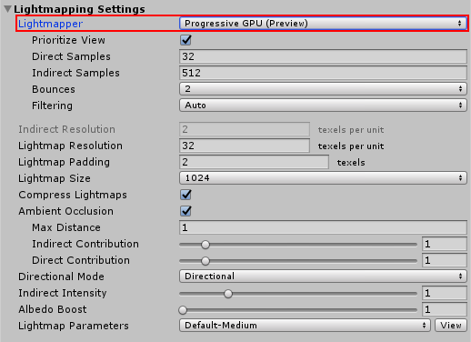

# Progressive GPU Lightmapper (Preview)
**Note:** This is a preview feature and is subject to change. Any Scenes that use this feature may need updating in a future release. Do not rely on this feature for full-scale production until it is officially released.

The GPU Lightmapper gives you an interactive workflow when you're setting up and tweaking the lighting in your scene. Because this lightmapper uses the GPU in your computer to generate baked  __lightmaps__ and __Light probes__,  it's a faster alternative to the [CPU Progressive Lightmapper](https://docs.unity3d.com/Manual/ProgressiveLightmapper.html). Sampling and noise patterns look slightly different than those produced by the CPU lightmapper, because the sampling algorithm is different.

### Hardware and software requirements
To use the Progressive GPU Lightmapper, your computer must have:

* A Windows operating system
* At least one GPU with OpenCL 1.2 support
* At least 2GB of dedicated GPU memory
* CPU that supports SSE4.1 instructions

If your computer has more than one GPU, Unity automatically selects one for rendering and a different one for light baking. To change this, see: [configuring which GPU to use for the lightmapper](#configuring-which-gpu-to-use).

**Note:** If the baking process uses more than the available GPU memory, the process can fall back to the CPU Lightmapper. Some drivers with virtual memory support swap to CPU memory instead, which makes the baking process slower.

<a name="selecting-the-progressive-gpu-lightmapper"></a>
## Selecting the Progressive GPU Lightmapper

To select the Progressive GPU Lightmapper in the Unity Editor:
In your Project, go to __Window__ > __Rendering__ > __Lighting Settings__.
Under __Lightmapping Settings__, find the __Lightmapper__ property, and select __Progressive GPU (Preview)__ in the drop-down menu.




<a name="configuring-which-gpu-to-use"></a>
## Configuring which GPU to use

If your computer has more than one GPU, Unity automatically uses one GPU for rendering the Scene and the other GPU for baking lightmaps. If the GPU assignments don't fit your needs, you can specify which graphics card to use for baking. 

To see which GPU Unity currently uses for baking:

* In the Editor, open the  __Lighting__ window. Next to __Bake Performance__, you can see the GPU. 

To see the available GPUs in your machine:

1. Make sure you've [selected the Progressive GPU lightmapper in the Editor](#selecting-the-progressive-gpu-lightmapper).
1. Generate the lighting in your Scene.
1. Open File Explorer, and navigate to the following path: _C:\Users\USER\AppData\Local\Unity\Editor_. 
1. Open the file called _Editor.log_.
1. In the file, search for the line _Listing OpenCL platforms_. This should jump to the part of the log with information about OpenCL devices. Here, you can see your available GPUs along with their corresponding platform and device indexes.

To select a specific GPU for baking:

* At the Command Line, enter this command (replacing `platform` and `device index` with the relevant numbers): 

```Unity.exe "-OpenCL-PlatformAndDeviceIndices" <platform> <device index>```


Your choice of assignment should depend on your needs while you're working on the Scene. If you assign the strongest GPU to either activity, this can incur a cost on the other activity. If you encounter issues, try re-assigning GPUs. 


### Limitations
The Progressive GPU Lightmapper does not support:

* Double-sided global illumination. The Lightmapper views all geometry as single-sided.
* Casting shadows. Meshes always cast and receive shadows, regardless of your choice in __Cast Shadows__ and __Receive Shadows__.
* Baked LOD.
* A-Trous filtering. It only uses Gaussian filtering.
* The custom bake API (experimental)
* Submeshes. The lightmapper uses material properties on the first submesh.


----
* <span class="page-edit">2018-11-26 <!-- include IncludeTextNewPageYesEdit --></span>
* <span class="page-history">Preview of Progressive GPU Lightmapper added in [2018.3] (https://docs.unity3d.com/2018.3/Documentation/Manual/30_search.html?q=newin20183) <span class="search-words">NewIn2018X</span></span>