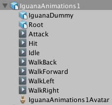
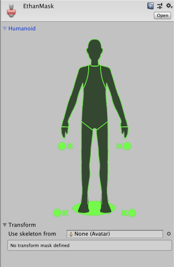

# Importing non-humanoid animations

A *Humanoid* model is a very specific structure, containing at least [15 bones organized in a way](ConfiguringtheAvatar) that loosely conforms to an actual human skeleton. Everything else that uses the [Unity Animation System](AnimationOverview) falls under the *non-Humanoid*, or __Generic__ category. This means that a Generic Model might be anything from a teakettle to a dragon, so non-Humanoid skeletons could have a huge range of possible bone structures. 

The solution to dealing with this complexity is that Unity only needs to know which bone is the __Root node__. In terms of the Generic character, this is the best approximation to the Humanoid character's center of mass. It helps Unity determine how to render animation in the most faithful way possible. Since there is only one bone to map, Generic setups do not use the [Humanoid Avatar window](class-Avatar). As a result, preparing to import your non-Humanoid Model file into Unity requires fewer steps than for Humanoid models.

1. [Set up your Rig](#RigSetup) as __Generic__.
2. You can optionally limit the animation that gets imported on certain bones by [defining an Avatar Mask](#AvatarMask).
3. From the __Animation__ tab, enable the __Import Animation__ option and then set the other Asset-specific properties, .
4. If the file consists of multiple animations or actions, you can [define specific frame ranges as Animation Clips](Splittinganimations).
5. For each Animation Clip defined in the file, you can:
    * [Set the pose and root transform](class-AnimationClip#ClipProperties)
    * [Optimize looping](LoopingAnimationClips)
    * [Add curves to the clip](AnimationCurvesOnImportedClips) in order to animate the timings of other items
    * [Add events to the clip](AnimationEventsOnImportedClips) in order to trigger certain actions in time with the animation
    * [Discard part of the animation](AnimationMaskOnImportedClips) similar to using a runtime [Avatar Mask](class-AvatarMask) but applied at import time
    * [Select a different Root Motion Node](AnimationRootMotionNodeOnImportedClips) to drive the action from
    * [Read any messages from Unity about importing the clip](class-AnimationClip#ImportMessages)
    * [Watch a preview of the animation clip](class-AnimationClip#AnimationPreview)
6. To save your changes, click the __Apply__ button at the bottom of the __Import Settings__ window or __Revert__ to discard your changes.

## Setting up the Rig

From the [Rig tab of the Inspector window](FBXImporter-Rig), set the __Avatar__ (animation) type to __Generic__. By default, the __Avatar Definition__ property is set to __Create From This Model__ and the __Root node__ option is set to __None__. 

In some cases, you can change the __Avatar Definition__ option to __Copy From Other Avatar__ to use an Avatar you already defined for another Model file. For example, if you create a Mesh (skin) in your 3D modeling application with several distinct animations, you can export the Mesh to one FBX file, and each animation to its own FBX file. When you import these files into Unity, you only need to create a single Avatar for the first file you import (usually the Mesh). As long as all the files use the same bone structure, you can re-use that Avatar for the rest of the files (for example, all the animations).

If you keep the __Create From This Model__ option, you must then choose a bone from the __Root node__ property. 

If you decide to change the __Avatar Definition__ option to __Copy From Other Avatar__, you need to specify which Avatar you want to use by setting the __Source__ property.

Click the __Apply__ button. Unity creates a __Generic__ __Avatar__ and adds an an Avatar sub-asset under the Model Asset, which you can find in the Project view. 

 

**Note:** The Generic Avatar is not the same thing as the Humanoid Avatar, but it does appear in the Project view, and it does hold the Root node mapping. However, if you click on the Avatar icon in the Project view to display its properties in the __Inspector__, only its name appears and there is no __Configure Avatar__ button.

## Creating an Avatar Mask

You can apply masking to animation clips either during import time, or at runtime. Masking during import time is preferable, because it allows the discarded animation data to be omitted from your build, making the files smaller and therefore using less memory. It also makes for faster processing because there is less animation data to be blended at runtime. In some cases, import masking may not be suitable for your purposes. In that case, you can apply a mask at runtime by creating an __Avatar Mask__ Asset, and [using it in the layer settings](AnimationLayers) of your __Animator Controller__. 

To create an empty Avatar Mask Asset, you can either:

* Choose __Create__ &gt; __Avatar Mask__ from the __Assets__ menu.
* Click the Model object you want to define the mask on in the __Project__ view, and then right-click and choose __Create__ &gt; __Avatar Mask__.

The new Asset appears in the __Project__ view:

You can now choose which bones to include or exclude from a [Transform hierarchy](class-AvatarMask#Transform) and then add the mask to either an [Animation Layer](AnimationLayers) or add a reference to it under the [Mask](AnimationMaskOnImportedClips) section of the [Animation tab](class-AnimationClip).

---

*  2018-04-25  <!-- include IncludeTextAmendPageSomeEdit -->
