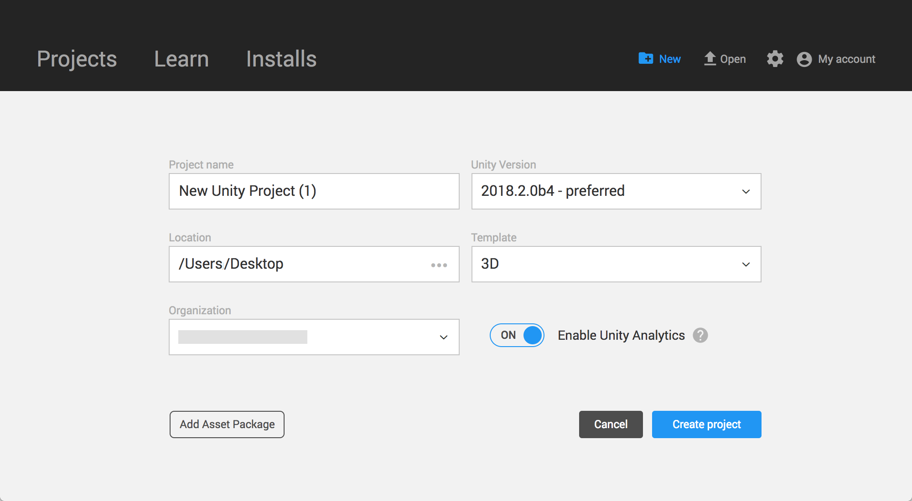
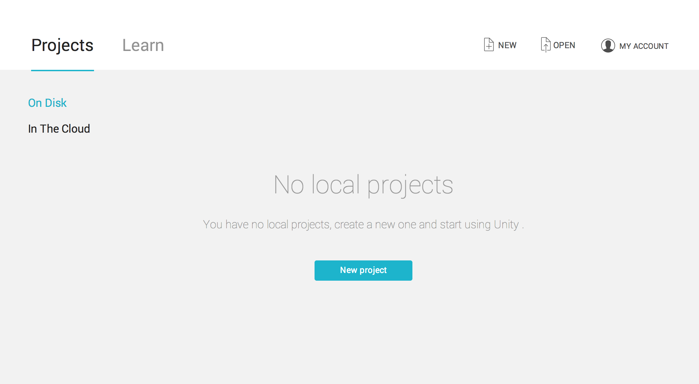
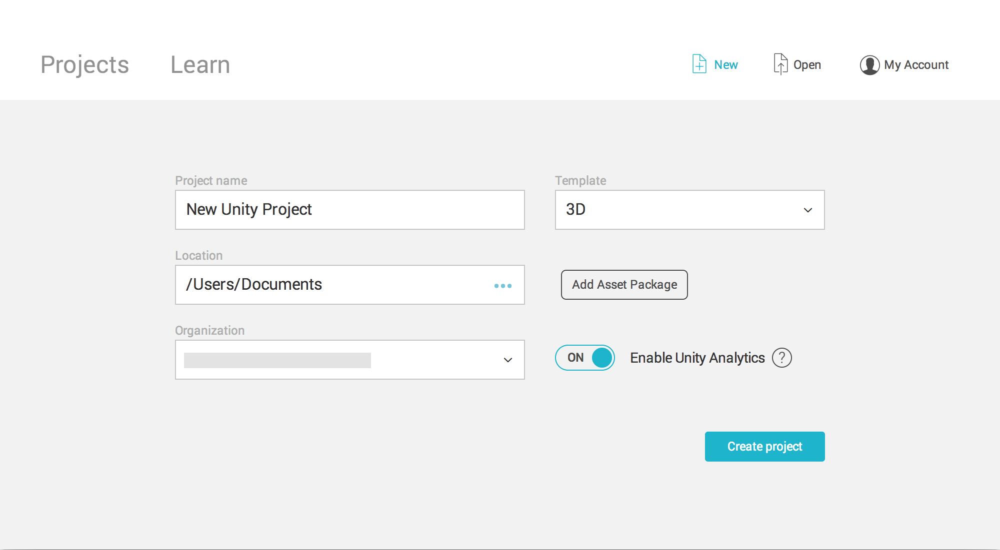

# Starting Unity for the first time

There are two ways to create a new Project:

* Using the Unity Hub - The Unity Hub is a standalone application that streamlines the way you find, download, and manage your Unity projects and installations. For information on installing the Unity Hub, see [Installing Unity using the Hub](GettingStartedInstallingHub).
* Using the Unity Launcher -  For more information on installing the Unity Editor with the Unity Launcher download assistant, see [Installing Unity using the download assistant](DeployingUnityOffline).

## Creating a Project using the Hub

To create a new Project (and specify which Editor version to open it in), click __New__.

| Setting| Function |
|:---|:---| 
| __Project name__| Sets the name of your Project. This names the main Project folder, which stores the Assets, Scenes, and other files related to your Project.  |
| __Unity Version__| Select the Editor version you want to use to create the Project. **Note**: The drop-down menu is only available if you have installed multiple versions of the Editor in the Hub. |
| __Location__| Use this to define where in your computer’s file system to store your Project. The location of your Project defaults to the home folder on your computer. To change it, type the file path to your preferred storage location into the Location field. Alternatively, click the ellipsis icon  in the Location field. This opens your computer’s file browser (Explorer, Finder or Files, depending on your computer’s operating system). In your file browser, navigate to the folder that you want to store your Project in, and click Select Folder or Open. |
| __Template__| Choose a Project Template. Project Templates provide pre-selected settings based on common best practices for Projects. These settings are optimized for 2D and 3D Projects across the full range of platforms that Unity supports. The default Template type is 3D.  |
| __Add Asset Package__| Use this to add pre-made content to your Project. The Asset Packages provided with Unity include pre-made models, particle effects, and example scripts, along with other useful tools and content. To import Unity-provided Asset Packages into your Project, click the Add Asset Package button, then tick the checkbox to the left of each Asset Package you want to import, and click Done. Unity automatically imports the selected Assets when your Project is created. The Add Asset Package screen also contains any Assets you have downloaded from the Unity Asset Store. You can also add Asset Packages later, once you’ve created your project. To do this in the Unity Editor, go to __Assets > Import Package__, and select the package you want to import. |
| __Enable Unity Analytics__| Select whether to enable Unity Analytics. Unity Analytics is a data platform that provides analytics for your Unity game. Using Analytics, you can find out who the players are in your game and their in-game behavior. Unity Analytics are enabled by default. |

## Creating a Project using the Unity Launcher

To use the Unity Editor you must have a Unity Developer Network (UDN) account. If you already have an account, sign in and proceed to the [The Projects tab](#projects) section.

If you do not have an account, follow the prompts to create one. For more information on accounts and subscriptions, see [Unity Organizations](OrgsUnityOrganizations).

When you launch the Unity Editor, the Unity launcher Home Screen appears.

There are two tabs: The __Projects__ tab and the __Learn__ tab.

The __Projects__ tab is where you can create new Projects or open existing Projects.

From the __Learn__ tab, you can access tutorials and learning resources to help you get started with Unity. If you are new to using Unity, you can work through the Unity Learn tutorials before starting a new project.

## The Projects tab

On the Home Screen, click __Projects__ to view the contents of the __Projects__ tab.

Unity stores Projects in two locations:

* __On Disk__: To open an existing Unity Project stored on your computer, click the Project name in the __Projects__ tab, or click __Open__ to browse your computer for the Project folder.
* __In the Cloud__: To access [Unity Collaborate](UnityCollaborate) Projects, click __In the Cloud__, then select the Project you want to load. The Hub prompts you to choose a storage location for the Project on your computer.

### Creating a Project

In the top right corner of the Home Window, click __New__ to open the Create Project View.

From the Create Project View, there are Project settings to complete before Unity creates your project. These are described in detail below.

| Setting| Function |
|:---|:---| 
| __Project name__| Sets the name of your Project. This names the main Project folder which stores the Assets, Scenes, and other files related to your Project.  |
| __Location__| Use this to define where in your computer’s file system to store your Project. The location of your Project defaults to the home folder on your computer. To change it, type the file path to your prefered storage location into the Location field. Alternatively, click the ellipsis icon  in the Location field. This opens your computer’s file browser (Explorer, Finder or Files, depending on your computer’s operating system). In your file browser, navigate to the folder that you want to store your Project in, and click Select Folder or Open. |
| __Template__| Choose a Project Template. Project Templates provide pre-selected settings based on common best practices for Projects. These settings are optimized for 2D and 3D Projects across the full range of platforms that Unity supports. The default Template type is 3D.  |
| __Add Asset Package__| Use this to add pre-made content to your Project. The Asset Packages provided with Unity include pre-made models, particle effects, and example scripts, along with other useful tools and content.To import Unity-provided Asset Packages into your Project, click the Add Asset Package button, then tick the checkbox to the left of each Asset Package you want to import, and click Done. Unity automatically imports the selected Assets when your Project is created. The Add Asset Package screen also contains any Assets you have downloaded from the Unity Asset Store.You can also add Asset Packages later, once you’ve created your project. To do this in the Unity Editor, go to __Assets__ > __Import Package__, and select the package you want to import. |
| __Enable Unity Analytics__| Select whether to enable Unity Analytics. Unity Analytics is a data platform that provides analytics for your Unity game. Using Analytics, you can find out who the players are in your game and their in-game behavior. Unity Analytics are enabled by default. |

When you are done, click the __Create Project__ button. Unity automatically generates the required files, creates your Project and opens the Project. 

--------------------------------
2018-06-12 <!-- include IncludeTextNewPageYesEdit -->
