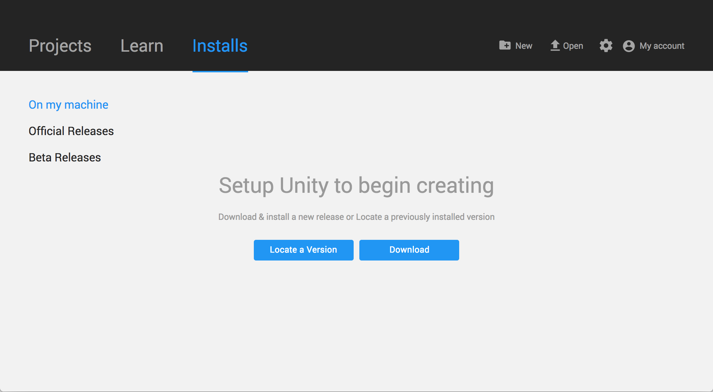
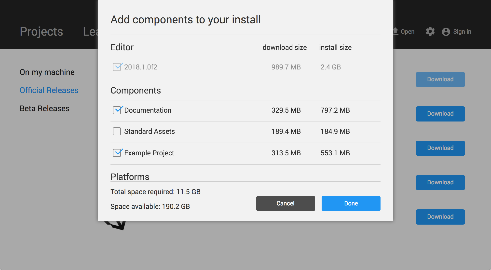
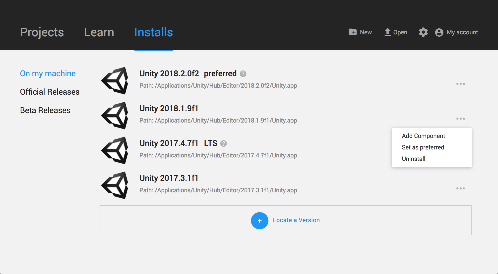

# Installing Unity using the Hub

The Unity Hub is a management tool that allows you to manage all of your Unity projects and installations. Use the Hub to manage multiple installations of the Unity Editor along with their associated components, create new Projects, and open existing Projects.

## Installing the Unity Hub

To install the Unity Hub, visit [Download Unity Personal](https://store.unity.com/download?ref=personal) on the Unity website,

To install and use the Unity Editor, you must have a Unity Developer Network (UDN) account. If you already have an account, sign in and proceed to the [Installing the Unity Editor](#install) section. 

If you do not have an account, follow the prompts to create one. You can choose to create a Unity ID, or use one of the social sign-ins. For more information on accounts and subscriptions, see [Unity Organizations](OrgsUnityOrganizations).

<a name="install"></a>
## Installing the Unity Editor

To install the Editor: 

1. Click the __Installs__ tab. The default install locations are:

    Windows:
    
    ```
    C:\Program Files\Unity\Hub\Editor
    ```
    
    Mac:

    ```
    /Application/Unity/Hub/Editor
    ```
    
    1. Optionally, to change the default installation location, click the Gear  icon.  

    2. In the __Editor Folder Location__ dialog box, enter the new installation location and click __Done__.

2. Click __Official Releases__ for released versions of the Editor, or __Beta Releases__ for the latest Beta release of the Editor.

    

3. Click the __Download__ button of the Editor version you want to install. This opens a dialog box called __Add components to your install__.

4. In the __Add components to your install__ dialog box, select the components you want to install with the Editor, and click __Done__. If you don’t install a component now, you can add it later if you need to. 

If you are installing multiple Editor versions, the first installation starts as soon as the download is complete. Other selected versions download simultaneously and queue to start when the current installation finishes.



The Hub displays the installation location of each Editor under the corresponding version label.

To set it an Editor version as your preferred version, add components to it, or uninstall it, click the three dots next to that Editor version.  



If you remove or uninstall the preferred Editor version, another installed Editor version becomes the preferred version.

## Adding existing instances of the Editor to the Hub

You can add instances of the Editor to the Hub that you installed outside of the Hub.
 
1. Click the __Installs__ tab.
2. Click the __On my machine__ tab. To find existing installations of the Editor, click __Locate a Version__.
3. In the file dialog, navigate to the location of the Editor installation and select the Unity executable. On MacOS this is *Unity.app*. On Windows this is *Unity.exe*. 

On macOS, the path is typically:

```
/Applications/Unity/Hub/Editor/<version>/Unity.app
```
    
On Windows, the path is typically:

```
C:\Program Files\Unity\Editor\Unity.exe
```

Or 

```
C:\Program Files\Unity<version>\Editor\Unity.exe
```

4. Click the __Select editor__ button.

To set the Editor as the preferred version, or to remove the Editor from the Hub, click the three dots next to the Editor version. 

Removing an Editor that you added in this manner does not uninstall it or modify it in anyway.

## Support for Editor versions prior to 2017.1

Sign in status is not shared for pre-2017.1 versions of the Editor opened through the Hub. Performing tasks such as __Manage License__, __Open Project__, __Create Project__, and __Sign in__ opens the Unity Launcher instead of the Hub.

If you attempt to use the Unity Hub to open an Editor version 5 or earlier and you do not have an appropriate license file, the Editor will hang on the splash screen.

To avoid this issue, run the Editor directly, external to the Unity Hub, and the Editor will load correctly even if the license file is not detected.

--------------------------------
<span class="page-edit">2018-06-12 <!-- include IncludeTextNewPageYesEdit --></span>
