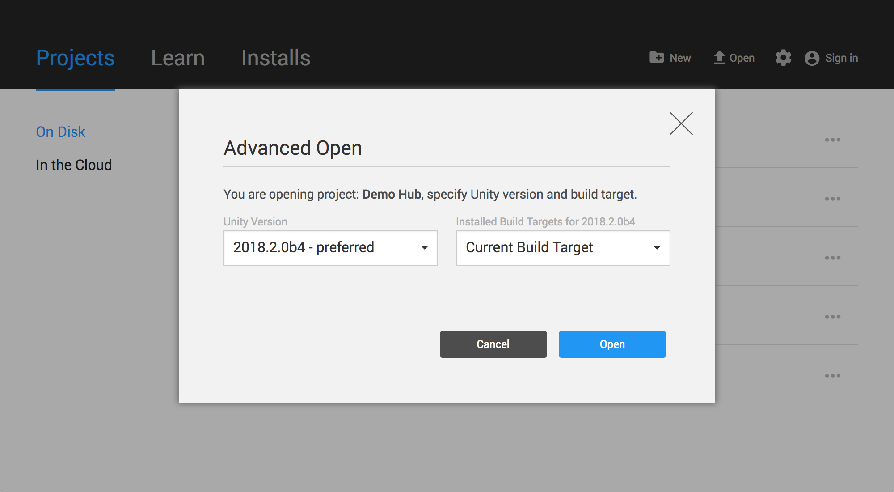
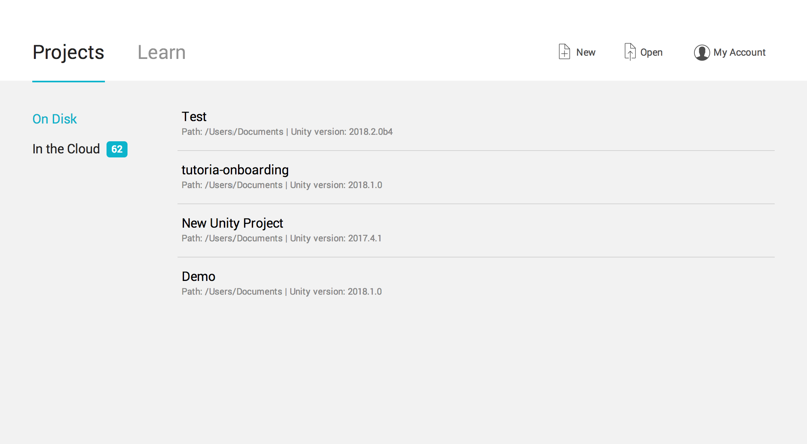

# Opening existing Projects

This page details how to open an existing Project from both the Hub and the Unity Launcher.

## Opening a Project from the Hub

You have several options when opening an existing Project from the Hub. You can:

* Click on the Project to open it using the assigned Editor version and the target platform.
* Use the __Advanced Open__ dialog to select a different Editor version or to specify a different target platform. To use __Advanced Open__, click the three dots to the right of the Project name and select the version you want to use.

The Hub also provides you with the means to open a Project with any installed version of the Editor. When you click __Open__ to work with an existing Project, the Unity Hub attempts to open the Project with the corresponding Editor version for the Project. If the Hub can’t find a matching Editor version for the Project, it displays a warning message and gives you the option to download the selected version, or open the Project with your preferred version.

## Opening a Project from the Launcher

The Home Screen’s __Project__ tab lists any Project you have previously opened on this computer. Click on a Project in the list to open it.

 

If the Editor is newly installed, or you haven’t yet opened the Project you need in this installation of Unity, click __Open__ to open your file browser and locate the Project folder. Note that a Unity Project is a collection of files and directories, rather than just one specific Unity Project file. To open a Project, you must select the main Project folder, rather than a specific file.

To view the Home Screen’s __Projects__ tab from inside the Unity Editor, go to __File__ > __Open Project__.

--------------------------------
2018-06-12 <!-- include IncludeTextNewPageYesEdit -->