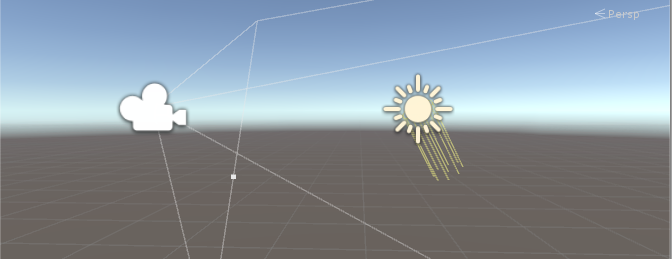
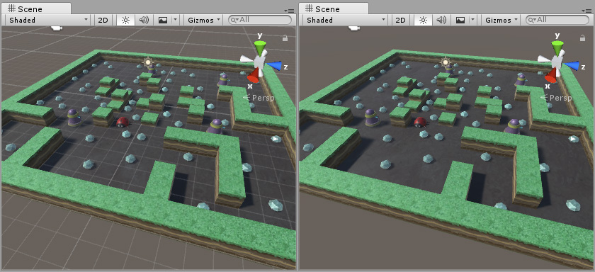
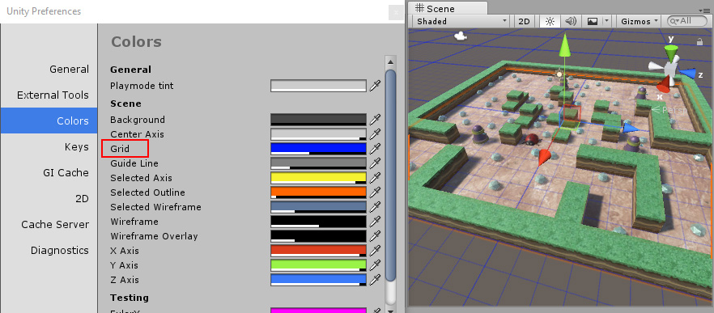
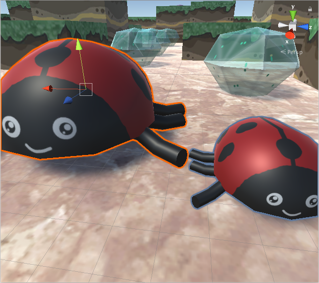
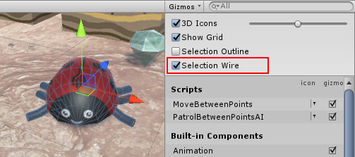
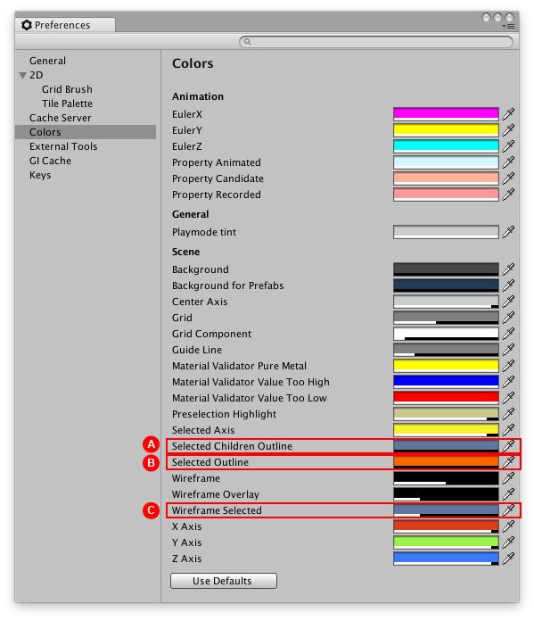
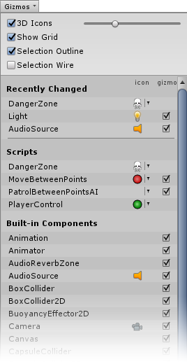

# Gizmos menu

The [Scene view](UsingTheSceneView) and the [Game view](GameView) both have a __Gizmos__ menu. Click the __Gizmos__ button in the toolbar of the Scene view or the Game view to access the __Gizmos__ menu.

| **Property** | **Function** |
|:---|:---| 
| __3D Icons__| The __3D Icons__ checkbox controls whether component icons (such as those for Lights and Cameras) are drawn by the Editor in 3D in the Scene view.  When the __3D Icons__ checkbox is ticked, component icons are scaled by the Editor according to their distance from the Camera, and obscured by GameObjects in the Scene. Use the slider to control their apparent overall size. When the __3D Icons__ checkbox is not ticked, component icons are drawn at a fixed size, and are always drawn on top of any GameObjects in the Scene view.  See [Gizmos and Icons](#GizmosIcons), below, for images and further information. |
| __Show Grid__| The __Show Grid__ checkbox switches the standard Scene measurement grid on (checked) and off (unchecked) in the Scene view. To change the colour of the grid, go to __Unity__ > __Preferences__ > __Colors__ and alter the __Grid__ setting.  This option is only available in the Scene view Gizmos menu; you cannot enable it in the Game view Gizmos menu.   See [Show Grid](#ShowGrid), below, for images and further information.|
| __Selection Outline__| Check __Selection Outline__ to display selected GameObjects with a colored outline, and their children with a different colored outline. By default, Unity highlights the selected GameObject in orange, and child GameObjects in blue.  __NOTE:__ This option is only available in the Scene view Gizmos menu; you cannot enable it in the Game view Gizmos menu.   See [Selection Outline and Selection Wire](#SelectionOutlineWire), below, for images and further information.|
| __Selection Wire__| Check __Selection Wire__ to show the selected GameObjects with their wireframe Mesh visible. To change the colour of the Selection Wire, go to __Unity__ > __Preferences__ > __Colors__ and alter the __Selected Wireframe__ setting.  This option is only available in the Scene view Gizmos menu; you cannot enable it in the Game view Gizmos menu.  See [Selection Outline and Selection Wire](#SelectionOutlineWire), below, for images and further information. |
| __Built-in Components__ | The __Built-in Components__ list controls the visibility of the icons and Gizmos of all component types that have an icon or Gizmo.  See [Built-in Components](#Components), below, for further information.|

 
## Gizmos and Icons

### Gizmos

__Gizmos__ are graphics associated with GameObjects in the Scene. Some Gizmos are only drawn when the GameObject is selected, while other Gizmos are drawn by the Editor regardless of which GameObjects are selected. They are usually wireframes, drawn with code rather than bitmap graphics, and can be interactive. The **Camera** Gizmo and **Light direction** Gizmo (shown below) are both examples of built-in Gizmos; you can also create your own Gizmos using script. See documentation on [Understanding Frustum](UnderstandingFrustum) for more information about the Camera.

Some Gizmos are passive graphical overlays, shown for reference (such as the **Light direction** Gizmo, which shows the direction of the light). Other Gizmos are interactive, such as the [AudioSource](class-AudioSource) **spherical range** Gizmo, which you can click and drag to adjust the maximum range of the AudioSource.

The __Move__, __Scale__, __Rotate__ and __Transform__ tools are also interactive Gizmos. See documentation on [Positioning GameObjects](PositioningGameObjects) to learn more about these tools.

See the Script Reference page for the [OnDrawGizmos](ScriptRef:MonoBehaviour.OnDrawGizmos.html) function for further information about implementing custom Gizmos in your scripts.

### Icons

You can display __icons__ in the Game view or Scene view. They are flat, billboard-style overlays which you can use to clearly indicate a GameObject’s position while you work on your game. The **Camera** icon and **Light** icon are examples of built-in icons; you can also assign your own to GameObjects or individual scripts (see documentation on [Assigning Icons](AssigningIcons) to lean how to do this).

 
## Show Grid

The __Show Grid__ feature toggles a grid on the plane of your Scene. The following images show how this appears in the Scene view:

To change the colour of the grid, go to __Unity__ > __Preferences__ > __Colors__ and alter the __Grid__ setting. In this image, the Scene view grid is colored dark blue so that it shows up better against the light-colored floor:

## Selection Outline and Selection Wire

### Selection Outline
When __Selection Outline__ is enabled, an outline appears around selected GameObjects and their child GameObjects. By default, Unity outlines selected GameObjects in orange, and child GameObjects in blue. You can change these colors in the Unity preferences (see [Selection Colors](#SelectionColors), below).

When you select a GameObject, Unity outlines all of its child GameObjects (and their child GameObjects, and so on), but does not outline parent GameObjects (or their parent GameObjects, and so on).

If selected GameObjects extend beyond the edges of the Scene view, the selection outline runs along the edge of the window:

### Selection Wire

When __Selection Wire__ is enabled, then when you select a GameObject in the Scene view or Hierarchy window, the wireframe Mesh for that GameObject is made visible in the Scene view:
 

### Selection colors

You can set custom colors for selection wireframes. 

1. Go to __Unity > Preferences__ (macOS) or __Edit > Preferences__ (Windows) to open the [Preferences](Preferences) editor.
1. On the colors tab, change one or more of the following colors:
    * (A) __Selected Children Outline__: outline color for selected GameObjects’ children.
    * (B) __Selected Outline__: outline color for selected GameObjects.
    * (C) __Wireframe Selected__:  outline color for selected GameObjects’ wireframes.

## Built-in Components

Use the __Built-in Components__ list to control the visibility of the icons and Gizmos of all component types that have an icon or Gizmo.

Some built-in component types (such as Rigidbody) are not listed here because they do not have an icon or Gizmo shown in the Scene view. Only components which have an icon or a Gizmo are listed.

The Editor also lists some of your project scripts here, above the built-in components. These are:

* Scripts with an icon assigned to them (see documentation on [Assigning icons](AssigningIcons)).

* Scripts which implement the [OnDrawGizmos](ScriptRef:MonoBehaviour.OnDrawGizmos) function.

* Scripts which implement the [OnDrawGizmosSelected](ScriptRef:MonoBehaviour.OnDrawGizmosSelected) function.

Recently changed items are at the top of the list.

The __icon__ column shows or hides the icons for each listed type of component. Click the small icon under the __icon__ column to toggle visibility of that icon. If the icon is in full colour in the menu then it is displayed in the Scene view; if it is greyed out in the menu, then it is not visible in the Scene view. Any scripts with custom icons show a small drop-down menu arrow. Click this to show the icon selector menu, where you can change the script's icon.

**Note**: If an item in the list has a Gizmo but no icon, there is no option in the icon column.

Tick the checkboxes in the __Gizmo__ column to select whether Gizmo graphics are drawn by the Editor for a particular component type. For example, Colliders have a predefined wireframe Gizmo to show their shape, and Cameras have a Gizmo which shows the [view frustum](UnderstandingFrustum). Your own scripts can draw custom Gizmos appropriate to their purpose; implement [OnDrawGizmos](ScriptRef:MonoBehaviour.OnDrawGizmos) or [OnDrawGizmosSelected](ScriptRef:MonoBehaviour.OnDrawGizmosSelected) to do this. Uncheck the checkboxes in this column to turn these Gizmos off.

**Note**: If an item in the list has an icon but no Gizmo, there is no checkbox in this column.

----

* 2018-10-08 <!-- include IncludeTextAmendPageSomeEdit -->

* Selection outline for child GameObjects added in [2018.3] (https://docs.unity3d.com/2018.X/Documentation/Manual/30_search.html?q=newin2018X) NewIn2018X