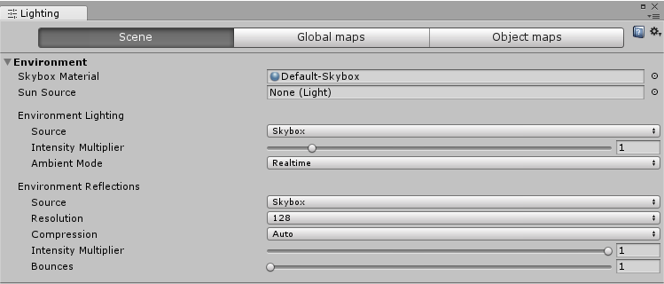
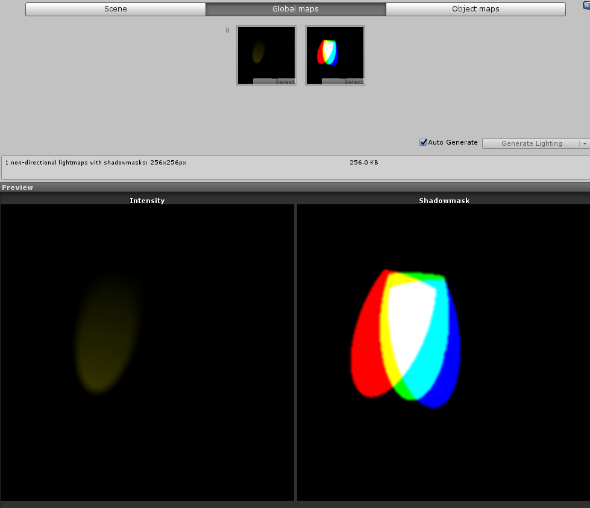
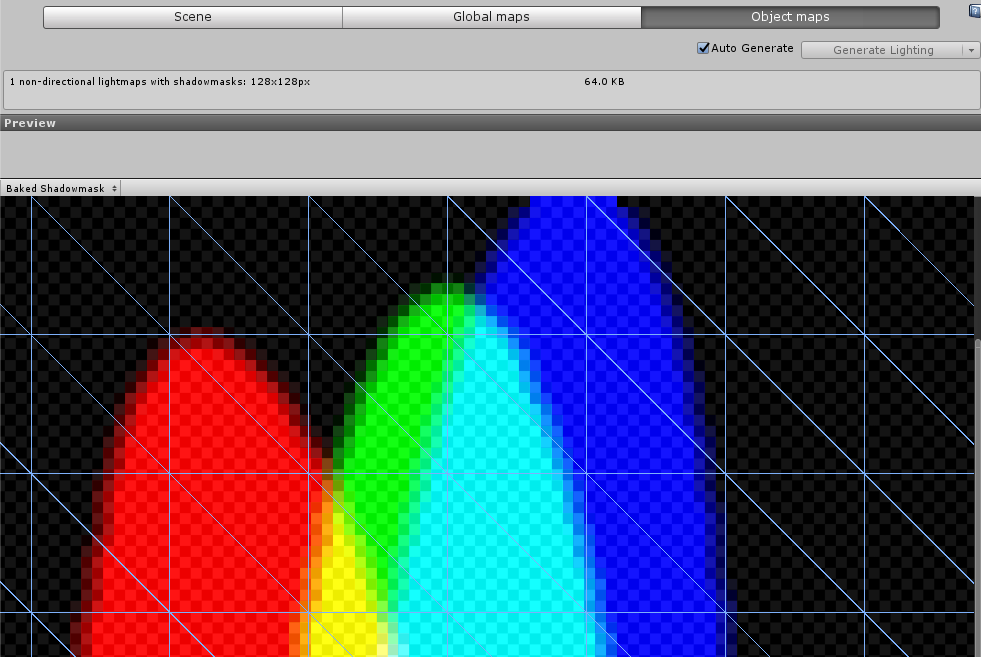

# Lighting Window

The Lighting window (menu: __Window__ &gt; __Rendering__ &gt; __Lighting Settings__) is the main control point for Unity’s [Global Illumination](GIIntro) (GI) features. Although GI in Unity gives good results with default settings, the Lighting window’s properties allow you to adjust many aspects of the GI process, to customise your Scene or optimise for quality, speed and storage space as you need. This window also includes settings for ambient light, halos, cookies and fog.

## Overview

The controls of the Lighting window are divided among three tabs:

* The __Scene__ tab settings apply to the overall Scene rather than individual GameObjects. These settings control lighting effects and also optimisation options.

* The __Global maps__ tab shows all of the lightmap Asset files generated by the GI lighting process.

* The __Object maps__ tab shows previews of GI lightmap textures (including shadow masks) for the currently selected GameObject.

The window also has an __Auto Generate__ checkbox below the displayed content. If you tick this checkbox, Unity updates lightmap data as you edit the Scene. Note that the update usually takes a few seconds rather than happening instantaneously. If you leave the __Auto Generate box__ unticked, the __Generate Lighting__ button to the right of the checkbox becomes active; use this button to trigger lightmap updates when you need them. Use the __Generate Lighting__ button if you want to clear the baked data from the Scene without clearing the [GI Cache](GICache). 

## Scene tab

The __Scene__ tab contains settings that apply to the overall Scene, rather than individual GameObjects. The __Scene__ tab contains several sections: 

* [Environment](#Environment)
* [Realtime Lighting](#RealtimeLighting)
* [Mixed Lighting](#MixedLighting)
* [Lightmapping Settings](#LightmappingSettings)
* [Other Settings](#OtherSettings)
* [Debug Settings](#DebugSettings)

### Environment

The Environmental Lighting section contains settings for the skybox, diffuse lighting and reflections.

| __Property:__| __Function:__ |
|:---|:---| 
| __Skybox Material__| A skybox is a Material that appears behind everything else in the Scene to simulate the sky or other distant background. Use this property to choose the skybox Material you want to use for the Scene. The default value is the Material __Default-Skybox__ in the [Standard Assets](AssetTypes#Standard). |
| __Sun Source__| When a procedural skybox is used, use this to specify a GameObject with a directional Light component to indicate the direction of the "sun" (or whatever large, distant light source is illuminating your Scene). If this is set to __None__ (the default), the brightest directional light in the Scene is assumed to represent the sun. |
| __Environment Lighting__ | These settings affect light coming from the distant environment. |
| __Source__| Diffuse environmental light (also known as ambient light) is light that is present all around the Scene and doesn’t come from any specific source object. Use this to define a source colour. The default value is __Skybox__.|
|&nbsp;&nbsp;&nbsp;&nbsp;Color| Select this to use a flat color for all ambient light in the Scene.  |
|&nbsp;&nbsp;&nbsp;&nbsp;Gradient| Select this to choose separate colors for ambient light from the sky, horizon and ground, and blend smoothly between them.  |
|&nbsp;&nbsp;&nbsp;&nbsp;Skybox| Select this to use the colors of the skybox (if specified by the __Skybox Material__) to determine the ambient light coming from different angles. This allows for more precise effects than __Gradient__. |
| __Intensity Multiplier__| Use this to set the brightness of the diffuse environmental light in the Scene, defined as a value between 0 and 8. The default value is 1. |
| __Ambient Mode__| Use this to specify the Global Illumination mode that should be used to handling ambient light in the Scene. This property is only available when both [real-time lighting](LightMode-Realtime) and [baked lighting](LightMode-Baked) are enabled in the Scene.  |
|&nbsp;&nbsp;&nbsp;&nbsp;Realtime| Choose __Realtime__ if you want the ambient light in the Scene to be calculated and updated in real time. |
|&nbsp;&nbsp;&nbsp;&nbsp;Baked| Choose __Baked__ if you want the ambient light to be precomputed and set into the Scene at run time. |
| __Environment ____Reflections__| These settings control global settings involved in [Reflection Probe](class-ReflectionProbe) baking, and settings affecting global reflections. |
| __Source__| Use this setting to specify whether you want to use the skybox for reflection effects, or a cube map of your choice. The default value is __Skybox__. |
|&nbsp;&nbsp;&nbsp;&nbsp;Skybox| Select this to use the skybox for reflections. If you select __Skybox__, an additional option called __Resolution__ appears. Use this to set the resolution of the skybox for reflection purposes. |
|&nbsp;&nbsp;&nbsp;&nbsp;Custom| Select this to use a cube map for reflections. If you select Custom, an additional option called __Cubemap__ appears. Use this to set the cube map of the skybox for reflection purposes.  |
| __Compression__| Use this to define whether or not reflection textures are compressed. The default setting is __Auto__. |
|&nbsp;&nbsp;&nbsp;&nbsp;Auto| The reflection texture is compressed if the compression format is suitable. |
|&nbsp;&nbsp;&nbsp;&nbsp;Uncompressed| The reflection texture is stored in memory uncompressed. |
|&nbsp;&nbsp;&nbsp;&nbsp;Compressed| The texture is compressed. |
| __Intensity Multiplier__| The degree to which the reflection source (the skybox or cube map specified in the __Reflection Source__ property) is visible in reflective objects. |
| __Bounces__| A reflection “bounce” occurs when a reflection from one object is then reflected by another object. The reflections are captured in the scene through the use of [Reflection Probes](ReflectionProbes). Use this property to set how many times the Reflection Probes evaluate bounces back and forth between objects. If this is set to 1, then Unity only takes the initial reflection (from the skybox or cube map specified in the __Reflection Source__ property) into account. |

### Realtime Lighting

| __Property:__| __Function:__ |
|:---|:---|
| __Realtime Global Illumination__ | If this checkbox is ticked, Unity calculates and updates the lighting in real time. See documentation on [Realtime Global Illumination](LightMode-Realtime) for more information. |

### Mixed Lighting

| Property:| Function: |
|:---|:---| 
| __Baked Global Illumination__ | If this checkbox is ticked, Unity precomputes the lighting and sets it into the Scene at run time. See documentation on [Baked Global Illumination](LightMode-Baked) for more information. |
| __Lighting Mode__| __Lighting Mode__ determines the way [Mixed Lights](LightMode-Mixed) and shadows work with GameObjects in the Scene. __Note__: When you change the __Lighting Mode__, you also need to re-bake the Scene. If __Auto Generate__ is enabled in the Lighting window, this happens automatically. If __Auto Generate__ is not enabled, click __Generate Lighting__ to see the updated lighting effect. |
| __Realtime Shadow Color__ | Define the color used to render real-time shadows. This setting is only available when __Lighting Mode__ is set to __Subtractive__. |

### Lightmapping Settings

Lightmapping Settings are specific to the Lightmapper backend. Unlike other settings, they’re not shared and have their own parameters. To see full settings information for each lighting system, see documentation on  [Progressive Lightmapper](ProgressiveLightmapper) and [Enlighten](GI-Enlighten).

#### Other Settings

This section provides documentation for the __Other Settings__ section.

|||| Property: | Function: |
|:---|:---|:---|:---|:---| 
| __Other Settings__|||| Settings for fog, [Halos](class-Halo), [Flares](class-Flare) and [Cookies](Cookies). |
| __Fog__|||| Enables or disables fog in the Scene. Note that fog is not available with the [Deferred rendering path](RenderingPaths). For deferred rendering, the [Post-processing fog effect](PostProcessing-Fog) effect might be suitable. |
|| Color ||| Use the color picker to set the color Unity uses to draw fog in the Scene. |
|| Mode ||| Define the way in which the fogging accumulates with distance from the camera. |
||| __Linear__ || Fog density increases linearly with distance. |
|||| Start | Set the distance from the Camera at which the fog starts. |
|||| End | Set the distance from the Camera at which the fog completely obscures Scene GameObjects. |
||| __Exponential__ || Fog density increases exponentially with distance. |
|||| Density | Use this to control the density of the fog. The fog appears more dense as the __Density__ increases. |
||| __Exponential Squared__ || Fog density increases faster with distance (exponentially and squared). |
|||| Density | Use this to control the density of the fog. The fog appears more dense as the __Density__ increases. |
| __Halo Texture__|||| Set the Texture you want to use for drawing a [Halo](class-Halo) around lights. |
| __Halo Strength__|||| Define the visibility of Halos around Lights, from a value between 0 and 1. |
| __Flare Fade Speed__|||| Define the time (in seconds) over which [lens flares](class-LensFlare) fade from view after initially appearing. This is set to 3 by default. |
| __Flare Strength__|||| Define the visibility of lens flares from lights, from a value between 0 and 1. |
| __Spot Cookie__|||| Set the [Cookie](HOWTO-LightCookie) texture you want to use for [spot lights](Lighting). |

### Debug settings

| __Property:__| __Function:__ |
|:---|:---| 
| __Debug Settings__| Settings that help you debug your Scene. |
| __Light Probe Visualization__| Use this to filter which [Light Probes](LightProbes) are visualized in the Scene view. The default value is __Only Probes Used By Selection__. |
|&nbsp;&nbsp;&nbsp;&nbsp;Only Probes Used By Selection| Only Light Probes that affect the current selection are visualized in the Scene view. |
|&nbsp;&nbsp;&nbsp;&nbsp;All Probes No Cells| All Light Probes are visualized in the Scene view. |
|&nbsp;&nbsp;&nbsp;&nbsp;All Probes With Cells| All Light Probes are visualized in the Scene view, and the tetrahedrons that are used for interpolation of Light Probe data are also displayed. |
|&nbsp;&nbsp;&nbsp;&nbsp;None| No Light Probes are visualized in the Scene view. |
| __Display Weights__| When ticked, Unity draws a line from the Light Probe used for the active selection to the positions on the tetrahedra used for interpolation. This is a way to debug probe interpolation and placement problems.|
| __Display Occlusion__| When ticked, Unity displays occlusion data for Light Probes if the Mixed lighting mode is [Distance Shadowmask](LightMode-Mixed-DistanceShadowmask) or [Shadowmask](LightMode-Mixed-Shadowmask). |

## Global maps tab

Use the __Global maps tab__ to view the actual textures in use by the lighting system. These include intensity light maps, shadow masks and directionality maps. This is only available when [Baked lighting](LightMode-Baked) or [Mixed lighting](LightMode-Mixed) is used; the preview is blank for [Realtime lighting](LightMode-Realtime).

 

## Object maps tab

Use the __Object maps__ tab to see previews of baked textures for the currently selected* *GameObject only, including shadow masks.

---

*  2017-06-08  <!-- include IncludeTextNewPageSomeEdit -->

* Updated in 5.6

* Lightmapping section and Debug settings updated in [2018.1](https://docs.unity3d.com/2018.1/Documentation/Manual/30_search.html?q=newin20181) NewIn20181
